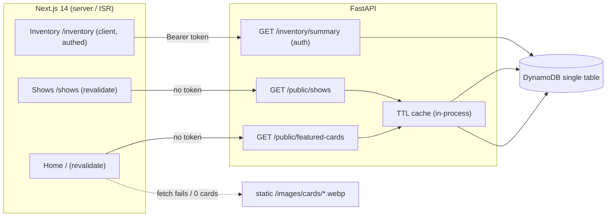

# RFC 0002: Real-Data Wiring — Shows, Featured Finds, Dashboard Stats

- **Status:** Draft
- **Author:** design-doc agent (for Ethan Harter)
- **Date:** 2026-07-25
- **Branch:** `Polishing-For-Deployment`
- **Builds on:** RFC 0001 (customer-visible surface, `_CUSTOMER_ITEM_FIELDS` allowlist discipline)

---

## Summary

Three pages currently render hardcoded placeholder data: the Home "Featured Finds"
row (static card images), the Shows page (invented cities in `upcoming[]`/`past[]`
arrays), and the Inventory dashboard header (fake `Cards in vault` / `Est. value` /
`Sets tracked` stats). This RFC wires all three to the real DynamoDB single-table
backend, which **already has** every read path needed (`InventoryRepository.list_inventory`,
`list_shows`, `batch_get_catalog_cards`). The only backend additions are (a) two
**public** read endpoints and one **authenticated** summary endpoint, (b) two optional
`Show` fields (`venue`, `city`), and (c) the frontend fetch wiring with graceful
fallbacks. No new services, no schema migration.

## Motivation

The site is live and launch-blocking polish is the remaining work (RFC 0001 fixed the
catalog-matching data layer). Placeholder data on public pages is misleading — the
Shows page in particular shows **invented cities** that are not in the business's
records. Wiring these to real data makes the pages honest and lets them auto-update as
inventory and shows change, without a redeploy.

## Goals

- Shows page renders real `SHOWLIST` records, auto-split into Upcoming/Past by date.
- Home "Featured Finds" renders the top real available cards that have a catalog image,
  and **never renders empty or broken** — it falls back to today's static images.
- Dashboard stats reflect the same customer-visible inventory the on-page search returns.
- Public endpoints expose **only** safe fields (allowlist by construction).

## Non-Goals

- **Not** fixing the catalog-matching data bug (RFC 0001's domain). This RFC accepts
  that ~93% of available items have `card_id = NULL` today and designs to degrade
  gracefully around it.
- **Not** multi-day show ranges. Each `Show` is a single date; the model is unchanged
  in that respect.
- **Not** historical venue/city backfill. The "Show Fees" source is free-text; old rows
  stay `None` (render as "N/A"). Only new shows carry venue/city.
- **Not** exposing prices or any internal figure on the public card endpoint.

---

## Detailed Design

### Component / router structure

Add **one new router** `backend/src/merlins_collection/routers/public.py`, mounted at
prefix `/public`, for the two unauthenticated endpoints. Rationale for a dedicated
router (recommended) over folding into `inventory.py`/a shows router:

- **Auth posture is a property of the whole router.** `/inventory/*` is authenticated
  (customer surface); mixing an unauthenticated route into it invites a future edit to
  accidentally inherit or drop the wrong dependency. A separate `public` router makes
  "these routes are intentionally unauthenticated" legible in one place.
- **Allowlist discipline stays local.** The public response models live next to the
  router that owns them.

The authenticated dashboard summary is **not** public, so it goes on the **existing**
`inventory.py` router as `GET /inventory/summary`, reusing that router's auth dependency.

Mounting in `main.py` (one line added alongside the existing includes):

```python
from merlins_collection.routers import auth, chat, health, inventory, public
...
app.include_router(public.router)   # prefix="/public"
```

CORS: the current policy allows `GET` (main.py:54), which covers all three new routes.
The public/shows and featured endpoints are consumed **server-side** by Next.js (ISR
fetch, server-to-server), so CORS is not even on the path for them. **No CORS change.**

### Request flow (spans layers)



Where each piece lives:

| Piece | Location |
|-------|----------|
| Public router + response models | `backend/src/merlins_collection/routers/public.py` (new) |
| TTL cache helper | `public.py` (small module-local helper; see Caching) |
| Dashboard summary route + model | `backend/src/merlins_collection/routers/inventory.py` |
| `Show.venue` / `Show.city` | `backend/src/merlins_collection/models/business.py` |
| Importer venue/city population | `backend/src/merlins_collection/services/spreadsheet_import.py` |
| Home fetch + fallback | `frontend/components/home/FeaturedFinds.tsx`, `frontend/lib/public.ts` (new) |
| Shows fetch + N/A | `frontend/app/(public)/shows/page.tsx`, `frontend/lib/public.ts` |
| Dashboard stats fetch | `frontend/app/(auth)/inventory/page.tsx` + a small client component, `frontend/lib/inventory.ts` |

---

## Data / Model Changes

### `Show` — two optional fields (backward-compatible)

```python
class Show(BaseModel):
    show_id: str = Field(default_factory=new_ulid)
    name: str
    date: date_type
    venue: str | None = None   # NEW — physical venue name, e.g. "Lloyd Center"
    city: str | None = None    # NEW — "Portland, OR"
    sales_goal: Decimal | None = None
    cash_at_start: Decimal | None = None
    inventory_value_at_start: Decimal | None = None
    notes: str | None = None
```

- **Backward-compatible.** Both default to `None`; existing stored rows lack the
  attributes, so `Show.model_validate(item)` in `list_shows` validates them to `None`.
  No backfill, no data migration.
- **No DynamoDB key-schema change.** `venue`/`city` are plain item attributes. `put_show`
  serializes via `model_dump` (dynamodb.py:634) and the SK stays
  `SHOW#<date.isoformat()>#<show_id>`. Confirmed: neither field participates in PK, SK,
  or any GSI key, so nothing about partitioning or the `SHOWLIST` query changes.

### Importer change surface (`spreadsheet_import.py`)

The Show builder populates `venue`/`city` **when structured source columns exist**, and
leaves them `None` otherwise. The "Show Fees" CSV is an unstructured financial ledger,
so a reliable backfill for **old** shows is not expected and is **not** attempted — do
not parse venue/city out of free-text, and do not invent them. New shows added going
forward (with structured venue/location columns) carry the values. This is a small,
additive change to the Show-construction site only; no importer control-flow change.

---

## API Contracts

> Wire note (matches the existing contract, RFC 0001 / `lib/inventory.ts`): pydantic
> `Decimal` and `date` serialize to JSON **strings** (`"48231.50"`, `"2026-08-14"`).
> The frontend types reflect that.

### `GET /public/shows` — PUBLIC (no auth)

Returns all shows, split by the **server's current date** (`date.today()` on the
backend), so "today" is unambiguous and unit-testable. Upcoming is ascending (next show
first); Past is descending (most recent first).

Response models are **purpose-built** (allowlist by construction — the internal `Show`'s
`sales_goal`, `cash_at_start`, `inventory_value_at_start`, `notes` can never appear):

```python
class PublicShow(BaseModel):
    name: str
    date: date          # -> "YYYY-MM-DD"
    venue: str | None = None
    city: str | None = None

class PublicShowsResponse(BaseModel):
    upcoming: list[PublicShow]
    past: list[PublicShow]
```

Example `200`:

```json
{
  "upcoming": [
    { "name": "Seattle Trading Card Con", "date": "2026-08-14", "venue": "Convention Center", "city": "Seattle, WA" }
  ],
  "past": [
    { "name": "Lloyd Center Show", "date": "2026-07-18", "venue": null, "city": null }
  ]
}
```

Split rule: `date >= today` → upcoming; `date < today` → past.

### `GET /public/featured-cards` — PUBLIC (no auth)

Top **5** AVAILABLE, customer-visible (`kind ∈ {raw, graded}`, `status == AVAILABLE`)
items **that resolve to a catalog card with an image**, ranked by market value
(`current_market_value` if present, else `listed_price`, else treated as 0) descending.
If fewer than 5 qualify, return fewer (possibly `[]`).

Exposes **only** display name + image URL. No price, no cost, no location, no internals.

```python
class FeaturedCard(BaseModel):
    name: str            # catalog card.name (authoritative for a matched item)
    image_url: str       # catalog card.images.small

class FeaturedCardsResponse(BaseModel):
    cards: list[FeaturedCard]   # 0..5
```

Example `200`:

```json
{ "cards": [
  { "name": "Lugia", "image_url": "https://images.pokemontcg.io/neo3/9_hires.png" },
  { "name": "Charizard", "image_url": "https://images.pokemontcg.io/base1/4.png" }
] }
```

Algorithm (in `public.py`):

1. `items = repo.list_inventory()`; keep `kind in {"raw","graded"}` and
   `status == AVAILABLE` (reuse the RFC 0001 `_CUSTOMER_KINDS` posture — import the set,
   do not re-list it, to keep one source of truth).
2. `catalog = repo.batch_get_catalog_cards({i.card_id for i in items if i.card_id})`.
3. Keep only items whose `card_id` is in `catalog` **and** whose catalog card has a
   non-empty `images.small`.
4. Sort by `current_market_value or listed_price or Decimal(0)` desc; take first 5.
5. Emit `FeaturedCard(name=card.name, image_url=card.images.small)`.

### `GET /inventory/summary` — AUTHENTICATED

Reuses the existing auth dependency (`get_current_user`) on the `inventory` router. Same
customer-visible cohort as `/inventory/search`: `kind ∈ {raw, graded}` and
`status == AVAILABLE`.

```python
class InventorySummary(BaseModel):
    cards_in_vault: int   # count of qualifying items
    est_value: Decimal    # -> "48231.50"; sum(current_market_value ?? listed_price)
    sets_tracked: int     # distinct catalog set_id among qualifying, matched items
```

Example `200`:

```json
{ "cards_in_vault": 312, "est_value": "48231.50", "sets_tracked": 27 }
```

- `cards_in_vault` = count of qualifying items.
- `est_value` = `sum(current_market_value ?? listed_price)`, skipping items where both
  are `None`. **Note the ordering:** this is **market-first**, which is the *opposite*
  of the customer search's `_price()` helper (`inventory.py:40`, listed-first). This is
  an intentional owner decision for the dashboard, not the search — call it out to the
  Council so it is not "corrected" to match `_price`. Implement it explicitly; do not
  reuse `_price`.
- `sets_tracked` = number of distinct `catalog.set_id` among qualifying items that have a
  `card_id` resolving in `batch_get_catalog_cards`. Items with `card_id = None`
  contribute no set (so today, with ~93% NULL, this number is small — that is correct,
  not a bug).

**Auth:** unauthenticated request → `401` via `get_current_user` (unchanged behavior).
Rate limiting is not required here (cheap read, logged-in customers only); if the Council
prefers, `rate_limit_search` is a drop-in alternative that also fails-open.

---

## Caching / Freshness Strategy

The two public endpoints each do a full `list_inventory` shard fan-out (+ a catalog
`batch_get` for featured). They are unauthenticated, so they are the abuse surface.

**Recommendation: two cheap layers.**

1. **Backend in-process TTL cache** in `public.py`: memoize each endpoint's computed
   response for a short TTL (propose **300 s**). A tiny helper (timestamp + cached value,
   guarded per endpoint) is enough — no new dependency. This caps the DynamoDB scan cost
   under a burst of anonymous requests regardless of how the frontend caches.
   - Trade-off: the cache is **per-process** (not shared across instances) and clears on
     redeploy/restart. That is fine for a cache — worst case is one scan per instance per
     TTL window; it is never a correctness issue because data is at most 300 s stale.
2. **Next.js ISR** on the Home and Shows pages: fetch with
   `next: { revalidate: 300 }`. The pages regenerate on a schedule, so new shows /
   featured cards **auto-appear without a redeploy**. Choose the ISR window ≥ the backend
   TTL so the two don't fight; 300 s on both is a clean default.

The authenticated `/inventory/summary` is **not** cached server-side (per-customer authed
read, low volume); the dashboard fetches it fresh on load.

---

## Frontend Wiring Plan

New typed client `frontend/lib/public.ts` (mirrors `lib/inventory.ts` style) with
`getFeaturedCards()` and `getShows()` over `apiFetch`, plus the response types above.

### Home — `components/home/FeaturedFinds.tsx`

- Becomes an **async server component**. `await getFeaturedCards()` with
  `revalidate: 300`.
- Map API cards → `CollectionRow`'s `{ src, alt }`: `src = image_url`, `alt = name`.
- **Graceful fallback (mandatory):** keep the existing static `featured` array as a
  module constant. If the fetch **throws** (endpoint down) **or returns 0 cards**, render
  the static images instead (the current 5-image cycle). The homepage therefore never
  renders empty or broken. If 1–4 cards return, render those (fewer tiles is acceptable
  per the owner decision) — do **not** pad with statics (keeps real vs placeholder
  honest); the all-or-nothing static fallback applies only to the zero/error case.
- **`next.config` images:** `CollectionRow` uses `next/image`. Remote catalog images
  (`images.pokemontcg.io`, and/or the CloudFront host if images are proxied) must be
  added to `images.remotePatterns`, or `next/image` will throw at render. **Flag this as
  a required config edit** — it is easy to miss and would break the page.

### Shows — `app/(public)/shows/page.tsx`

- Delete the hardcoded `upcoming[]`/`past[]` arrays (and the **invented cities**).
- `await getShows()` with `revalidate: 300`; render `upcoming` then `past`.
- Derive the `DateBadge` month/day from `show.date` (parse the ISO date). Build the
  `dates` label from the single date (e.g. "Jul 25, 2026"); no multi-day range.
- **N/A handling (mandatory):** `city` → render `city ?? 'N/A'`; `venue` likewise. The
  row must never break on a missing field. Title = `show.name`.
- Empty state: if both lists are empty, show a friendly "No shows on the calendar right
  now" message rather than empty sections.

### Dashboard — `app/(auth)/inventory/page.tsx`

- The summary needs the Cognito token, so fetch it **client-side** in a small client
  component (`InventoryStats`) using the same token source `InventoryWorkspace` already
  uses. The page passes the three **labels** through unchanged
  (`Cards in vault` / `Est. value` / `Sets tracked`).
- Formatting: `cards_in_vault` and `sets_tracked` as integers; `est_value` via the
  existing `formatPrice` (USD). 
- **Loading / error fallback:** show placeholder dashes ("—") or a skeleton while
  loading, and on error keep the labels with "—" values — never crash the authed page,
  never show the old fake numbers.

---

## Error Handling & Edge Cases

| Case | Behavior |
|------|----------|
| Empty inventory | `/summary` → `{0, "0", 0}`; `/featured-cards` → `{cards: []}` → Home shows static fallback. |
| Zero qualifying featured cards (all NULL `card_id`) | `{cards: []}` → Home renders static images. This is the expected state **today**. |
| 1–4 qualifying featured cards | Render those N tiles; no static padding. |
| Catalog card missing `images.small` | Item excluded from featured (step 3). |
| Item with both prices `None` | Excluded from `est_value` sum; ranks as 0 for featured. |
| Missing `venue`/`city` (old shows) | Render "N/A"; never throw. |
| Unauth request to `/inventory/summary` | `401` (via `get_current_user`); dashboard shows "—". |
| Public endpoint down / 5xx | Home falls back to static images; Shows shows empty-state copy; neither page crashes. |
| `next/image` remote host not allowed | Prevented by the required `remotePatterns` config edit — flagged above. |
| DynamoDB scan cost under anonymous burst | Bounded by the backend TTL cache (300 s). |

---

## TDD Test Plan (RED first, per CLAUDE.md)

Write these **failing** first; confirm they fail; then implement minimally.

### Backend — `backend/tests/routers/test_public.py` (new)

- `test_featured_cards_returns_top_available_by_value` — several available raw/graded
  items with catalog cards; response is ordered by `current_market_value` desc and capped
  at 5.
- `test_featured_cards_uses_listed_price_when_market_absent` — an item with
  `current_market_value=None` ranks by `listed_price`.
- `test_featured_cards_excludes_items_without_catalog_image` — item whose `card_id` has
  no catalog card, and item whose catalog card lacks `images.small`, are both excluded.
- `test_featured_cards_excludes_non_available_and_non_customer_kinds` — sold, on_hold,
  sealed, bulk all excluded.
- `test_featured_cards_returns_empty_list_when_none_qualify` — all NULL `card_id` →
  `{cards: []}` (the graceful-degradation guarantee).
- `test_featured_cards_exposes_only_name_and_image` — response item keys are exactly
  `{name, image_url}`; no price/cost/location/id leak (allowlist guard).
- `test_shows_splits_upcoming_and_past_by_today` — with a fixed "today", a future-dated
  and a past-dated show land in the right lists; upcoming ascending, past descending.
- `test_shows_show_on_today_is_upcoming` — boundary: `date == today` → upcoming.
- `test_shows_exposes_only_safe_fields` — no `sales_goal`/`cash_at_start`/
  `inventory_value_at_start`/`notes` on any item.
- `test_shows_renders_missing_venue_city_as_null` — a stored show without venue/city
  serializes them as `null`.

### Backend — `backend/tests/routers/test_inventory.py` (extend)

- `test_summary_counts_only_available_customer_items` — count excludes sold/on_hold and
  sealed/bulk.
- `test_summary_est_value_prefers_market_over_listed` — item with both set uses
  `current_market_value`; item with only `listed_price` uses that; both-None skipped.
- `test_summary_sets_tracked_counts_distinct_catalog_sets` — two items in the same set
  count once; a NULL-`card_id` item contributes nothing.
- `test_summary_empty_inventory_returns_zeroes` — `{0, "0", 0}`.
- `test_summary_requires_authentication` — no bearer token → `401`.

### Backend — `backend/tests/models/test_business.py` (extend or add)

- `test_show_defaults_venue_and_city_to_none` — new fields default `None`.
- `test_show_validates_legacy_row_without_venue_city` — `Show.model_validate` on a dict
  lacking both keys yields `None`/`None` (backward-compat guard).

### Backend — `backend/tests/services/test_spreadsheet_import.py` (extend)

- `test_import_populates_show_venue_city_when_columns_present` — structured source →
  fields set.
- `test_import_leaves_show_venue_city_none_when_absent` — no structured columns → `None`
  (no invention from free-text).

### Frontend — `frontend/lib/__tests__/public.test.ts` (new)

- `getShows` / `getFeaturedCards` build the right paths and parse the response shapes.
- Date parsing helper for `DateBadge` yields correct month/day from an ISO date.

### Frontend — `frontend/components/home/__tests__/FeaturedFinds.test.tsx` (new)

- `renders API cards when the endpoint returns some` — maps `image_url`/`name` into tiles.
- `falls back to static images when the endpoint returns zero cards`.
- `falls back to static images when the fetch throws`.
- `renders fewer than five tiles without static padding when 1–4 cards return`.

### Frontend — `frontend/app/(public)/shows/__tests__` (or component test)

- `renders "N/A" for a show missing city/venue`.
- `splits into Upcoming and Past sections from the API payload`.
- `shows the empty-state copy when both lists are empty`.

### Frontend — dashboard stats test

- `renders the three summary values with the existing labels`.
- `renders "—" placeholders while loading and on error` (never the old fake numbers).

---

## Alternatives Considered

- **Fold public routes into `inventory.py` / a `shows` router.** Rejected: auth posture
  is a router-level property; a dedicated `public` router makes "unauthenticated on
  purpose" legible and keeps the allowlist models local. (Recommended: new `/public`.)
- **Project the internal `Show`/inventory models with `response_model_include`** (as
  `/inventory/search` does). Viable, but **purpose-built** `PublicShow`/`FeaturedCard`
  models are a stronger allowlist for brand-new public surfaces — a field added to `Show`
  later can never leak because it isn't in the public model at all. Chosen.
- **No backend cache, rely only on ISR.** Rejected: ISR protects the rendered page, not
  the endpoint; a direct anonymous hit to `/public/*` would still scan DynamoDB. The
  300 s in-process TTL cap is cheap insurance.
- **Pad featured cards with static images to always show 5.** Rejected: blends real and
  placeholder data dishonestly. Fallback is all-or-nothing (only on zero/error).
- **Backfill historical venue/city.** Rejected (non-goal): source is free-text; inventing
  data is exactly the dishonesty this RFC removes.

## Risks & Mitigations

- **Leaking internal figures on a public endpoint.** Mitigated structurally by
  purpose-built response models (no internal field is even present) + the allowlist tests
  (`test_*_exposes_only_*`).
- **Empty/broken homepage** (the ~93% NULL-`card_id` reality). Mitigated by the
  zero/error static fallback and its tests — the endpoint returning `[]` is a designed,
  tested path, not an incident.
- **`next/image` throwing on an un-allowed remote host.** Mitigated by the required
  `remotePatterns` config edit, flagged in the wiring plan; covered indirectly by the
  Featured render test.
- **Dashboard `est_value` "corrected" to match `_price` (listed-first).** Mitigated by an
  explicit test asserting market-first and a prominent note to the Council.
- **Anonymous scan-cost abuse.** Mitigated by the backend TTL cache.
- **Show date split off-by-one at the boundary.** Mitigated by the explicit
  `date == today → upcoming` test.

## Open Questions

- Should `/inventory/summary` use `get_current_user` (plain auth, recommended) or
  `rate_limit_search` (auth + fail-open rate cap)? Leaning plain auth for a cheap read —
  **owner/Council call.**
- Exact image host(s) for `remotePatterns`: `images.pokemontcg.io` directly, or a
  CloudFront alias if images are proxied? Confirm against how catalog `images.small` URLs
  are stored. **TBD.**
- ISR/TTL window: 300 s proposed for both; acceptable, or does the owner want shows to
  appear faster (shorter window, more scans)? **TBD.**
```
