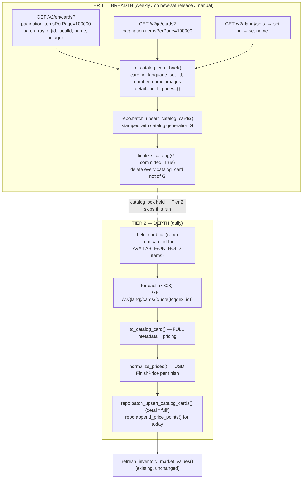

# RFC 0003: TCGdex Catalog Data Layer — Identity, Tiered Seed, and Price Normalization

- **Status:** Draft
- **Author:** design-doc agent (for Ethan Harter)
- **Date:** 2026-07-26
- **Branch:** `Database-Redesign-Second-Round`
- **Implements:** `claude-progress.txt` PHASE 1 (TCGdex client + multilingual model) and PHASE 2 (wipe + reseed)
- **Depends on locked decisions:** D1 (TCGdex only), D3 (store everything / show unsold), D4 (wipe scope), Q1 (display in USD)
- **Does not cover:** the slab pipeline (PSA/PriceCharting, Phase 4), the importer rewrite (Phase 3), display scoping (Phase 5). Those are separate RFCs/phases and this document only fixes the contracts they consume.

---

## Summary

Replace `pokemontcg.io` with TCGdex as the sole catalog source, and split what is
today one monolithic "sync the catalog" job into **two tiers with different
cadences, because coverage and pricing are different problems.** Live API
research (verified against `api.tcgdex.net` on 2026-07-26) established that
TCGdex returns the *entire* English catalog — ~23,444 cards — in a single
sub-second 2.36 MB request, but exposes **pricing only on the per-card detail
endpoint**. The business holds ~291 singles + 17 slabs + 3 sealed items. Pricing
the whole catalog therefore costs ~35,000 requests per run to produce data that
is 99.1% never displayed.

This RFC recommends **Tier 1 (Breadth)**: one list request per language seeds
every card's identity (id, name, number, set, image, language) so the matcher can
resolve any row on the sheet; and **Tier 2 (Depth)**: one detail request per
*held* card hydrates full metadata *and* prices, ~308 requests/day. It also
settles card identity (`card_id = "{api_lang}:{tcgdex_id}"`), the `language`
field and the matcher index key, the exact USD normalization rule including the
Cardmarket EUR path, the TCGdex→internal finish mapping that preserves
`build_review.finish_from_source` untouched, sync/staleness/outage behavior, the
generation-swap fix for the catalog (which today cannot participate in the swap
at all), and the safety rails for the authorized destructive wipe of the live
`merlins-cards` table.

---

## Motivation

`pokemontcg.io` is English-only. The current design bands every Japanese row `NA`
("no catalog identity to find and never will" —
`backend/scripts/build_review.py`), which is a settled-answer band for a premise
that is about to become false. D1 removes that premise. TCGdex covers Japanese,
ships pricing from two providers, is MIT-licensed, unauthenticated, and — unlike
`pokemontcg.io`, whose intermittent instability forced the 25-attempt retry loop
and 2.2 s page pacing still sitting in `backend/scripts/seed_catalog.py` — served
the full catalog in one request with no observed rate limiting.

But the brief's Phase 2.1 ("reseed the catalog over TCGdex, writing catalog_card
+ initial price_point rows") was written before we knew pricing is one HTTP call
per card. Executed literally it is a ~35,000-request job producing ~22M
price-history rows per year for cards the site will never list. The central job
of this RFC is to resolve that, and to settle the identity/normalization
questions the brief left as "decide the id scheme" and "decide the display rule".

---

## Detailed Design

### 0. The distinction this whole design rests on

> **Coverage is not pricing.**
>
> The **matcher** needs broad catalog **coverage** — every card that could appear
> on the sheet must be findable by (name, number, language), including Japanese
> printings and cards we have never owned. Coverage is identity data. It is
> cheap, it changes only when a new set releases, and it is worthless without
> breadth.
>
> The **site** needs **prices** only for cards it actually lists for sale.
> Pricing is volatile, expensive (one request per card), and worthless without
> freshness.
>
> Fetching them together — which is what a single `sync_catalog` implies — forces
> the cheap-and-broad thing to run at the cadence of the expensive-and-narrow
> thing. Splitting them is the entire architectural move in this RFC.

### 1. Tiered seed/sync strategy — the options

| | (a) Breadth-cheap, depth-on-demand **[RECOMMENDED]** | (b) Full catalog with pricing | (c) MIT bulk repo / self-hosted image |
|---|---|---|---|
| Requests, initial seed | 2 list + 2 set-list = **4** | ~35,000 (23,444 EN + JP) | 0 API; 1 repo clone / 1 container |
| Requests, steady state (daily) | ~**308** (held cards only) | ~35,000/day | 0 API for breadth; still ~308/day for prices |
| Wall-clock, steady state | ~30 s (at 0.1 s spacing) | ~58 min for EN alone at 0.1 s spacing; ~1 h+ with JP | n/a |
| Catalog rows written | ~23.4k EN + JP | same | same |
| `price_point` rows/day | ~308–900 | ~60,000 | ~308–900 |
| `price_point` rows/year | ~0.3M | **~22M** | ~0.3M |
| Prices for cards we list | yes | yes | yes |
| Prices for cards we don't list | no | yes (99.1% waste) | no |
| New infrastructure | none | none | **yes** (container to host/run, or a submodule + build step in CI and prod) |
| Matches TCGdex's own guidance ("cache locally rather than re-fetch") | yes | no | yes |

**Recommendation: (a).**

The decisive number is business size. 308 held items against a 23,444-card
English catalog means **0.9% of the priced rows would ever be read**. Option (b)
spends 99.1% of its request budget and ~22M DynamoDB rows/year to keep prices
fresh on cards we do not own, cannot sell, and never render. There is no product
surface that reads an unheld card's price: `/inventory/search`, the MCP tools,
and the public endpoints all project from `InventoryItem` rows and enrich via
`batch_get_catalog_cards` on `card_id`s that came *from inventory*
(`routers/inventory.py`). A price with no item attached is unreachable by
construction.

Option (b) is also the option most likely to get us rate-limited or blocked. The
API is free and unauthenticated; 35,000 requests/day from one client against a
volunteer-run service, to fetch data they explicitly tell you to cache, is
antisocial. We would be creating the throttling that the design then has to
survive.

Option (c) solves a problem option (a) already solved in **one request**. The
bulk repo gives us breadth offline — but breadth is not the expensive half, and
the repo does **not** carry live pricing (pricing is a live-API concern), so (c)
still needs the Tier 2 depth pass verbatim. Its cost is a genuinely new piece of
infrastructure — a container to run and keep updated, or a data submodule wired
into CI and prod — which D1's spirit and the project's YAGNI posture do not
justify for a 291-single business. **It is recorded here as the documented
escape hatch:** if TCGdex introduces rate limits, withdraws the
`pagination:itemsPerPage` behavior, or the list endpoint's latency degrades, the
breadth tier — and only the breadth tier — swaps to the bulk repo behind the same
`TcgdexClient.iter_brief_cards()` interface. That is a one-implementation change,
not a redesign, which is precisely why (a) is safe to pick now.

**Explicitly rejected sub-option:** extending Tier 2 to "recently viewed or
otherwise needed" cards. Customer surfaces only ever render `status=AVAILABLE`
inventory (D3, Phase 5), which is a subset of held; there is no view that can
request an unheld card. Adding a fetch-on-view path would put an uncached
external HTTP call on a customer request path — new latency, new failure mode,
new cache-invalidation problem — for zero reachable benefit.

### 2. The two tiers, concretely



**Tier 2 is a hydration pass, not merely a price pass.** The single
`GET /cards/{id}` that fetches pricing also returns rarity, types, set logo and
`variants` — everything the brief list omits. So promotion from brief to full
metadata and price acquisition are the *same* request. A card becomes held the
moment the importer resolves a `card_id` for it; the next daily run picks it up
from `repo.list_inventory()` with no registry to maintain.

`detail: Literal["brief", "full"]` on `CatalogCard` is what makes the two tiers
distinguishable downstream, and it exists for an honesty reason: the review page
must be able to say *"this card has no price because we never hydrated it"*
rather than implying *"neither provider covers this card"*. Those are different
facts and the guardrails forbid conflating them.

### 3. Card identity — `card_id`

**Decision: `card_id = f"{api_lang}:{tcgdex_id}"`** — e.g. `en:base1-4`,
`ja:M5-001`, `en:exu-!`.

`api_lang` is the **TCGdex API language code** (`en`, `ja`), not the domain
`Language` enum value (`EN`, `JP`). One mapping table lives in `services/tcgdex.py`:

```python
LANGUAGE_API_CODE = {Language.EN: "en", Language.JP: "ja"}
API_CODE_LANGUAGE = {v: k for k, v in LANGUAGE_API_CODE.items()}
```

`ja` vs `JP` is a live footgun (they differ, and both appear in this system), so
the rule is: **the enum is for the domain, the code is for the URL, and the code
is what goes in `card_id`** — because `card_id`'s second job is to reconstruct a
request path.

**Rejected alternative: bare TCGdex id.** The brief suggested it ("use TCGdex's
own id; it is stable") and the research confirms EN and JP namespaces are
currently disjoint, so a bare id would work *today*. It is rejected because D1
requires a JP card and its EN twin to be **distinct catalog rows**, and a bare id
makes that invariant depend on an upstream promise no one made to us. A single
future namespace collision would silently *merge* two printings into one
DynamoDB row — a JP card overwriting its EN twin's prices — which is exactly the
failure D1 forbids, would be near-undetectable, and has no cheap remediation
after the fact. The composite key makes the invariant structural. It also means a
stored `card_id` alone is sufficient to build its detail URL; a bare id would
force every Tier 2 call to read `language` out of the row body first.

**Cost of the composite:** none worth counting. Every stored `pokemontcg.io` id
is dead after the D4 wipe, so there is no migration. `card_id` is never a URL
path segment in our own API — it appears only as a JSON body field
(`routers/inventory.py`, `frontend/lib/inventory.ts`,
`frontend/components/inventory/CardGrid.tsx`) — so `:` introduces no routing
hazard. `:` is legal in DynamoDB keys and does not collide with the `#` SK
delimiter.

**`set_id` takes the same composite form** — `en:base1`, `ja:M5` — so that
`card_id == f"{set_id}-{local_id}"` continues to hold structurally, the
`GSI1PK = SET#{set_id}` partition stays unambiguous across languages, and
`list_cards_by_set` needs no signature change. `set_name` remains the display
value; `card_text.sets_agree` compares set *names*, so it is unaffected.

**Deriving `set_id` from a brief record.** The brief list gives `id` and
`localId` but no set. Since `id == f"{set_id}-{local_id}"`, the split is exact
and must be done by **length, not by delimiter**:

```python
tcgdex_set_id = tcgdex_id[: -(len(local_id) + 1)]   # correct for exu-! and base1-4
```

Splitting on the last `-` is wrong for any `local_id` containing a hyphen and is
forbidden.

#### 3a. The URL-encoding hazard

Real ids include `exu-!` and `exu-%3F`. Two separate concerns:

1. **Building request paths.** All id interpolation goes through one function,
   `tcgdex.encode_card_id(tcgdex_id) -> str`, and no call site may build a path
   by f-string. The default rule is `urllib.parse.quote(tcgdex_id, safe="")`.
   There is a genuine ambiguity the research cannot settle from the response
   alone: if the id's literal characters are `e`,`x`,`u`,`-`,`%`,`3`,`F`, then
   `quote(..., safe="")` yields `exu-%253F` and the server must double-decode;
   if the API is instead reporting an already-encoded form of the id `exu-?`,
   the correct request is `exu-%3F` and quoting again breaks it. See Open
   Question **OQ-2** — it is resolved by a two-request spike in Phase 1, not left
   open, and the fixture corpus pins whichever answer the spike returns.
2. **Storage keys.** `!`, `%`, `?`, `:` are all safe in a DynamoDB `S` key, and
   `PK = CARD#<card_id>` uses the whole string, so no id can corrupt a key. The
   one real corruption risk is a `#` inside a **finish** name, which would break
   `SK = PRICE#RAW#{finish}#{date}` parsing — see §6.

### 4. The `language` field and the matcher index

`language: Language = Language.EN` goes on **`CatalogCard`** (mirroring
`_ItemBase.language` in `models/inventory.py`, including the default, so records
written before the field existed still validate). It is stored as a field rather
than parsed out of `card_id` at read time because the matcher indexes on it,
DynamoDB filters can read it, and a model should not have to parse its own
primary key. The redundancy with the `card_id` prefix is accepted and pinned by a
test asserting the two agree for every mapped card. A pydantic validator was
considered and rejected: it would drag the `LANGUAGE_API_CODE` table from
`services/` into `models/`, and `models/catalog.py` currently imports nothing
from `services/`.

**Only `EN` and `JP`.** Q4 is resolved empirically: the sheet contains only
`Language=English`, `Language=all`, and an `(jp)` name marker. `Language` already
has exactly these two members. **Do not add FR/DE/IT/ES/PT**, and do not fetch
those language lists — every added language is another ~20k catalog rows and
another axis of matcher ambiguity for data that does not exist.

**Index key.** `card_text.build_catalog_index` currently keys
`by_name_number[(name, num_key)]`. It becomes a **3-tuple with language last**:

```python
by_name_number[(normalize_name(name), num_key, language)] -> [card]
by_core_number[(core_name(name),     num_key, language)] -> [card]
```

Plus two accessors on the frozen `CatalogIndex` dataclass:

- `lookup(name, num_key, language) -> list` — the importer's primary path.
- `lookup_any_language(name, num_key) -> dict[Language, list]` — for the review
  page's cross-language corroboration.

**Why one index with a 3-tuple key rather than one index per language:** a single
build pass over ~23k rows, one object to pass around, and — decisively — the
review page needs to answer *"this JP row matched nothing in JP but does match an
EN card"*, which per-language dicts make awkward and a 3-tuple makes trivial.
That answer is what retires the `NA` band (Phase 6.1): a JP row now bands by
confidence, and a JP-row-matching-only-an-EN-card becomes an explicit `MEDIUM` +
`needs_review`, never a silent link to the wrong-language card.

**Set-based JP inference falls out for free.** Q4 notes some Slabs rows are
Japanese only by set (`SV11B`, "Shiny Treasure EX") with no name marker and no
URL. After the breadth seed, *the catalog itself is the lookup table*: a set id
or set name present under `ja` and absent under `en` is a JP signal. So
`card_text` gains `language_from_set(set_text, index) -> Language` reading the
seeded index, with a small hardcoded fallback list (`SV11B`, `Shiny Treasure EX`)
for stub/offline mode where no catalog is loaded. This is a direct payoff of
buying breadth: coverage we needed anyway also solves language detection.

### 5. Price normalization to USD (Q1 is locked: display in USD)

**The invariant: every `Decimal` in `FinishPrice` and every `PricePoint.market`
is USD.** Provenance is recorded alongside; it never changes the unit. This
keeps `models/inventory.py::_market_price` and
`build_review.py::_catalog_price` correct **with no changes at all** — they read
`prices[finish].market` and can keep assuming one currency.

**The rule, in order:**

1. **TCGplayer.** `pricing.tcgplayer.<finish>.marketPrice` → `FinishPrice.market`.
   `lowPrice`/`midPrice`/`highPrice` → `low`/`mid`/`high`.
   `source="tcgplayer"`, `source_currency="USD"`, `value_note=None`.
   `unit` is asserted to be `"USD"`; a non-USD unit is a mapping failure (counted,
   card skipped) rather than a silent mis-priced card.
2. **Cardmarket (EUR).** Only when TCGplayer is absent/null for that finish.
   Converted with a **config FX constant**:
   - config key **`EUR_USD_RATE`** (`settings.eur_usd_rate: Decimal`), **default
     `Decimal("1.08")`**.
   - `source="cardmarket"`, `source_currency="EUR"`, and
     `value_note="converted from EUR 12.50 at EUR_USD_RATE=1.08"` — **required**,
     on both the `FinishPrice` and the emitted `PricePoint`.
   - **Which Cardmarket field is "market": `trend`.** Justification: TCGplayer's
     `marketPrice` is a *computed current-value estimate*, not a raw average.
     Cardmarket's semantic analog is `trend` (their own price-trend estimate);
     `avg` is a long-window average of completed sales and lags hard on a moving
     card, which would systematically under-price exactly the cards whose price
     is moving. Fallback chain when `trend` is null:
     **`trend` → `avg7` → `avg30` → `avg`**, and the `value_note` names the field
     actually used. `low` maps to `FinishPrice.low`; `avg` maps to
     `FinishPrice.mid`; **`high` stays `None`** — Cardmarket publishes no high, and
     synthesizing one would be inventing data.
   - **`-holo` suffixed fields → the `holofoil` finish**; unsuffixed fields → the
     `normal` finish. A `holofoil` band is emitted only when at least one `-holo`
     field is non-null. **Cardmarket figures are never mapped to
     `reverseHolofoil`** — the flat block does not distinguish reverse prints, so
     any such mapping would be a guess presented as a price. A reverse single
     backed only by Cardmarket data therefore falls through
     `FINISH_PREFERENCE` and `build_review._finish_caveat` emits its existing
     *"the name reads as a 'reverseHolofoil' print, but the matched card has no
     reverseHolofoil price … verify the finish/band"* warning. That is the honest
     outcome and it is already built.
3. **Neither provider.** Write **no** `FinishPrice` and **no** `PricePoint` for
   that finish — not a null-market band, not a zero. Absence in the catalog is
   the signal. The importer then falls back to the sheet's own value and sets
   `needs_review=True` (already its behavior, and the brief's guardrail: never
   invent a figure, never halt).

**Japanese cards will mostly take path 2.** The research found JP cards with
`tcgplayer: null` and a populated `cardmarket` block, so the FX path is the
*normal* path for JP inventory, not an edge case. It must be first-class and
first-tested.

**Why a constant and not a live FX feed.** A live rate is a new external
dependency, a new key, a new outage mode, and a new staleness problem, in
exchange for a few percent of accuracy on figures that are already a
second-choice fallback and already sit inside a low/mid/high spread far wider
than FX drift. The constant is one env var; the `value_note` prints the exact
rate used, so any figure is auditable and re-derivable. If the rate ever needs to
move, it is a config change with no code deploy. Rejected alternative recorded:
`exchangerate.host`/ECB daily feed — revisit only if the business starts pricing
in EUR, which it does not.

### 6. Finish mapping

**The internal finish vocabulary does not change.** The canonical keys stay the
existing `pokemontcg.io`-shaped camelCase set:

`normal`, `holofoil`, `reverseHolofoil`, `1stEditionHolofoil`,
`1stEditionNormal`, `unlimitedHolofoil`

Four live code paths already hardcode these, and the finish-band inference added
this session **must be preserved**:

- `models/inventory.py::_MARKET_FINISH_FALLBACK`
- `scripts/build_review.py::FINISH_PREFERENCE`
- `scripts/build_review.py::finish_from_source` — **returns** these exact keys
- stored `RawInventoryItem.finish` values and every
  `SK = PRICE#RAW#<finish>#<date>` already written

So normalization happens **at the TCGdex boundary and nowhere else**:

```python
TCGDEX_FINISH_MAP = {
    "normal":           "normal",
    "holofoil":         "holofoil",
    "reverse-holofoil": "reverseHolofoil",   # note: hyphenated upstream
}
```

**Unknown / future keys** (the research is explicit that the finish keys must be
iterated, not enumerated): pass through a deterministic
`_camelize(key)` — hyphen/underscore-separated → lowerCamel, so a future
`first-edition-holofoil` lands as `firstEditionHolofoil`. They are **not
dropped** (that is silent data loss) and **not guessed into** a canonical key
(that is inventing a band). An unmapped band is still reachable: both
`_market_price` and `_catalog_price` end with "any finish that carries a market
figure". Guard: a mapped key containing `#` is rejected and counted as a mapping
failure, because it would corrupt the `PRICE#RAW#…` sort key.

**`finish_from_source` is not changed by this RFC, and may not be.** Its output
vocabulary is the contract the mapper targets. It can legitimately return
`1stEditionHolofoil`/`unlimitedHolofoil`, which TCGdex never emits under any
name; that produces a `FINISH_PREFERENCE` fallback plus the existing
`_finish_caveat` warning — the already-correct behavior for "we read a band off
the name but the catalog can't confirm it".

**`variants` / `variants_detailed` are not stored.** `variants_detailed[].pricing`
is explicitly supplementary and can be null even when top-level `pricing` is
populated, so top-level `pricing` is the sole source of truth. Adding a
`variants` field to `CatalogCard` has no consumer today (YAGNI); the one place it
was tempting — deciding whether a Cardmarket `-holo` band is real — is handled by
the simpler "emit when non-null" rule above and flagged as **OQ-3**.

### 7. Sync cadence, staleness, and outage behavior

`services/catalog_sync.py` splits:

| Function | Cadence | Requests | Failure posture |
|---|---|---|---|
| `sync_catalog_breadth(repo, client, languages, *, gen)` | weekly / on new-set release / manual | 4 | leaves prior generation intact (§8) |
| `refresh_held_prices(repo, client, today)` | daily | ~308 | per-card failures counted; existing prices never touched |
| `snapshot_graded_prices` / `snapshot_sealed_prices` / `refresh_inventory_market_values` | daily (unchanged) | 0 | unchanged |

`run_daily_sync` becomes `refresh_held_prices` + the three existing steps.
**Breadth is deliberately not in the daily job** — it is a different cadence for
a different kind of data, which is the whole point of §0.

**Held set:** `{item.card_id for item in repo.list_inventory() if item.card_id and
item.status in (AVAILABLE, ON_HOLD)}`. Sold items are excluded: their realized
sale price is recorded on the transaction and a live market price for something
we no longer own has no consumer. *Tradeoff:* per-card price history stops
accruing once the last copy sells; if longitudinal analytics on sold stock is
ever wanted, widen this predicate — the history already written is retained
either way (see §8 on why `price_point` is never generation-swept).

**`pricing.*.updated` handling.** Stored as
`FinishPrice.source_updated_at` / `PricePoint.source_updated_at`. It is **not**
used to dedupe: a daily observation of an unchanged figure is a legitimate
history row and they are cheap at this volume. It is used for exactly one
behavior — when `source_updated_at` is older than
`settings.catalog_price_stale_days` (**default 30**), the figure is still stored
but the staleness is appended to `value_note`, so a customer-facing number is
never silently ancient. Anything more elaborate (suppressing stale prices,
auto-flagging `needs_review`) is deferred; it would degrade the site in exchange
for a warning we can already render.

**Outage behavior (D1: an outage delays a refresh, it never takes the site down).**
The site reads prices from **DynamoDB, never from TCGdex** — no request path
touches the API. Concretely:

- `refresh_held_prices` catches per-card errors, counts them under `failures`,
  and **never deletes, zeroes, or nulls an existing price**. A total outage means
  0 cards updated and yesterday's cached prices serve unchanged.
- After `max_consecutive_failures` (**default 25**) consecutive failures the run
  aborts and returns `{"aborted": True, ...}` rather than burning ~300 timeouts
  against a dead endpoint.
- Politeness pacing: `request_delay_seconds` (**default 0.1**) → ~30 s for 308
  cards. No rate limiting was observed; this is courtesy, not necessity, and is
  configurable to 0 for tests.
- A breadth-sync failure leaves the previous catalog generation fully in place
  (§8), so a failed reseed is a no-op, not an outage.

### 8. The generation swap — and the `_gen()` gap

**The gap, precisely.** `dynamodb.py::_IMPORT_OWNED_ENTITIES` deliberately
*excludes* the catalog ("The catalog side … is NOT import-owned and is
preserved"), and `_catalog_item()` does **not** splice in `**self._gen()` the way
`put_inventory_item` / `put_transaction` / `put_show` do. So **the catalog cannot
participate in the load-then-swap at all.** A reseed today is a destructive
in-place overwrite, and every old `pokemontcg.io`-keyed row — whose id TCGdex
will never rewrite — survives forever as an orphan. That is the "known
pre-existing `_gen()` gap" the brief flags, and it is load-bearing for Phase 2:
without it there is no way to reseed without either a half-empty catalog or
permanent garbage.

**The fix — a second, parallel generation domain, not an extension of the first.**

> **Do not simply add `catalog_card` to `_IMPORT_OWNED_ENTITIES`.** That would
> make every *spreadsheet* import's `finalize_import(committed=True)` sweep the
> catalog, coupling two unrelated lifecycles: a routine sheet re-import would
> delete the entire catalog because it did not rewrite it. This is the single
> most tempting wrong fix here.

Instead:

- `_CATALOG_OWNED_ENTITIES = frozenset({"catalog_card"})`
- lock item `{"PK": "CATALOGLOCK", "SK": "LOCK"}`, same conditional-write +
  TTL-expiry semantics as `_LOCK_KEY`
- `_catalog_gen`, set by `set_catalog_generation(gen)`, spliced into
  `_catalog_item()`
- `acquire_catalog_lock(gen)` / `release_catalog_lock(gen)` /
  `finalize_catalog(gen, *, committed)`
- the shared body of the existing implementation is extracted into
  `_acquire_lock(key, gen, ttl)` and `_finalize_generation(gen, committed,
  owned_entities)`, so there is **one algorithm with two configurations**, not a
  copy

**`price_point` is deliberately NOT in the catalog-owned set.** Price history is
append-only and must survive a reseed; sweeping it on every catalog swap would
delete history the daily job spent months accruing. The D4 wipe of existing
`price_point` rows is a **one-time migration** (§9), not a recurring swap
behavior. Corollary: a `price_point` written yesterday under a now-superseded
`card_id` becomes an orphan — acceptable and bounded, since after the wipe every
`card_id` in the table is a TCGdex composite id and orphans arise only when
TCGdex retires a card.

**Reseed sequence** (site never observes a half-empty catalog):

1. `gen = new_ulid()`; `acquire_catalog_lock(gen)`; `set_catalog_generation(gen)`
2. Tier 1 breadth writes all ~23.4k rows **alongside** the existing catalog (new
   `card_id`s, so no collision with the dead pokemontcg rows)
3. on success: `finalize_catalog(gen, committed=True)` — deletes every
   `catalog_card` not of `gen`, i.e. the entire old pokemontcg catalog, in one
   swap; writes marker `{"PK": "CATALOGGEN", "SK": "CURRENT", "gen": gen}`
4. on failure: `finalize_catalog(gen, committed=False)` — deletes only this run's
   rows; the old catalog is untouched and the site is unaffected
5. `release_catalog_lock(gen)` in a `finally`

**Race the daily job must avoid.** If `refresh_held_prices` writes a
`catalog_card` after the reseed has passed that card but before `finalize`, the
row carries the *old* generation and the commit sweeps it — the card silently
vanishes. Mitigation: `refresh_held_prices` **acquires the same catalog lock**;
if it is held, the run skips with `{"skipped": "catalog reseed in flight"}`.
Outside a reseed it stamps the current generation read from the `CATALOGGEN`
marker, so its in-place updates survive the next commit.

**Cost note.** `_finalize_generation` is a full-table `Scan` with
`ConsistentRead=True`. At 55k items pre-wipe / ~25k post-seed that is seconds and
cents — fine for a per-reseed operation, and a reason `finalize_catalog` must
**not** run daily.

### 9. Migration / wipe (D4) — blast radius and safety rails

The owner has **authorized running this live** against `merlins-cards`
(us-east-1, **55,210 items** today) and **explicitly declined a backup step**.
This is destructive and irreversible. It is therefore specified in more detail
than anything else in this RFC.

**DELETE**

| Entity | Why |
|---|---|
| `catalog_card` | via `finalize_catalog` swap (§8), not a blind scan-delete |
| `price_point` | keyed to dead `pokemontcg.io` `card_id`s; unreachable after the reseed |
| `inventory_item` | D4; re-created by the Phase 3 import |
| sheet-derived `transaction` | D4; re-created by the Phase 3 import |
| `graded_price` | **recommended, needs confirmation (OQ-4)** — keyed on `card_id`, so every row is orphaned by the id-scheme change; re-derivable from the sheet's Sticker/Current Market |
| `item_price_point` | **recommended, needs confirmation (OQ-4)** — keyed on `item_id`, and every `item_id` is regenerated by the re-import |

**PRESERVE**

`show`, `consignor`, `cash_account`, `buying_policy`, `payment_method`,
`debt`, `payout`, `expense`, the **frozen** `balance_sheet_snapshot` baseline.
The rate-limit counters live in a **separate table**
(`settings.rate_limit_table_name = "merlins-rate-limits"`) and Cognito holds
auth — both are structurally out of this table's blast radius, which is worth
stating rather than assuming.

> ### RISK — the second wipe nobody asked for
>
> `_IMPORT_OWNED_ENTITIES` includes `expense`, `debt`, `payout`, `show`,
> `consignor`, `cash_account`, `buying_policy`, `payment_method`,
> `balance_sheet_snapshot`. The Phase 3 spreadsheet import ends with
> `finalize_import(committed=True)`, which **deletes every import-owned record not
> of the new generation**. The 7-25 workbook is scoped to five tabs; **the finance
> tabs are explicitly out of scope and will not be re-imported.** Therefore the
> Phase 3 import — entirely separately from this RFC's catalog wipe — will delete
> every `expense`, `debt` and `payout` written by a previous run from an older
> workbook, because nothing recreates them.
>
> This is a real, code-grounded consequence of running Phase 3 against a
> reduced-scope workbook, and D4 says to preserve exactly this data. Three
> options, none of which this RFC may choose unilaterally: (i) import the finance
> tabs after all; (ii) remove the finance entities from `_IMPORT_OWNED_ENTITIES`
> so the sweep cannot reach them; (iii) accept the loss with explicit owner
> sign-off. Raised as **OQ-5**; it must be settled *before* Phase 3 runs, not
> after.

**Safety rails** — all of these, in a new `backend/scripts/wipe_card_data.py`:

1. **Dry-run is the default.** Writing requires `--execute`.
2. **Explicit destructive acknowledgement flag** — `--i-understand-this-is-destructive`
   — in addition to `--execute`.
3. **Target assertion.** `--table` and `--region` must be typed explicitly and
   must equal `settings.dynamodb_table_name` / `settings.aws_region`. A mismatch
   aborts. (This is the worktree-shadowing guardrail applied to data: the sibling
   checkout exists and this script must never be pointed at a surprise table.)
4. **Pre-flight census.** One projection-only scan producing counts per `entity`,
   printed. Abort if `catalog_card == 0` or `show == 0` — either strongly
   suggests the wrong table.
5. **Preserved-entity assertion.** Capture preserved-entity counts before; re-count
   after; **fail loud and non-zero** if any preserved count changed by even one.
6. **Targeted deletes only.** Scan filtered on `entity IN (…)` + `batch_writer`.
   Never `DeleteTable`, never an unfiltered sweep.
7. **Ordering: reseed first, delete second.** Tier 1 breadth loads the new
   catalog, `finalize_catalog(committed=True)` swaps it in, *then* the other
   deletions run, *then* Phase 3 imports. The site is never without a catalog.
8. **Expected before/after published** in the run log: 55,210 items before;
   ~23.4k EN + JP `catalog_card` + ~308 `inventory_item` + a first day of
   `price_point` after. An operator who sees a wildly different number stops.
9. **No backup gate** — the owner was asked and declined; recorded here as an
   accepted, named risk rather than silently omitted.

**Known transient window.** Between the wipe and the Phase 3 import, inventory
rows are gone and any straggler references a dead `card_id`. Customer surfaces
degrade gracefully rather than erroring — `_enrich` yields `card=None` and the
RFC 0001 `display_name` fallback renders name+number — which is why the two
phases should run back-to-back.

### 10. Files touched

| Path | Change |
|---|---|
| `backend/src/merlins_collection/services/tcgdex.py` | **new** — client, id helpers, mappers, finish map, FX conversion |
| `backend/src/merlins_collection/services/pokemontcg.py` | **delete** |
| `backend/src/merlins_collection/services/catalog_sync.py` | split into breadth/depth; TCGdex source strings |
| `backend/src/merlins_collection/services/dynamodb.py` | catalog generation domain + lock; extract shared lock/finalize bodies |
| `backend/src/merlins_collection/services/card_text.py` | 3-tuple index key + accessors; `language_from_set` |
| `backend/src/merlins_collection/models/catalog.py` | `language`, `detail`, price provenance fields; docstring no longer cites pokemontcg.io |
| `backend/src/merlins_collection/models/inventory.py` | docstring only (`_market_price`, `CardSummary` comments); **no logic change** |
| `backend/src/merlins_collection/config.py` | `+eur_usd_rate`, `+catalog_price_stale_days`, `-pokemontcg_api_key` |
| `backend/scripts/seed_catalog.py` | repointed at Tier 1 breadth + `finalize_catalog` |
| `backend/scripts/wipe_card_data.py` | **new** — the only genuinely new component; §9 |
| `backend/scripts/build_review.py` | **no change in this RFC** — `finish_from_source`, `FINISH_PREFERENCE`, `_finish_caveat`, `predict_value` and the bulk buttons are preserved verbatim (banding changes are Phase 6.1) |

**Flagged addition:** `wipe_card_data.py` is the one new component this RFC
introduces beyond replacing an existing one. It is justified because D4's
deletion set spans four entity types across three key layouts, is irreversible,
and is being run against live production data — that does not belong inline in
`seed_catalog.py`, and it needs its own tests.

---

## Data Schemas

### `CatalogCard` (DynamoDB: `PK=CARD#<card_id>`, `SK=META`, `GSI1PK=SET#<set_id>`, `GSI1SK=CARD#<card_id>`)

| Field | Type | Notes |
|---|---|---|
| `card_id` | `str` | **changed meaning** — `"{api_lang}:{tcgdex_id}"`, e.g. `en:base1-4`, `ja:M5-001` |
| `language` | `Language` | **new**, default `Language.EN`; agrees with the `card_id` prefix |
| `name` | `str` | TCGdex `name` |
| `set_id` | `str` | **changed meaning** — `"{api_lang}:{tcgdex_set_id}"`, e.g. `en:base1` |
| `set_name` | `str` | from the per-language set list; `""` when unavailable (see OQ-1) |
| `number` | `str` | TCGdex `localId` |
| `rarity` | `str \| None` | `None` on brief rows |
| `types` | `list[str]` | `[]` on brief rows |
| `images` | `CardImages` | `small`/`large` **now default `""`** — JP brief rows frequently have no image |
| `prices` | `dict[str, FinishPrice]` | keyed by **internal** finish name; `{}` on brief rows |
| `detail` | `Literal["brief","full"]` | **new**, default `"brief"` — which tier wrote this row |
| `priced_at` | `date \| None` | **new** — last successful Tier 2 pass |
| `last_synced_at` | `datetime` | unchanged |

Row-count estimate: ~23,444 EN + JP (unmeasured; see OQ-1).

### `CardImages`

| Field | Type | Notes |
|---|---|---|
| `small` | `str` (default `""`) | `f"{base}/low.webp"` |
| `large` | `str` (default `""`) | `f"{base}/high.webp"` |

TCGdex returns an extensionless, quality-less base URL; the suffix is ours to
append. **`webp` chosen** for payload size (`next/image` consumes it fine);
`png`/`jpg` remain valid if any consumer objects. Set logos/symbols take an
extension only, **no quality segment** — a separate helper, easy to get wrong.
Empty string when the API omits `image` (common on JP): the frontend already
treats `image_small` as optional (`CardSummary.image_small: str | None`).

### `FinishPrice` — **all values USD**

| Field | Type | Notes |
|---|---|---|
| `market` `low` `mid` `high` | `Decimal \| None` | unchanged names; now always USD |
| `currency` | `Literal["USD"]` = `"USD"` | **new** — makes the invariant explicit at the schema level |
| `source` | `str \| None` | **new** — `"tcgplayer"` \| `"cardmarket"` |
| `source_currency` | `str \| None` | **new** — `"USD"` \| `"EUR"` |
| `source_updated_at` | `datetime \| None` | **new** — provider's `pricing.*.updated` |
| `value_note` | `str \| None` | **new** — required on any converted or stale figure |

### `PricePoint` (DynamoDB `SK=PRICE#RAW#<finish>#<date>` / `PRICE#GRADED#<company>#<grade>#<date>`)

| Field | Type | Notes |
|---|---|---|
| `card_id` `date` `kind` `finish` `company` `grade` `market` `low` `mid` `high` | unchanged | |
| `source` | `str` | **values change** — `"tcgplayer"` \| `"cardmarket"` (was `"pokemontcg.io"`); `"manual"` unchanged for graded |
| `currency` | `str` = `"USD"` | **new** (Phase 1.2) |
| `source_currency` | `str \| None` | **new** |
| `source_updated_at` | `datetime \| None` | **new** |
| `value_note` | `str \| None` | **new** |

### `CatalogIndex` (`services/card_text.py`, in-memory)

| Field | Type |
|---|---|
| `by_name_number` | `dict[tuple[str, str, Language], list]` |
| `by_core_number` | `dict[tuple[str, str, Language], list]` |

### Config additions (`backend/src/merlins_collection/config.py`)

| Key | Env var | Type / default |
|---|---|---|
| `eur_usd_rate` | `EUR_USD_RATE` | `Decimal` = `Decimal("1.08")` |
| `catalog_price_stale_days` | `CATALOG_PRICE_STALE_DAYS` | `int` = `30` |
| `tcgdex_languages` | `TCGDEX_LANGUAGES` | `str` = `"en,ja"` |
| `tcgdex_offline` | `TCGDEX_OFFLINE` | `bool` = `False` — selects the fixture-backed stub client |
| ~~`pokemontcg_api_key`~~ | — | **removed** |

---

## API Contracts

### Consumed — TCGdex (`https://api.tcgdex.net/v2/{lang}`, no auth)

| Purpose | Request | Response shape used |
|---|---|---|
| Tier 1 breadth | `GET /v2/{lang}/cards?pagination:itemsPerPage=100000` | **bare JSON array** of `{id, localId, name, image?}` — not an envelope, no total-count header |
| Set names | `GET /v2/{lang}/sets` | `[{id, name, …}]` — **UNVERIFIED, see OQ-1** |
| Tier 2 depth | `GET /v2/{lang}/cards/{encode_card_id(id)}` | full object incl. `pricing`, `set{id,name,cardCount}`, `rarity`, `types`, `variants` |

Example Tier 2 pricing block (shape verified 2026-07-26):

```json
{
  "id": "base1-4", "localId": "4", "name": "Charizard",
  "set": { "id": "base1", "name": "Base Set", "cardCount": { "official": 102, "total": 102 } },
  "variants": { "normal": false, "reverse": false, "holo": true, "firstEdition": false, "wPromo": false },
  "pricing": {
    "tcgplayer": {
      "unit": "USD", "updated": "2026-07-25T21:04:11.000Z",
      "holofoil": { "productId": 42361, "lowPrice": 220.0, "midPrice": 349.99,
                    "highPrice": 900.0, "marketPrice": 331.42, "directLowPrice": 289.99 }
    },
    "cardmarket": {
      "unit": "EUR", "updated": "2026-07-25T00:00:00.000Z", "idProduct": 274,
      "avg": null, "low": 199.0, "trend": 312.5,
      "avg1": null, "avg7": 305.0, "avg30": 298.4,
      "avg-holo": null, "low-holo": 199.0, "trend-holo": 312.5,
      "avg1-holo": null, "avg7-holo": 305.0, "avg30-holo": 298.4
    }
  }
}
```

Maps to `prices = {"holofoil": FinishPrice(market=331.42, low=220.0, mid=349.99,
high=900.0, currency="USD", source="tcgplayer", source_currency="USD",
source_updated_at=2026-07-25T21:04:11Z, value_note=None)}`. The Cardmarket block
is ignored here because TCGplayer covered the finish — rule §5.1.

A JP card (`tcgplayer: null`, `cardmarket` populated) maps to
`prices = {"normal": FinishPrice(market=Decimal("13.50"), low=…, mid=…, high=None,
currency="USD", source="cardmarket", source_currency="EUR",
value_note="converted from EUR 12.50 (cardmarket trend) at EUR_USD_RATE=1.08")}`.

### Provided — internal Python interfaces (signatures only)

```python
# services/tcgdex.py
LANGUAGE_API_CODE: dict[Language, str]          # {EN: "en", JP: "ja"}
TCGDEX_FINISH_MAP: dict[str, str]

def build_card_id(language: Language, tcgdex_id: str) -> str: ...
def parse_card_id(card_id: str) -> tuple[Language, str]: ...
def encode_card_id(tcgdex_id: str) -> str: ...            # the ONLY path-builder
def map_finish(tcgdex_finish: str) -> str: ...            # raises on '#'
def convert_eur_to_usd(amount: Decimal, rate: Decimal) -> Decimal: ...

def to_catalog_card_brief(raw: dict, language: Language, *,
                          set_names: dict[str, str] | None = None,
                          synced_at: datetime | None = None) -> CatalogCard: ...
def to_catalog_card(raw: dict, language: Language, *,
                    fx_rate: Decimal, synced_at: datetime | None = None) -> CatalogCard: ...
def to_price_points(card: CatalogCard, today: date) -> list[PricePoint]: ...

class TcgdexError(RuntimeError):
    status_code: int | None

class TcgdexClient:
    BASE_URL = "https://api.tcgdex.net/v2"
    def __init__(self, *, client=None, max_retries=3, backoff_base=0.5,
                 request_delay_seconds=0.1): ...
    def iter_brief_cards(self, language: Language) -> Iterator[dict]: ...
    def list_sets(self, language: Language) -> list[dict]: ...
    def get_card(self, language: Language, tcgdex_id: str) -> dict | None: ...   # None on 404

class StubTcgdexClient(TcgdexClient):
    """Fixture-backed; selected when settings.tcgdex_offline. Same interface."""

# services/catalog_sync.py
def sync_catalog_breadth(repo, client, languages: list[Language], *, gen: str) -> dict: ...
def held_card_ids(repo) -> set[str]: ...
def refresh_held_prices(repo, client, today: date, *,
                        fx_rate: Decimal,
                        max_consecutive_failures: int = 25) -> dict: ...
def run_daily_sync(repo, client, today: date) -> dict: ...   # depth + the 3 existing steps

# services/dynamodb.py (InventoryRepository)
def acquire_catalog_lock(self, gen, *, ttl_seconds: int | None = None) -> None: ...
def release_catalog_lock(self, gen) -> None: ...
def set_catalog_generation(self, gen) -> None: ...
def current_catalog_generation(self) -> str | None: ...
def finalize_catalog(self, gen, *, committed: bool) -> int: ...
def count_by_entity(self) -> dict[str, int]: ...             # wipe pre/post census
def delete_entities(self, entities: set[str], *, dry_run: bool = True) -> dict[str, int]: ...

# services/card_text.py
def language_from_set(set_text: str, index: CatalogIndex | None = None) -> Language: ...
```

### Unchanged contracts

**No new FastAPI routes.** `GET /inventory/search`, `GET /inventory/summary`,
`POST /chat` and the public endpoints keep their current shapes. **No MCP tool
signature changes** — `get_inventory_summary`, `search_inventory`,
`get_card_price_history`, `calculate_inventory_value`,
`flag_underpriced_cards` all operate on `card_id` as an opaque string, and the
composite form passes through unchanged. **Frontend contract unchanged** —
`card_id` is a JSON body field only, never a route segment. One verification item
(not a change): confirm the set-filter dropdown in
`frontend/components/inventory/FilterPanel.tsx` sources its `set_id` values from
the API rather than hardcoding them, since `set_id` values now carry a language
prefix.

---

## Alternatives Considered

| # | Alternative | Why it lost |
|---|---|---|
| 1 | **Price the whole catalog** (the brief's literal Phase 2.1) | ~35,000 requests/run, ~58 min for EN alone, ~22M price rows/year, for data 99.1% of which is unreachable — no surface reads an unheld card's price. Also the option most likely to get us throttled by a free volunteer API that asks us to cache. |
| 2 | **MIT bulk data repo / self-hosted Docker image for breadth** | Solves in new infrastructure a problem one HTTP request already solves, and does not carry live pricing, so the expensive tier is unchanged. Retained as the documented escape hatch behind `iter_brief_cards()` if TCGdex adds rate limits. |
| 3 | **Bare TCGdex id as `card_id`** | Correct today (namespaces are disjoint) but makes D1's "JP and EN twins are distinct rows" depend on an upstream promise; one future collision silently merges two printings with no cheap remediation. Also forces a body read before any URL can be built. |
| 4 | **Derive `language` from the `card_id` prefix at read time** | Model would parse its own primary key and `models/` would need `services/`' language-code table. Storing the field costs one attribute and is what the index keys on. |
| 5 | **Per-language `CatalogIndex` objects** | Makes "matched nothing in JP but does match an EN card" awkward — exactly the query that retires the `NA` band. A 3-tuple key gives it for free with one build pass. |
| 6 | **Live FX feed for EUR→USD** | New dependency, key, outage mode and staleness problem for a few percent on a second-choice fallback already inside a wide low/high spread. The constant is one env var and `value_note` makes every figure auditable. |
| 7 | **Cardmarket `avg` (or `avg30`) as the market figure** | `avg` is a long-window average of completed sales and lags on moving cards, systematically under-pricing exactly the cards whose price is moving. `trend` is Cardmarket's own current-value estimate — the true analog of TCGplayer's `marketPrice`. `avg7`/`avg30`/`avg` remain the fallback chain. |
| 8 | **Map Cardmarket `-holo` fields onto `reverseHolofoil` when a card has no holo variant** | The flat block does not distinguish reverse prints; the mapping would be a guess rendered as a price, violating the "never invent a figure" guardrail. The existing `_finish_caveat` warning is the honest outcome. |
| 9 | **Adopt TCGdex's finish names (`reverse-holofoil`) as the internal vocabulary** | Would break `finish_from_source`'s return contract, `FINISH_PREFERENCE`, `_MARKET_FINISH_FALLBACK`, every stored `RawInventoryItem.finish`, and every `PRICE#RAW#…` SK already written — to rename a key. Normalize at the boundary instead. |
| 10 | **Add `catalog_card` to `_IMPORT_OWNED_ENTITIES`** | Couples two unrelated lifecycles: a routine spreadsheet re-import's `finalize_import(committed=True)` would delete the entire catalog. A second, parallel generation domain sharing one extracted algorithm is the minimal non-coupling fix. |
| 11 | **Generation-sweep `price_point` too** | Every catalog reseed would delete accrued price history. The D4 `price_point` deletion is a one-time migration, not recurring behavior. |
| 12 | **Fetch prices on customer view (lazy)** | Puts an uncached external HTTP call on a request path, for cards no surface can request (customer views are `status=AVAILABLE` inventory = already held = already hydrated). |
| 13 | **Dedupe `PricePoint`s using `pricing.*.updated`** | A daily observation of an unchanged figure is legitimate history and cheap at ~308/day; deduping would make the history lie about observation cadence. `updated` drives a staleness note instead. |

---

## Risks & Mitigations

| Risk | Severity | Mitigation |
|---|---|---|
| **Phase 3's `finalize_import` deletes finance entities** the reduced-scope workbook does not recreate (`expense`/`debt`/`payout`) | **High** — silent, irreversible, contradicts D4 | Flagged as **OQ-5**; must be settled before Phase 3 runs. Three options in §9. |
| Live wipe against 55,210 production items, no backup (owner declined) | **High** | Nine safety rails, §9: dry-run default, double flag, target assertion, pre-flight census with abort thresholds, preserved-entity assertion, targeted deletes only, reseed-before-delete ordering, published before/after counts. |
| Reseed leaves a half-empty catalog | Medium | Catalog generation domain + load-then-swap (§8); a failed reseed rolls back to the previous generation and is a no-op. |
| Daily refresh races a reseed and its rows get swept | Medium | Refresh acquires the same `CATALOGLOCK` and skips when held; outside a reseed it stamps the current generation from the `CATALOGGEN` marker. |
| The tempting wrong fix: adding `catalog_card` to `_IMPORT_OWNED_ENTITIES` | Medium | Called out explicitly in §8 with the failure it causes; the correct shape is specified. |
| TCGdex outage | Low | No request path touches the API; DynamoDB serves cached prices. Per-card failures counted, existing prices never zeroed, run aborts after 25 consecutive failures. |
| TCGdex changes the `pagination:itemsPerPage` behavior or adds rate limits | Medium | Breadth tier is one interface (`iter_brief_cards`); alternative 2 is the pre-analyzed swap. A paging fallback is a client-internal change. |
| Id-encoding ambiguity (`exu-%3F`) 404s a card | Low | Single `encode_card_id` chokepoint, OQ-2 spike resolves it in two requests, fixtures pin both `exu-!` and `exu-%3F`. |
| Unknown future finish key corrupts a `PRICE#RAW#…` SK | Low | `map_finish` rejects any key containing `#` and counts it as a mapping failure. |
| `EUR_USD_RATE` goes stale | Low | `value_note` prints the exact rate on every converted figure; correction is a config change, no deploy. |
| Losing the finish-band inference / bulk-button work in `build_review.py` | Medium | This RFC changes **no** line of `build_review.py`; §6 makes `finish_from_source`'s output the vocabulary the mapper targets. Banding changes are deferred to Phase 6.1. |
| JP catalog size unmeasured — memory/write-cost surprise | Low | EN is 2.36 MB / 23,444 rows; JP is smaller in practice. Client streams per language and flushes in `batch_size` chunks, as `sync_catalog` already does. Measured in the Phase-1 spike (OQ-1). |
| The 7 skipped `test_language_recall.py` tests encode the removed `NA`/English-only premise | Low | Rewrite or retire deliberately in Phase 6/7, per the brief; do not leave them skipping. |

**Security surface.** Net reduction: one unauthenticated read-only outbound
dependency replaces one API-keyed one, and `POKEMONTCG_API_KEY` leaves the config
entirely. No new inbound routes, no new auth paths, no user-supplied value ever
reaches a TCGdex URL (ids come from our own catalog, and only through
`encode_card_id`). `cost_basis` and internal prices remain out of every
customer surface — this RFC adds no field to `CardSummary`, which is the
customer-facing projection. Responses are JSON parsed into pydantic models;
`value_note` is the only new free-text field reaching a UI and it is composed by
us from numeric inputs, never echoed from the API.

---

## Testability (outside-in TDD is mandatory — CLAUDE.md)

**No test in this repo may make a network call.** The site must run fully on
stubs — that is the same posture the brief already mandates for PSA/PriceCharting
and it applies identically here.

**Fixture corpus** — `backend/tests/fixtures/tcgdex/`, captured verbatim from the
real 2026-07-26 responses, committed, never re-fetched:

| Fixture | Pins |
|---|---|
| `cards_en_brief.json` | bare-array shape; a card **with no `image`**; `exu-!` and `exu-%3F` ids |
| `cards_ja_brief.json` | JP brief rows, most without `image` |
| `sets_en.json` / `sets_ja.json` | set id→name; `serie` (singular) spelling |
| `card_en_base1-4.json` | TCGplayer `holofoil` + `normal`; `unit: "USD"` |
| `card_en_reverse.json` | the hyphenated `reverse-holofoil` key |
| `card_en_no_pricing.json` | older EX with **neither** provider → no bands written |
| `card_ja_M5-001.json` | `tcgplayer: null`, `cardmarket` populated → **the FX path** |
| `card_cardmarket_nulls.json` | `trend` null → `avg7` fallback; `avg-holo` populated |
| `card_unknown_finish.json` | a finish key outside `TCGDEX_FINISH_MAP` |

**Per piece:**

- **Mappers** (`to_catalog_card`, `to_catalog_card_brief`, `to_price_points`,
  `map_finish`, `convert_eur_to_usd`) are **pure functions over fixtures** — the
  easiest RED tests to write first and where the majority of coverage lives.
  Assertions on `card_id`, `language`, `set_id` derivation by length,
  `number`, per-finish `market`/`currency`/`source`/`value_note`, and on the
  invariant that `language` agrees with the `card_id` prefix for every fixture.
- **Client** (`TcgdexClient`) — `httpx.MockTransport` injected through the
  existing `client=` seam that `PokemonTcgClient` already established. Covers
  retry/backoff, 404→`None`, 5xx→raise, timeout, and — critically —
  **asserts the exact path string** produced for `exu-!` / `exu-%3F` so the
  encoding rule is pinned by a test rather than by a comment.
- **Sync** (`sync_catalog_breadth`, `refresh_held_prices`, `held_card_ids`) —
  `catalog_sync` already takes `repo` and `client` as parameters, so a fake repo
  + fake client needs no patching. Cases: outage (every call raises → 0 updates,
  **existing prices unchanged**), 25 consecutive failures → `aborted`, held-set
  excludes `SOLD`, lock-held → `skipped`.
- **Generation swap** (`finalize_catalog`, locks, `count_by_entity`,
  `delete_entities`) — **moto**, following the existing `endpoint_url` pattern.
  Cases: commit deletes only other generations; rollback deletes only this one;
  `price_point` is **never** touched by either; `finalize_import` does **not**
  touch `catalog_card` and `finalize_catalog` does **not** touch
  `inventory_item` (the decoupling assertion, both directions).
- **Wipe script** — moto table seeded with every entity type. Cases: dry-run
  writes nothing; missing `--execute` or missing acknowledgement aborts; table
  mismatch aborts; `catalog_card == 0` pre-flight aborts; preserved counts
  unchanged after; a deliberately mutated preserved count makes the assertion
  **fail loudly**.
- **Index + language** — `build_catalog_index` 3-tuple keys; `lookup` returns
  only same-language cards; `lookup_any_language` surfaces the cross-language
  case; `language_from_set` resolves `SV11B` / "Shiny Treasure EX" to `JP` both
  from a seeded index and from the offline fallback list.
- **Regression guard on preserved work** — the existing
  `backend/tests/scripts/test_build_review.py` suite must stay green **unmodified**.
  It is the executable proof that `finish_from_source`, `_finish_caveat`,
  finish-aware `predict_value` and the bulk buttons survived.

**Running on stubs.** `TCGDEX_OFFLINE=true` selects `StubTcgdexClient`, which
serves the fixture corpus through the identical interface, so
`AUTH_DISABLED=true` local dev, CI, and a demo can seed a small catalog and
exercise both tiers with no network at all.

**Fixture rot.** One opt-in `@pytest.mark.network` contract test, **deselected by
default** (`-m "not network"` in the pytest config), hits the live API and
asserts the fixture *shapes* still hold — the honest way to notice upstream
drift without making the suite flaky. It is never part of the green-run gate.

**Baseline to protect:** `python -m pytest backend/tests -q` → 558 passed, 7
skipped, 0 failed. The 7 skips are `test_language_recall.py` (production snapshot
gitignored); they encode the English-only/`NA` premise this RFC removes and must
be deliberately rewritten or retired in Phase 6/7 rather than left skipping.

---

## Open Questions

| # | Question | Working default so implementation is not blocked |
|---|---|---|
| **OQ-1** | **`GET /v2/{lang}/sets` is the one endpoint in this design that was NOT response-verified.** Does it exist, what is its shape, and how large is the JP card list? | Resolve with a 2-request Phase-1 spike before writing the mapper. Default if unavailable: `set_name = ""`; breadth and matching do not depend on it (the key is name+number+language, and `sets_agree` compares names only as a *corroborating* signal), so the design degrades rather than breaks. |
| **OQ-2** | Is the id `exu-%3F` literally seven characters including `%`, or an already-encoded `exu-?`? Determines whether `encode_card_id` quotes with `safe=""` or `safe="%"`. | Two-request spike: fetch both forms, keep the one that 200s, pin it in `test_tcgdex_client.py` and the fixture. Default `quote(id, safe="")`. |
| **OQ-3** | When a card has `variants.holo == False` but `variants.reverse == True`, do Cardmarket's `-holo` fields describe the reverse print? | Conservative default: `-holo` → `holofoil` only, never `reverseHolofoil` (§5). Only an owner/market-knowledge call would change it. Costs nothing to defer — the `_finish_caveat` warning already fires. |
| **OQ-4** | D4 says "ask before deleting" anything ambiguous. **Delete `graded_price` and `item_price_point` in the wipe?** | Recommended **yes**: both are keyed to identifiers (`card_id`, `item_id`) that the reseed/re-import regenerates, so keeping them leaves permanently unreachable rows keyed to dead pokemontcg ids. Both are re-derivable (sheet Sticker/Current Market; the daily sealed snapshot). Needs an explicit owner yes before `--execute`. |
| **OQ-5** | **Blocking for Phase 3, not Phase 2.** `finalize_import(committed=True)` will delete `expense`/`debt`/`payout` because the 7-25 workbook's finance tabs are out of scope and nothing recreates them. Import the finance tabs, remove those entities from `_IMPORT_OWNED_ENTITIES`, or accept the loss? | No safe default — this destroys owner data either way. Must be answered before Phase 3 runs. Phase 2 can proceed without it. |
| **OQ-6** | Image format: `webp` (chosen, smallest, `next/image`-friendly) vs `png` (transparency, universal). | Default `webp` via a single module constant; a one-line change if any consumer objects. |
| **OQ-7** | Breadth cadence: weekly cron, or manual on new-set release? | Default **manual/on-release**. Pokemon set releases are ~monthly and known in advance; a weekly cron adds a scheduled full-table finalize scan for data that rarely changes. Trivial to promote to a cron later. |
