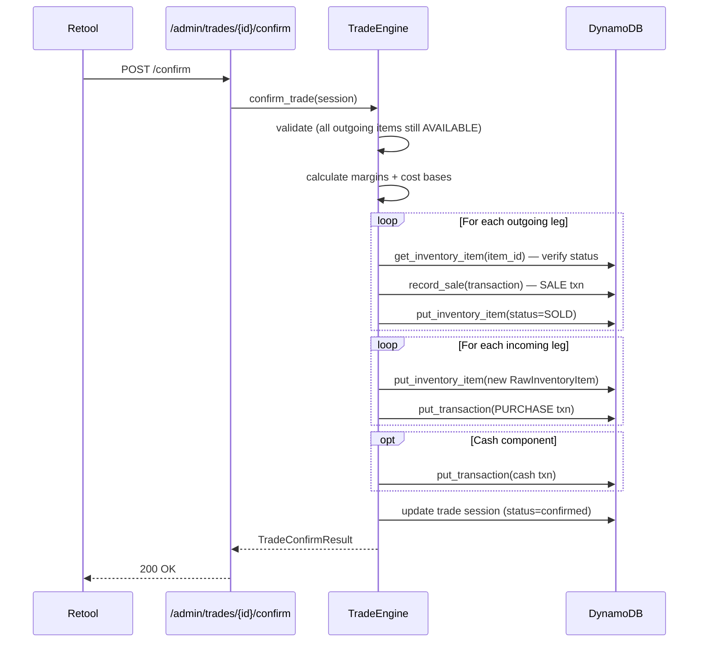
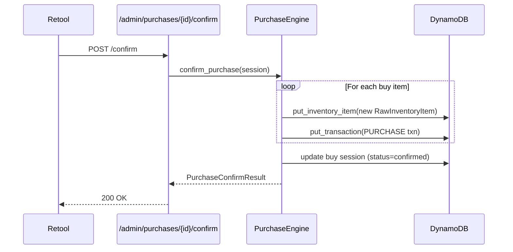
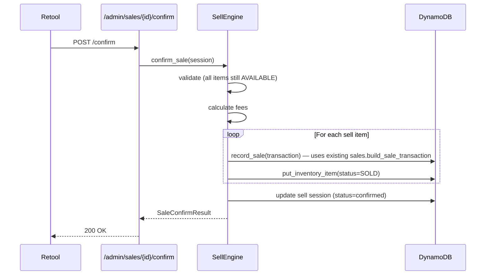

# RFC 0004: Retool Admin API

- **Status:** Draft
- **Author:** design-doc agent
- **Date:** 2025-01-27

## Summary

A comprehensive admin-only API surface (`/admin/...`) that Retool connects to for live inventory management during card shows. Covers trades (multi-card with cash components and margin tracking), buys, sells, show prep (repricing + location moves), inventory CRUD, and external market lookups.

## Motivation

The business operates at physical card shows where speed matters. Currently, inventory changes require direct database manipulation or spreadsheet reimports. A Retool-backed admin panel needs a clean API layer that:

1. Supports the full trade lifecycle (the most complex interaction — cards going out, cards coming in, cash balancing, margin tracking).
2. Records every transaction atomically for P&L accuracy.
3. Provides a "customer view" that strips internal cost data for showing trade valuations to customers.
4. Handles show prep workflows (repricing, location moves) in bulk.
5. Searches both owned inventory and the broader TCGdex market.

## Detailed Design

### Authentication

Retool authenticates via Bearer token (Cognito JWT). All `/admin/*` routes use the existing `require_admin` dependency (`backend/src/merlins_collection/dependencies.py:129`), which checks `user.is_admin` derived from Cognito group membership.

No new auth infrastructure is needed — the gate already exists and is tested.

### Router Structure

```
backend/src/merlins_collection/routers/
├── admin/
│   ├── __init__.py          # Sub-router aggregation
│   ├── inventory.py         # CRUD + search (admin view, all fields visible)
│   ├── trades.py            # Trade session lifecycle
│   ├── sales.py             # Sell flow
│   ├── purchases.py         # Buy flow
│   ├── show_prep.py         # Repricing, location moves
│   └── market.py            # TCGdex lookups, watchlist
```

All sub-routers mounted under a single `APIRouter(prefix="/admin", dependencies=[Depends(require_admin)])` so the auth gate applies once.

### Service Layer

```
backend/src/merlins_collection/services/
├── trade_engine.py          # Trade session state machine + atomics
├── purchase_engine.py       # Buy session + item creation
├── sell_engine.py           # Sell session + status flip
└── show_prep.py             # Price flagging, bulk moves
```

---

## Data Schemas

### Trade Session

A trade is a composite operation: items going out (ours, being sold), items coming in (theirs, being bought), and an optional cash component to balance. Stored in DynamoDB for multi-step durability (two admins at one show should never conflict on the same trade).

```python
class TradeMode(StrEnum):
    CUSTOMER = "customer"        # Standard customer trade
    VENDOR = "vendor"            # Vendor-to-vendor (margin transfer)

class TradeLeg(BaseModel):
    """One item in a trade — either ours going out or theirs coming in."""
    item_id: str | None = None       # Our item_id (outgoing) or None (incoming)
    card_id: str | None = None       # Catalog link
    name: str                        # Display name
    set_name: str | None = None
    condition: Condition | None = None
    condition_modifier: ConditionModifier | None = None
    finish: str | None = None
    language: Language = Language.EN
    market_value: Decimal            # TCGdex/agreed market value
    our_cost_basis: Decimal | None = None  # Internal only (outgoing legs)
    agreed_value: Decimal            # What both parties agree it's worth in this trade
    image_url: str | None = None

class CashComponent(BaseModel):
    """Cash/Venmo flowing in one direction to balance a trade."""
    direction: Literal["we_pay", "they_pay"]
    amount: Decimal
    payment_method: str              # "cash" | "venmo" | etc.

class TradeSession(BaseModel):
    trade_id: str = Field(default_factory=new_ulid)
    mode: TradeMode = TradeMode.CUSTOMER
    status: Literal["draft", "confirmed", "cancelled"] = "draft"
    show_id: str | None = None
    created_at: datetime
    confirmed_at: datetime | None = None
    created_by: str                  # admin sub

    outgoing_legs: list[TradeLeg] = []   # Our cards going out
    incoming_legs: list[TradeLeg] = []   # Their cards coming in
    cash: CashComponent | None = None

    # Computed at confirmation
    total_out_value: Decimal | None = None
    total_in_value: Decimal | None = None
    cash_delta: Decimal | None = None     # positive = we received cash
    margin_pct: Decimal | None = None     # (in_value + cash_in - cost_of_out) / cost_of_out

    notes: str | None = None
    counterparty: str | None = None       # Customer/vendor name

class TradeSessionCustomerView(BaseModel):
    """Sanitized trade view — strips cost_basis, margin, internal notes."""
    trade_id: str
    outgoing_legs: list[TradeLegCustomerView]
    incoming_legs: list[TradeLegCustomerView]
    cash: CashComponent | None
    total_out_value: Decimal
    total_in_value: Decimal
    balance_description: str          # "Even trade" / "You pay $X" / "We pay $X"

class TradeLegCustomerView(BaseModel):
    """What the customer sees: card identity + agreed value, no cost data."""
    name: str
    set_name: str | None
    condition: Condition | None
    finish: str | None
    language: Language
    agreed_value: Decimal
    image_url: str | None
```

#### Vendor-to-Vendor Margin Transfer

When `mode=VENDOR`, confirming a trade applies "split the middle" logic:

```
For each incoming leg:
    their_market = leg.market_value
    our_outgoing_avg_cost_pct = sum(out.our_cost_basis) / sum(out.market_value)
    # We split the savings: new cost basis = midpoint of their market and what
    # we'd have paid at our usual buy percentage
    new_cost_basis = (their_market * our_outgoing_avg_cost_pct + their_market) / 2
```

This means we confirm some profit on what we traded away and carry a slightly higher cost basis on what we acquired — the margin is split rather than fully realized or fully deferred.

### Buy/Sell Sessions

Lighter-weight than trades (no two-sided item negotiation), but same atomic confirmation pattern.

```python
class BuySession(BaseModel):
    buy_id: str = Field(default_factory=new_ulid)
    status: Literal["draft", "confirmed", "cancelled"] = "draft"
    show_id: str | None = None
    created_at: datetime
    created_by: str

    items: list[BuySessionItem] = []
    total_cost: Decimal | None = None
    payment_method: str | None = None
    counterparty: str | None = None
    notes: str | None = None

class BuySessionItem(BaseModel):
    """A card being purchased — becomes a new inventory item on confirm."""
    card_id: str | None = None
    name: str
    set_name: str | None = None
    number: str | None = None
    condition: Condition
    condition_modifier: ConditionModifier | None = None
    finish: str = "normal"
    language: Language = Language.EN
    market_value: Decimal             # What TCGdex says it's worth
    buy_price: Decimal                # What we're paying (our cost basis)
    buy_pct: Decimal | None = None    # buy_price / market_value as %
    location: str = "toploader"       # Where it'll be stored
    image_url: str | None = None

class SellSession(BaseModel):
    sell_id: str = Field(default_factory=new_ulid)
    status: Literal["draft", "confirmed", "cancelled"] = "draft"
    show_id: str | None = None
    created_at: datetime
    created_by: str

    items: list[SellSessionItem] = []
    total_revenue: Decimal | None = None
    payment_method: str | None = None
    fee: Decimal | None = None
    counterparty: str | None = None
    notes: str | None = None

class SellSessionItem(BaseModel):
    """An inventory item being sold."""
    item_id: str
    name: str                         # Denormalized for display
    agreed_price: Decimal             # Negotiated/listed price
    original_price: Decimal | None    # Market value before discount
    discount_pct: Decimal | None = None
```

### Watchlist (Market Lookup)

```python
class WatchlistEntry(BaseModel):
    entry_id: str = Field(default_factory=new_ulid)
    card_id: str                      # TCGdex catalog card_id
    name: str
    set_name: str
    added_at: datetime
    added_by: str
    target_buy_price: Decimal | None = None
    notes: str | None = None
    current_market: Decimal | None = None  # Denormalized, refreshed by sync
```

### Show Prep: Mispriced Cards

No new model — this is a query + update pattern on existing `InventoryItem` rows:

```python
class MispricedCard(BaseModel):
    """A card whose current_market_value has drifted from last-known by threshold."""
    item_id: str
    card_id: str | None
    name: str
    location: str | None
    old_market_value: Decimal | None
    new_market_value: Decimal
    delta_pct: Decimal                 # (new - old) / old * 100
    tcg_url: str | None
```

---

## API Contracts

### Admin Inventory CRUD

```
GET    /admin/inventory/search     # Full admin search (all fields, all statuses)
GET    /admin/inventory/{item_id}  # Single item with full detail
PUT    /admin/inventory/{item_id}  # Update any field(s) on an item
POST   /admin/inventory            # Create a new inventory item manually
DELETE /admin/inventory/{item_id}  # Soft-delete (set status=LOST) or hard-delete

GET    /admin/inventory/{item_id}/history  # Price history + transactions
```

**Search differs from customer `/inventory/search`**: no location/status filtering, all fields returned, supports searching across ALL statuses (sold, lost, etc.), and includes cost_basis/margin in response.

#### Example: Admin Search

```http
GET /admin/inventory/search?name=charizard&status=available&location=glass&sort=price_desc
Authorization: Bearer <admin_token>
```

```json
{
  "items": [
    {
      "item_id": "01J...",
      "kind": "raw",
      "card_id": "en:base1-4",
      "display_name": "Charizard #4",
      "condition": "LP",
      "finish": "holofoil",
      "location": "glass",
      "cost_basis": "45.00",
      "current_market_value": "189.99",
      "margin_pct": "322.2",
      "status": "available",
      "acquired_at": "2025-06-15",
      "notes": "Light whitening on back corners",
      "card": { "name": "Charizard", "set_name": "Base Set", ... }
    }
  ],
  "total": 1
}
```

#### Example: Update Item

```http
PUT /admin/inventory/01JABC123
Authorization: Bearer <admin_token>
Content-Type: application/json

{
  "location": "glass",
  "condition": "LP",
  "notes": "Moved from toploader binder to display case"
}
```

### Trade Endpoints

```
POST   /admin/trades                    # Create draft trade session
GET    /admin/trades/{trade_id}         # Get trade session (full admin view)
GET    /admin/trades/{trade_id}/customer-view  # Sanitized customer projection
PATCH  /admin/trades/{trade_id}         # Update trade metadata (mode, counterparty, notes)

POST   /admin/trades/{trade_id}/outgoing     # Add outgoing leg (our item)
DELETE /admin/trades/{trade_id}/outgoing/{item_id}  # Remove outgoing leg

POST   /admin/trades/{trade_id}/incoming     # Add incoming leg (their card)
DELETE /admin/trades/{trade_id}/incoming/{index}    # Remove incoming leg

PUT    /admin/trades/{trade_id}/cash         # Set/update cash component
DELETE /admin/trades/{trade_id}/cash          # Remove cash component

GET    /admin/trades/{trade_id}/balance      # Compute balance + margins
POST   /admin/trades/{trade_id}/confirm      # Atomically execute the trade
POST   /admin/trades/{trade_id}/cancel       # Cancel draft trade
```

#### Example: Confirm Trade Response

```json
{
  "trade_id": "01JXYZ...",
  "status": "confirmed",
  "outgoing_count": 3,
  "incoming_count": 2,
  "total_out_value": "125.00",
  "total_in_value": "110.00",
  "cash_received": "15.00",
  "net_margin_pct": "18.5",
  "transactions_created": 5,
  "items_created": 2,
  "items_sold": 3
}
```

### Buy Endpoints

```
POST   /admin/purchases                     # Create draft buy session
GET    /admin/purchases/{buy_id}
PATCH  /admin/purchases/{buy_id}            # Update metadata

POST   /admin/purchases/{buy_id}/items      # Add item to buy session
PUT    /admin/purchases/{buy_id}/items/{idx} # Update item details
DELETE /admin/purchases/{buy_id}/items/{idx} # Remove item

GET    /admin/purchases/{buy_id}/summary    # Total cost, avg buy %
POST   /admin/purchases/{buy_id}/confirm    # Create items + record transaction
POST   /admin/purchases/{buy_id}/cancel
```

### Sell Endpoints

```
POST   /admin/sales                         # Create draft sell session
GET    /admin/sales/{sell_id}
PATCH  /admin/sales/{sell_id}

POST   /admin/sales/{sell_id}/items         # Add item (by item_id lookup)
DELETE /admin/sales/{sell_id}/items/{item_id}

GET    /admin/sales/{sell_id}/summary       # Total revenue, fees, net
POST   /admin/sales/{sell_id}/confirm       # Mark items SOLD + record transactions
POST   /admin/sales/{sell_id}/cancel
```

### Show Prep Endpoints

```
GET    /admin/show-prep/mispriced?threshold=10  # Cards where market moved >threshold%
POST   /admin/show-prep/update-price            # Update current_market_value on item
POST   /admin/show-prep/bulk-move               # Move multiple items to new location

GET    /admin/show-prep/location-summary        # Item counts by location
```

#### Example: Mispriced Cards

```http
GET /admin/show-prep/mispriced?threshold=15&location=glass
```

```json
{
  "items": [
    {
      "item_id": "01J...",
      "name": "Mew ex",
      "set_name": "151",
      "location": "glass",
      "old_market_value": "25.00",
      "new_market_value": "32.50",
      "delta_pct": "30.0",
      "tcg_url": "https://..."
    }
  ],
  "total_flagged": 12
}
```

#### Example: Bulk Move

```http
POST /admin/show-prep/bulk-move
{
  "item_ids": ["01JABC...", "01JDEF...", "01JGHI..."],
  "new_location": "glass",
  "reason": "Prep for Portland show 2025-02-01"
}
```

### Market Lookup Endpoints

```
GET    /admin/market/search?name=charizard&set=base1  # TCGdex catalog search
GET    /admin/market/card/{card_id}                    # Full card detail + prices
GET    /admin/market/card/{card_id}/trend              # Price history (1/7/30d)

POST   /admin/watchlist                    # Add card to watchlist
GET    /admin/watchlist                    # List watchlist entries
DELETE /admin/watchlist/{entry_id}         # Remove from watchlist
```

### Photo Upload

```
POST   /admin/photos/upload-url    # Get S3 presigned upload URL
```

```json
// Request
{ "item_id": "01JABC...", "content_type": "image/jpeg" }

// Response
{
  "upload_url": "https://s3.amazonaws.com/...",
  "photo_key": "photos/01JABC.../1706384400.jpg",
  "expires_in": 300
}
```

---

## DynamoDB Storage

### Trade/Buy/Sell Sessions

Stored in the existing `merlins-cards` table using the single-table pattern:

| Entity | PK | SK | GSI1PK | GSI1SK |
|--------|----|----|--------|--------|
| Trade Session | `TRADE#{trade_id}` | `META` | `TRADES#{status}` | `{created_at}` |
| Buy Session | `BUY#{buy_id}` | `META` | `BUYS#{status}` | `{created_at}` |
| Sell Session | `SELL#{sell_id}` | `META` | `SELLS#{status}` | `{created_at}` |
| Watchlist | `WATCHLIST#{entry_id}` | `META` | `WATCHLIST#ALL` | `{added_at}` |

Sessions are ephemeral — draft sessions older than 24h can be garbage-collected. Confirmed sessions are kept indefinitely (they reference transactions).

### Existing Entities (Unchanged)

The existing `Transaction`, `InventoryItem`, `CatalogCard`, `Show`, etc. schemas are NOT modified. The admin API writes to them through the existing `InventoryRepository` methods (`put_inventory_item`, `record_sale`, `put_transaction`, etc.).

---

## Request Flows

### Trade Confirmation (the complex one)



### Buy Confirmation



### Sell Confirmation



---

## Implementation Phases

### Phase 1: Admin Auth & Router Shell
- Mount `/admin` router with `require_admin` gate
- Health check endpoint (`GET /admin/health`)
- Admin-specific search (all fields, all statuses)
- Single item CRUD (GET/PUT/POST/DELETE)
- **Tests:** Auth rejection (403), admin pass-through, CRUD on items

### Phase 2: Market Lookup
- TCGdex catalog search via `services/tcgdex.py` (already has the client)
- Price trend endpoint
- Watchlist CRUD (new DynamoDB entity)
- **Tests:** Search results, watchlist persistence, TCGdex mock

### Phase 3: Sell Flow
- `SellSession` model + DynamoDB storage
- `SellEngine` service (add items, calculate fees, confirm)
- Atomic confirmation (status flip + transactions)
- **Tests:** Full lifecycle, fee calculations, sold-item rejection

### Phase 4: Buy Flow
- `BuySession` model + DynamoDB storage
- `PurchaseEngine` service (add items, buy-% policy, confirm)
- Atomic confirmation (create items + PURCHASE transactions)
- **Tests:** Full lifecycle, policy enforcement, multi-item

### Phase 5: Trade Engine
- `TradeSession` model + DynamoDB storage
- `TradeEngine` service (full state machine)
- Balance calculator with margin tracking
- Customer view projection
- Vendor-to-vendor margin transfer
- Atomic confirmation (multi-directional)
- **Tests:** Balance math, margin transfer, atomicity, customer view sanitization

### Phase 6: Show Prep
- Mispriced card detection (threshold-based)
- Bulk location move
- Sort by price delta
- **Tests:** Flagging logic, bulk move, threshold edge cases

### Phase 7: Photo Upload
- S3 presigned URL generation
- Photo key stored on inventory item metadata
- **Tests:** URL generation, key format, auth gate

### Phase 8: Analytics/Reporting
- Show P&L aggregation (revenue − COGS − fees per show)
- Trade margin reporting (across all confirmed trades)
- Inventory velocity (days held per item)
- **Tests:** Aggregation math, date ranges, empty states

---

## Alternatives Considered

### 1. Direct DynamoDB access from Retool
Retool supports direct DynamoDB connections. Rejected because:
- No business logic layer (margin calculations, atomic multi-item operations)
- No validation (Retool could write malformed data)
- No audit trail (who did what)
- Can't enforce the SOLD→AVAILABLE state machine

### 2. GraphQL instead of REST
Retool works better with REST (native resource-based queries). GraphQL adds complexity without benefit here since each Retool panel maps cleanly to one endpoint.

### 3. Client-side session state (Retool temporary state)
Trade/buy/sell sessions could live entirely in Retool's frontend state until confirmation. Rejected because:
- Two admins could sell the same item simultaneously
- Browser crash loses the in-progress trade
- No way to resume a trade started on one device from another

---

## Risks & Mitigations

| Risk | Impact | Mitigation |
|------|--------|------------|
| Two admins sell same item | Double-sale, inventory discrepancy | Optimistic lock: verify item status=AVAILABLE at confirm time; reject with 409 if already sold |
| Trade confirmation partial failure | Some items sold, others not created | Implement as batch of DynamoDB transact-write-items (up to 100 items per txn); larger trades split into ordered sub-batches |
| Stale market prices during show | Buy/trade at wrong value | Market lookup always hits TCGdex live; show prep runs pre-show |
| Retool token expiry mid-session | Lost work on long trades | Sessions are server-side; re-auth resumes the draft |
| Photo uploads to wrong item | Incorrect condition documentation | Presigned URLs are scoped to specific item_id paths |

---

## Open Questions

1. **Trade session TTL** — How long should a draft trade persist before auto-cancellation? (Proposed: 24 hours, configurable)
2. **Bulk buy limit** — Maximum items per buy session? (Proposed: 50, to stay within DynamoDB transact-write limits)
3. **Discount authorization** — Should discounts beyond X% require a second admin approval? (Proposed: not for v1, add later if needed)
4. **Watchlist alerts** — Should the system notify when a watched card hits target price? (Proposed: defer to v2, just show current price on the list for now)
5. **Photo retention** — Keep photos indefinitely or expire after N days? (Proposed: indefinite for sold items as condition proof, S3 lifecycle rule for drafts)
