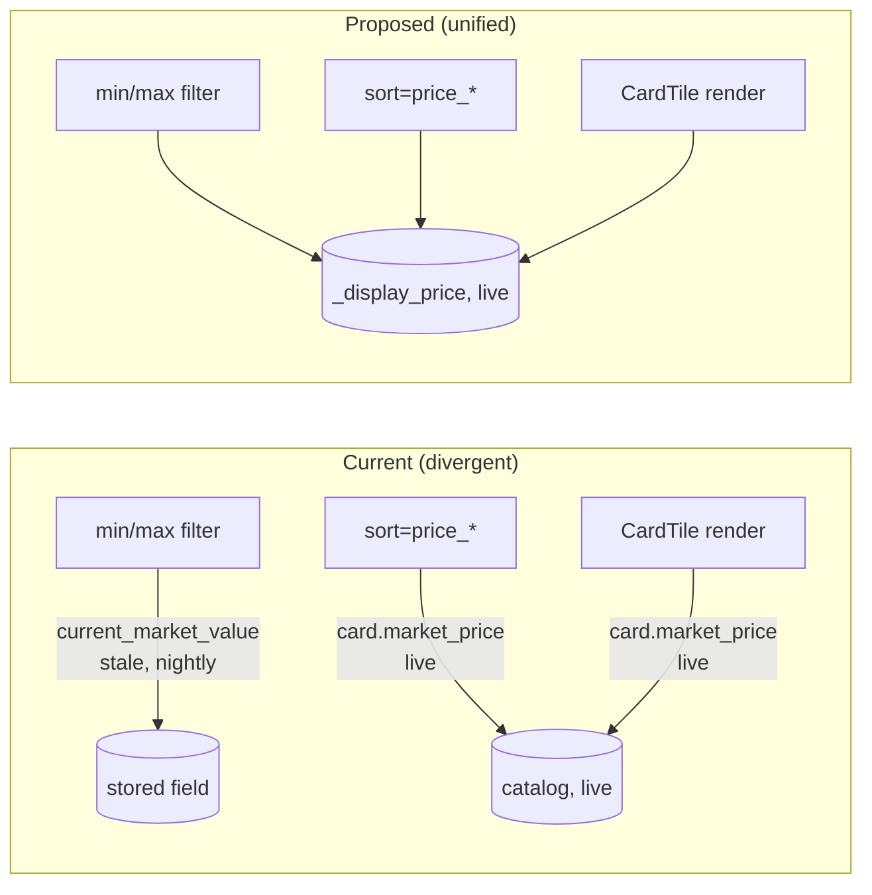

# RFC 0008: Search Correctness, Catalog Pipeline & Admin UX Fixes

**Status:** Draft
**Author:** design-doc agent
**Date:** 2026-08-05 (revised same day — §C and §E updated after owner feedback)
**Scope:** 14 owner-reported issues across the public filter search, chat mode, and the admin panel. Bug-fix + UX design only — no implementation in this RFC.

## Summary

Fourteen issues reported by the owner across `/inventory` (filter + chat) and `/admin` group into six root causes: (A) the price filter on `/inventory/search` compares a different figure than the one rendered on the card tile, letting out-of-range cards through; (B) the condition facet endpoint can never surface `LP+`/`LP-` because it only ever aggregates the bare tier; (C) Japanese-print cards have no English name to fall back to in the catalog schema, and a real fix has to reckon with how much of a card's name is even translatable without risking a wrong name in front of a customer; (D) the MCP chat tools prefer the stale nightly-denormalized price over the live catalog figure the dashboard prefers, so totals diverge; (E) catalog search on the Buy page, Trade page, Watchlist, and Catalog view returns nothing even though the catalog table is now populated (seeded post-draft of this RFC) — the leading suspect is the search endpoint's unindexed full-table scan degrading under real data volume, compounded by the frontend silently treating every failure as "no results"; (F) the admin panel is missing several pieces of CRUD/UX polish (shows CRUD, a non-scrolling sidebar, a dead vendor/customer toggle, set-filter parity, configurable columns, an incomplete/cramped item-detail editor). Each section below documents the confirmed root cause (with file:line evidence) and the fix design; nothing here has been implemented yet.

## Motivation

The owner drove the live filter search, chat mode, and admin panel and found four categories of problem: filters that don't filter correctly, a catalog-search path that returns nothing despite real data, a display bug specific to Japanese cards, and a grab-bag of admin ergonomics gaps. Several of these were reported with an accompanying hypothesis about the cause (e.g. "the dashboard value is probably static," "vendor mode might be vestigial," "the catalog table is empty") — those hypotheses are checked against the actual code below and corrected where the real cause differs, since building the wrong fix would leave the underlying bug in place. §E's investigation was revised mid-review: the owner confirmed the seed script had already been run and catalog rows are visible in DynamoDB directly, which rules out this RFC's original "empty table" diagnosis and redirects §E toward the search code path itself.

## Detailed Design

### A. Price filter/sort use different figures than the displayed price (issue #2)

**Confirmed root cause.** In `backend/src/merlins_collection/routers/inventory.py`:

- `_price()` (line 79-96), used by `_apply_price_bounds()` for `min_price`/`max_price`, reads `item.current_market_value` — the **nightly-denormalized** figure written by `services.catalog_sync.refresh_inventory_market_values`.
- `_display_price()` (line 396-409), used both for `sort=price_*` **and** documented as mirroring exactly what `CardTile.tsx` renders, reads the **live** `item.card.market_price` (computed fresh per-request via `CardSummary.from_catalog` → `_market_price()`), falling back to `listed_price`.
- The frontend (`frontend/components/inventory/CardTile.tsx:18-19`) renders `item.card?.market_price ?? item.listed_price` — i.e. the same live figure as `_display_price()`, never `current_market_value`.

So a card whose live catalog price has moved since the last nightly sync — e.g. the Rayquaza the owner saw at a **displayed** $517 — can still pass a `max_price=500` filter if its **stale** `current_market_value` was ≤ 500 at last sync. The filter, the sort, and the tile are quietly reading three different fields today (filter: stale stored value; sort: live value; tile: live value), and only two of the three agree.



**Fix.** Make `_apply_price_bounds` filter on the same value `_display_price()`/the tile already use, instead of `_price()`/`current_market_value`. Concretely: replace the `_price()` helper's body with `_display_price(item)` (after enrichment — this requires reordering `search_inventory` so catalog enrichment happens *before* the price bound is applied, since `_display_price` reads `item.card.market_price`, which today is only populated by `_enrich()` after the bound already ran). The `hidden_no_price` accounting (Phase 12 owner decision 2) is unaffected — it's still "excluded because unknown," just measured against the correct field.

**Admin-page instance (same issue, different code path — owner explicitly asked this be checked too).** `backend/src/merlins_collection/routers/admin/inventory.py:879-882`, `_effective_price()`:

```python
def _effective_price(item: InventoryItem) -> Decimal | None:
    market = item.current_market_value
    return market if market is not None else item.cost_basis
```

This backs the admin min/max price *filter* (line 163-173) — and it silently blends two different semantics (market value falling back to cost basis) under one control with no indication in the UI which basis a given result was filtered on. This is a distinct but related problem from #A above (see §K below, "price filter ambiguity," which folds in the admin filter's blended-basis issue together with the admin *sort* ambiguity the owner separately flagged as #11 — the sort itself is not ambiguous, see §K for why).

### B. Condition filter is missing LP+/LP- (issue #1)

**Confirmed root cause.** `GET /inventory/facets` (`routers/inventory.py:338-383`) builds its `conditions` list from `item.condition.value` only:

```python
if hasattr(item, "condition"):
    conditions.add(item.condition.value)   # Condition enum: NM/LP/MP/HP/DMG — modifier not included
```

`condition_modifier` (`ConditionModifier`, `+`/`-`) is a **separate stored field** (per `models/inventory.py:69-104`, `normalize_condition`) and is never combined into the facet value. So the facets endpoint structurally cannot produce `"LP+"` or `"LP-"` as distinct options — it only ever has the five bare tiers to offer, regardless of what's in inventory. This is not a data problem (LP+/LP- items exist and are stored correctly per Round 1 commit 031c45e in `claude-progress.txt`); it's that the facet aggregation throws the modifier away before the frontend ever sees it.

The frontend's `FilterPanel.tsx:135-151` renders `condition` options straight from `facets?.conditions`, not from the existing `CONDITION_OPTIONS` constant (`frontend/lib/constants.ts:8-16`, which **already lists** `NM, LP+, LP, LP-, MP, HP, DMG` and is used correctly by the admin `CardDetailModal`). The backend's own `/inventory/search?condition=` accepts a bare tier as "the whole tier including LP+/LP-" (line 204-206 comment) — a narrower semantic than the admin's `_parse_condition_query`, which lets `condition=LP+` narrow to exactly that grade (`admin/inventory.py:863-876`).

**Fix.** Two changes, both needed:
1. Backend: have `/inventory/facets` emit the combined display string (tier + modifier, via the same `formatCondition`/mirror-of-`normalize_condition` convention already used elsewhere) as the facet value, so `LP+`/`LP`/`LP-` appear as distinct options only when at least one available item actually has that grade.
2. Backend: extend `/inventory/search`'s `condition` query param to accept the combined form and narrow to the modifier when one is given (mirroring `_parse_condition_query`), not just the bare tier.
3. Frontend: no change needed once facets return the combined strings — `FilterPanel.tsx` already renders whatever `facets.conditions` contains.

### C. Japanese cards render in Japanese script (issue #3)

**Partially already built.** The "JP marker + image" half of this ask already exists: `CardTile.tsx:24-31` renders a `JP` badge (`isJapanese(item)`, `frontend/lib/inventory.ts:259-261`) whenever `item.language === 'JP'`, and the card image renders regardless of language. What's missing is the English-name half.

**Confirmed root cause.** `itemTitle()` (`frontend/lib/inventory.ts:238-241`) renders `item.card?.name` first. `CatalogCard` (`backend/src/merlins_collection/models/catalog.py:63-86`) has exactly one `name: str` field — there is no English cross-reference. Per the `Language` model's own docstring (`models/inventory.py:38-53`): *"a JP item resolves to a JP catalog row, never to its English twin"* — by design, a Japanese Seismitoad is a different catalog row from the English one, priced and matched independently. That JP catalog row's `name` is whatever TCGdex's Japanese (`ja`) endpoint returned, i.e. native-script text (confirmed via `services/tcgdex.py:59, 233-260` — `card_id = f"{language_api_code}:{tcgdex_id}"`, so a JP card's `card_id` is namespaced `ja:...` and its `CatalogCard.name` comes straight from the `ja` API response).

**Fix — three tiers of confidence, not one blanket "translation."** The owner's follow-up question ("how good are the JP→EN translations, really?") is the right question, because a wrong name on a customer-facing card listing is worse than no name at all. Reading the actual seed pipeline (`services/tcgdex.py`, `scripts/seed_catalog.py`) surfaces three genuinely different cases that need different treatment:

1. **Pokémon species name — potentially near-100% reliable, and not really "translation" at all.** The Pokémon Company assigns an official English species name to every Pokémon as part of core game localization, independent of whether any given TCG card ever got an English print. If TCGdex's per-card DETAIL response exposes a National Pokédex number (a `dexId`-shaped field — **needs verification against TCGdex's live API/docs**, since neither `to_catalog_card_brief` nor `to_catalog_card` in `services/tcgdex.py:493-556` currently captures one), that number can be joined against a small, static, offline English-Pokédex name table (public Nintendo data, bundled as a JSON asset — no third-party MT, no ongoing dependency, no per-request cost). This resolves the species portion of the name with no real translation-quality risk.
   - **Coverage caveat:** TCGdex's DETAIL endpoint (the only one with per-card enough data to plausibly carry `dexId`) is currently only ever fetched for cards the business already **owns** — the "depth pass," `services/catalog_sync.py:158, 287-338`, scoped explicitly to `"RAW cards the business still owns"`. The Buy-page catalog search browses cards you *don't* own yet, by definition, so getting full coverage means widening the depth pass (or running an equivalent one-time detail fetch) across the **whole** catalog, not just held items — roughly 31,000 extra paced TCGdex requests (23,444 EN + 8,159 JA, per the seed script's own measured counts, `scripts/seed_catalog.py:81-92`), not the small number the current depth pass does today. That's a real scope increase, not a drop-in field addition.
2. **Mechanic suffixes (V, VMAX, ex, GX, Full Art, ...) — low risk.** Japanese-language Pokémon cards conventionally keep these in Latin script already (they're brand/mechanic terms, not translated prose), so a small closed lookup table (dozens of entries) covers this reliably without MT.
3. **Everything else — Trainer/Item/Supporter/Stadium/Energy card names, and any Pokémon card's flavor/subtitle text — genuinely hard, and this is where the owner's skepticism is warranted.** These have no Pokédex number to hang a lookup on. Two options, neither great:
   - **TCGdex's own EN-catalog cross-reference** (the original design in this section) — reliable *only* when a matching English print of that exact card exists. Per the seed script's own measured completeness (`scripts/seed_catalog.py:81-101`): EN is 98.7% complete, but JA is only 50.4% complete *within TCGdex itself*, and a large, non-long-tail fraction of that Japanese catalog (spanning 2003-2024, including mainline sets) has **no English printing to cross-reference against at all** — TCGdex's own status page treats this as a steady state, not a gap that will close. So this path will silently fail to resolve a meaningful share of exactly the cards most likely to need it.
   - **Real machine translation** (Google Translate / DeepL) as a last-resort fallback — genuinely unreliable for card-game proper nouns and idiomatic Trainer-card names, and should **never** be presented with the same visual confidence as a verified name. If used at all, it needs a distinct, visibly-flagged UI state (e.g. italicized, tagged "machine translated — unverified") rather than silently replacing the native name, and turning it on at all is a product/trust call for the owner to make explicitly (see Open Questions), not a default this RFC should assume.

**Net recommendation:** ship tier 1+2 first (Pokémon species name + suffix table) — it's the highest-value, lowest-risk slice, since most search traffic is almost certainly "is this Pokémon in stock" rather than needing the exact Trainer-card flavor name — and treat tier 3 (Trainer/Energy cards, JP-exclusive prints with no dexId path) as a separate, owner-reviewed follow-up rather than bundling it into the same fix. Cards tier 1+2 can't resolve keep today's behavior: native name + JP badge, not a guess.

Schema-wise: `CatalogCard` gains `name_en: str | None` (tier 1+2 output; `None` when unresolved) and, if `dexId` is confirmed available, a `dex_number: int | None` used only at sync time to compute it (not necessarily exposed on the wire). `CardSummary.from_catalog` passes `name_en` through; `itemTitle()` prefers `card.name_en ?? card.name` for JP items only — English cards are unaffected, since their `name` is already English.

### D. Chat total disagrees with dashboard total (issue #4)

**Owner's hypothesis does not match the code — the dashboard is not static.** `frontend/components/inventory/InventoryStats.tsx:27-44` fetches `/inventory/summary` fresh in a `useEffect` on every mount (once the session token hydrates), never caches or hardcodes a value. The backend's `inventory_summary` handler (`routers/inventory.py:261-313`) computes `est_value` **live**: for each item it calls `_market_price(card, finish)` first (the live, finish-aware catalog lookup) and only falls back to the stored `current_market_value ?? listed_price` when the live lookup yields nothing (line 300-307). This is deliberate and documented at line 269-275 as an explicit owner decision (Phase 12, Problem 3) specifically so the dashboard total can never disagree with the live per-card prices rendered beneath it.

**Confirmed actual root cause: the MCP chat tools prioritize the fields in the opposite order.** `mcp-server/src/dynamodb-repository.ts`, `marketPrice()` (line 195-233):

```ts
if (row.current_market_value != null) return asNumber(row.current_market_value);  // STALE FIRST
// ...live finish-aware fallback only reached when current_market_value is null
```

This is backwards relative to the backend's `/inventory/summary`, which tries **live first, stored second**. Whenever the nightly denormalizer (`refresh_inventory_market_values`) is behind the live catalog — the exact situation that also produces the Rayquaza bug in §A — the chat tools (`get_inventory_summary`, `calculate_inventory_value`) sum the stale stored figures while the dashboard sums live ones, and the two totals disagree. This is the same root defect family as §A: two independent reimplementations of "the price of a card" that were supposed to agree (the `models/inventory.py:272-311` docstring explicitly warns against re-implementing this walk elsewhere) have drifted in priority order.

**Fix.** Invert the priority in `DynamoDbInventoryRepository.marketPrice()` to try the live finish-aware catalog lookup first and fall back to `current_market_value` only when the live lookup has nothing (mirroring the Python helper's fallback order exactly, including the condition-adjustment step `apply_condition_adjustment` applies for raw cards on the admin refresh path — confirm whether the dashboard total is condition-adjusted before matching that specifically, see Open Questions).

### E. Catalog search returns nothing on Buy/Trade/Watchlist/Catalog despite a populated table (issues #6, #14)

**Revised mid-investigation.** This RFC's first draft assumed the catalog table was empty in production (per an open item in `claude-progress.txt`) and treated #6/#14 as already-resolved by running `scripts/seed_catalog.py --execute`. The owner has since confirmed that script was already run and catalog rows are visible directly in DynamoDB — so the table has real data, and catalog search is *still* broken. That rules out "empty table" and points at the search code path itself.

**Shared code path, confirmed.** All four symptoms share exactly one query path:

- Buy page catalog search (`frontend/app/(admin)/admin/buy/page.tsx:86`) calls `GET /market/search`.
- Trade page's incoming-card search (`frontend/app/(admin)/admin/trade/page.tsx:149`) calls the **same** `GET /market/search`.
- The admin Watchlist add flow (`backend/src/merlins_collection/routers/admin/market.py:423-442`) requires a `card_id` sourced from the same catalog search.
- The Catalog view is a thin UI over `_scan_catalog()` (`admin/market.py:471`) — the same code.

`market_search()` (`admin/market.py:70-105`): when no `set_id` is given (the case for every one of the searches above — Buy/Trade search by name, not by set), it calls `_scan_catalog(repo)` → `repo.list_all_catalog_cards()` → `iter_catalog_cards()` (`services/dynamodb.py:874-886`), which is a **full, unindexed DynamoDB `Scan`** with a `FilterExpression` on `entity == "catalog_card"` — explicitly documented in its own docstring as *"Expensive — admin-only"* and, in the search endpoint's comment, *"unindexed by name/number."* Critically, this scans the **entire shared single table** — inventory items, transactions, price-history rows, shows, watchlist entries, and catalog rows all coexist in one DynamoDB table — filtering client-side (well, server-side-but-post-read) rather than via an index. Per the seed script's own measured counts (`scripts/seed_catalog.py:81-92`), the catalog alone is ~23,444 EN + ~8,159 JA rows; the price-history and transaction volume on top of that in a live business table could be substantial. A full scan at that volume, paginated in a blocking `while True` loop with no concurrency, is a plausible source of a very slow or outright timing-out request — which would look identical, from the Buy page, to "no matches."

**This is compounded by a real bug in its own right, independent of the above.** The Buy page's `searchCatalog()` (`admin/buy/page.tsx:78-95`) and the Trade page's equivalent both wrap the request in a bare `catch { setCatalogResults([]); ... }` — **any** failure (500, timeout, network error, throttle) is indistinguishable from a genuine zero-match search result in the UI. This means the owner (and this investigation) cannot currently tell, from the frontend alone, whether the search is failing or genuinely finding nothing — which is itself worth fixing regardless of what the underlying cause turns out to be.

**Leading hypothesis, not yet confirmed.** I have not been able to execute the live search request to observe its actual status code/latency, so the full-scan-under-load theory above is the best evidence-backed candidate, not a proven cause. **Recommended first diagnostic step, before designing a fix:** hit `GET /market/search?name=<a card known to be in the seeded catalog>` directly (`curl`/Postman with an admin token, bypassing the frontend) and check the actual response — a 200 with a genuinely empty `items` array points somewhere else entirely (e.g. a name-casing/matching bug, or a stale `entity` tag from an older schema version on some rows); a timeout, 5xx, or multi-second-plus latency confirms the scan-at-scale theory.

**If confirmed, the real fix is architectural, not a one-line patch:** an unindexed full-table scan was an acceptable design when the catalog was believed empty (trivially fast) but doesn't hold up now that it's populated. Options: (a) add a dedicated GSI for name-prefix lookup (DynamoDB doesn't do substring search natively, so this only gets exact-prefix matching, not the "type a few letters anywhere in the name" search the UI implies today); (b) stand up a real search index (e.g. OpenSearch) fed by the catalog sync, sized for this from the start given `list_cards_by_set` already proves the GSI-per-access-pattern approach works well for the set-scoped case (`services/dynamodb.py:888-895`); (c) at minimum, cap/paginate the scan with a hard result limit and surface a "search timed out, try narrowing by set" state instead of an unbounded background scan. This needs its own design pass once the diagnostic step above confirms the cause — flagged as an Open Question rather than specced further here.

### F. Admin panel gaps

#### F1. No Shows CRUD (issue #5)

**Confirmed gap.** `backend/src/merlins_collection/routers/admin/analytics.py` exposes only `GET /admin/shows` (list, line 153-164) and `POST /admin/shows/{show_id}/analytics/generate` / `GET .../analytics` (snapshot generation, not the show record itself). There is no create/update/delete endpoint for a `Show` at all — the only writer today is `services/spreadsheet_import.py:694` (`repo.put_show(show)`), a one-time import path. No `/admin/shows` frontend page exists (confirmed via glob over `frontend/app/(admin)/admin/**/page.tsx`).

The data-access layer already has what's needed: `InventoryRepository.put_show()` (upsert), `list_shows()`, `get_show()` (`services/dynamodb.py:1085-1102`) — no `delete_show()` yet. The `Show` model (`models/business.py:80-92`) is a plain Pydantic model (`show_id, name, date, venue, city, sales_goal, cash_at_start, inventory_value_at_start, notes`) with no dependent-record constraints of its own (unlike locations, a show doesn't have a "409 if in use" concern — a show already referenced by a transaction's `show_id` should probably not be deletable, though; see Open Questions).

**Fix — follow the `admin/locations.py` precedent** (named directly in CLAUDE.md as the pattern for admin-managed lists):
- `POST /admin/shows` — create (body validates against `Show`, minus `show_id`).
- `PUT /admin/shows/{show_id}` — partial update (merge + re-validate, mirroring `admin_update_item`'s pattern in `admin/inventory.py:267-319`).
- `DELETE /admin/shows/{show_id}` — needs a `delete_show()` repo method; block with 409 if any transaction/analytics snapshot references the show (mirroring `locations.py`'s in-use guard), or soft-delete — see Open Questions.
- New frontend page `/admin/shows` (add to `AdminShell.tsx` nav) — list + create/edit form + delete, same shape as the existing Cosigners CRUD page.

#### F2. Sidebar scrolls with page content (issue #7)

**Confirmed root cause.** `frontend/components/admin/AdminShell.tsx:52`: the outer wrapper is `min-h-screen ... flex` (not `h-screen`). `<main>` (line 143) carries `overflow-y-auto`, but `overflow-y-auto` only bounds scrolling when the element's height is *constrained* — under `min-h-screen` (a minimum, not a cap) with default flex `align-items: stretch`, both `<aside>` and `<main>` grow to whatever height the content demands, and the **document** ends up scrolling instead of `<main>` scrolling internally. Since `<aside>` has no `sticky`/`fixed` positioning of its own, it scrolls away with the document exactly as reported. The nav's own `overflow-y-auto` (line 79) is already correctly placed for the "so many tabs it needs its own scroll" case — it just never engages today because the aside itself is never height-bound.

**Fix.** Change the outer wrapper to `h-screen overflow-hidden` (a hard cap, not a minimum) and give `<main>` (and implicitly `<aside>`, via flex stretch within a now height-capped parent) real bounded heights so their individual `overflow-y-auto` rules actually activate. `<aside>`'s existing internal `<nav className="overflow-y-auto vault-scroll">` then naturally becomes the "scrolls independently if the tab list overflows" behavior the owner asked for, with no further change needed there.

#### F3. Trade "Vendor Mode" toggle is vestigial (issue #8)

**Confirmed: the owner's suspicion is correct — it's dead.** `mode: "customer"|"vendor"` was introduced in RFC 0007 §A1 to gate a percent-based margin-split formula for vendor trades. That formula was retired by the Round 3 "OWNER RULING 2026-08-04" (`claude-progress.txt` line 60-66) and replaced by the unconditional `basis_mode` (transfer/split/manual) selector — Task 3.0's frontend notes explicitly say the mode selector renders "unconditionally (not gated behind vendorMode)" (`claude-progress.txt` line 76-77, confirmed again in the RFC 0007 excerpt: the vendor-mode margin-split formula is struck through as superseded).

Grepping the current trade backend (`admin/trades.py`) for any remaining branch on the string `"vendor"` returns nothing — every `mode ==` check in that file is against `basis_mode` values (`transfer`/`split`/`manual`), a different field entirely. The frontend's `vendorMode` state (`frontend/app/(admin)/admin/trade/page.tsx:87`) today does exactly two things: swaps a badge label (line 409-413) and appends `" (vendor mode)"` to the confirmation dialog text (line 828). The trade session's stored `mode` field (`admin/trades.py:176, 271`) is still written on every trade (defaulting `"customer"`) but is never read back for any calculation.

**Fix — recommend removal.** Delete the `vendorMode` state, its toggle button, and the confirm-text interpolation from the trade page; stop sending `mode` in the trade session create/update payload (or keep sending a hardcoded `"customer"` if the stored field is relied on elsewhere for reporting/filtering — check before dropping the write; see Open Questions). This is a deletion, not a redesign — there is no remaining functional behavior to preserve.

#### F4. Admin set filter should match the public combobox (issue #9)

The public `FilterPanel.tsx` already has exactly the pattern requested: `SetCombobox` (line 242-339) — a type-to-narrow text input over `facets.sets`, backed by `GET /inventory/facets`. The admin inventory page's set filter is a plain `set_name` substring `<input>` against `admin/inventory.py`'s `_filter_by_catalog` (line 885-943), not a dropdown at all. **Fix:** reuse `SetCombobox` (extract it to a shared component, e.g. `frontend/components/shared/SetCombobox.tsx`, since it's currently private to the public `FilterPanel.tsx`) on the admin inventory page, sourced from the admin's own set list (the admin search has no `/facets`-equivalent endpoint today — one is needed, or the admin page can reuse the public `/inventory/facets` sets list directly, since set identity isn't a security-sensitive field; see Open Questions for which).

#### F5. Admin inventory: configurable columns (issue #10)

**Confirmed gap.** `frontend/app/(admin)/admin/inventory/page.tsx:201` builds a hardcoded `columns: Column<InventoryItem>[]` array (Image, Name, Status, Kind, Cond, Location, Price Paid, Market, Sticker, ...). There is no column-visibility control and no persistence mechanism in the file.

**Fix.**
- Define a superset column registry covering every field on every item kind (raw/graded/sealed/bulk — the union in `models/inventory.py:170-247`), not just the fields currently wired into the hardcoded array. Each entry needs a stable `key`, a `label`, a `render`, and a default-visible flag.
- Add a column-picker control (checkbox list or multi-select) that filters which registry entries are passed to `DataTable`.
- Persist the chosen set per-admin-user in `localStorage` (simplest — no backend schema change, no cross-device sync requirement was stated) keyed by a versioned key (e.g. `admin-inventory-columns-v1`) so a future default-set change doesn't silently resurrect a stale saved list with a broken shape.
- Filters should track the same registry: the filter panel's field list currently includes `card_number`/`artist`/`set_name` etc. regardless of which columns are shown (per the issue report) — restrict the filter UI to fields that are both (a) in the registry and (b) currently checked visible, OR keep filters independent of column visibility and instead ensure every *filterable* field also has a corresponding *displayable* column in the registry (even if hidden by default) so a user is never filtering on something they can't see the value of. (Design choice — see Open Questions.)

#### F6. Item detail: partial fields, tiny notes box (issues #12, #13)

**Confirmed gap — both issues, one file.** `frontend/components/admin/shared/CardDetailModal.tsx:22-36`, `EDITABLE_FIELDS`, lists 13 fields (`display_name, product_name, condition, location, cost_basis, current_market_value, sticker_price, sticker_notes, notes, status, finish, language, tcg_url`). The `_ItemBase` model (`models/inventory.py:170-202`) plus kind-specific fields totals roughly twice that: missing are `market_value_at_purchase`, `listed_price`, `acquired_at`, `acquired_show_id`, `consignment` (nested: `consignor_id`, `split_percent`, `minimum_price`, `paid_out`), `value_note`, `needs_review`, `lineage_id`/`predecessor_item_id` (arguably read-only/linked, not raw-edited), `condition_modifier` (only reachable today via the combined `condition` select using `CONDITION_OPTIONS`, which is fine), `factory_sealed`, and kind-specific fields for graded (`company`, `grade`, `cert_number`) and sealed (`product_type`) items beyond what's listed.

Separately, `notes` (line 31) renders through the same generic branch as every other text field — a single-line `<input type="text">` (line 266-278), not even a multi-row `<textarea>` (contrast with the Buy page's own add-form notes field, `admin/buy/page.tsx` uses a proper `<textarea rows={2}>` for the same kind of free text). This is the exact "tiny box" the owner described.

**Fix.**
- Extend `EDITABLE_FIELDS` to cover every field on `_ItemBase` plus the active kind's specific fields (conditionally rendered by `item.kind`, mirroring how the model itself is a discriminated union). Read-only/derived fields (`lineage_id`, `predecessor_item_id`, `item_id`) display but don't get an edit control; `consignment` needs its own small sub-form (it's a nested object, not a scalar) rather than fitting the flat `{key, label, type}` shape.
- Give `notes` (and any other long-text field, e.g. `value_note`) a `type: 'textarea'` variant in `EDITABLE_FIELDS` that renders an auto-growing or fixed-multi-row `<textarea>` instead of the generic `<input>`, sized to comfortably show a full note rather than truncating.

## Data Schemas

**`CatalogCard`** (`backend/src/merlins_collection/models/catalog.py`) — add:

```python
class CatalogCard(BaseModel):
    ...
    name: str            # existing — native-script name for the row's own language
    name_en: str | None = None   # NEW — English name resolved at sync time via the
                                  # tiered lookup in §C (dexId+Pokédex table, then
                                  # suffix table; TCGdex EN cross-reference and MT are
                                  # separate, owner-gated follow-ups, not this field's
                                  # first cut). None when unresolved — never a guess.
```

If TCGdex's DETAIL payload confirms a Pokédex-number field (verification needed, see Open Questions), the sync mapper additionally needs to capture it — either as a transient value used only to compute `name_en` at sync time, or persisted as its own `dex_number: int | None` if useful for other lookups later.

**`Show`** — no schema change; only new endpoints over the existing model (`models/business.py:80-92`).

**Admin column-visibility preference** — no backend schema; `localStorage` only (see F5).

## API Contracts

| Method | Route | Change | Notes |
|---|---|---|---|
| GET | `/inventory/facets` | **Modified** | `conditions` emits combined tier+modifier strings (e.g. `LP+`), not bare tiers |
| GET | `/inventory/search` | **Modified** | `condition` query param accepts combined form (`LP+`) and narrows to modifier |
| GET | `/inventory/search` | **Modified (internal)** | price bound now filters on the same live-derived figure as `sort`/tile, not `current_market_value` |
| POST | `/admin/shows` | **New** | body: `Show` minus `show_id`; 201 + created show |
| PUT | `/admin/shows/{show_id}` | **New** | partial update, merge + re-validate (pattern: `admin_update_item`) |
| DELETE | `/admin/shows/{show_id}` | **New** | 409 if referenced by a transaction/snapshot (pattern: `locations.py`), else delete |
| GET | `/admin/inventory/facets` (or reuse `/inventory/facets`) | **New or reused** | sets list for the admin `SetCombobox` — see Open Questions |
| GET | `/market/search` | **Diagnosis-pending, likely modified** | §E — leading suspect is the underlying full-table scan; exact contract change depends on which fix (GSI / external index / capped scan) is chosen after the diagnostic step, not yet specced |

MCP: `mcp-server/src/dynamodb-repository.ts`'s `marketPrice()` internal priority order changes (live-first); no tool signature or contract-file change (`shared/tool-contract.json` untouched — this is a bugfix inside an existing tool's implementation, not a new tool or schema).

## Alternatives Considered

- **§A/§D (price divergence):** instead of unifying every reader on `_display_price`, could instead make the *nightly sync* run more often so `current_market_value` rarely goes stale. Rejected as a mitigation, not a fix — it narrows the divergence window without closing it, and the codebase already has one designated live-price authority (`_market_price`) that the rest should defer to per its own docstring warning.
- **§C (JP names):** instead of a `name_en` catalog field, could store a manual admin-entered translation per JP item. Rejected — duplicates translation work per physical item instead of once per catalog card, and drifts from the catalog as the source of truth for card identity.
- **§C (JP names):** could go straight to machine translation (Google/DeepL) for every JP name instead of the tiered dexId-first approach. Rejected as the default — MT is measurably unreliable for card-game proper nouns and Trainer-card names, and shipping it as the primary path risks a wrong name reaching a customer with no visible signal it's unverified; the tiered design gets the high-confidence, high-traffic case (species names) for free before ever touching MT.
- **§E (catalog search):** could just add a `Limit` to the existing `Scan` instead of an index. Rejected as a real fix — it bounds latency but returns an arbitrary, non-representative slice of the table before filtering by name (DynamoDB applies `FilterExpression` after the page's `Limit`, not before), so a capped scan can return zero matches for a card that's actually in the catalog just because it wasn't in the scanned page. Fine as a stop-gap alongside a clear "narrow your search" UI message, not as the endpoint's long-term shape.
- **§F2 (sidebar):** could use `position: sticky` on `<aside>` without capping the outer container height. Rejected — `sticky` alone doesn't stop the *page* from scrolling past the sidebar's own content once the sidebar's height is shorter than the viewport in a tall-page layout; capping the container is the more direct fix already implied by `<main>`'s existing (currently inert) `overflow-y-auto`.
- **§F5 (columns):** could persist column choice server-side (per-admin-user DB row) instead of `localStorage`. Rejected for now — no multi-device requirement was stated, and it avoids a new schema/endpoint for a preference with low stakes if lost; revisit if multi-device admin use becomes real.

## Risks & Mitigations

- **§A fix reorders `search_inventory`** (enrichment before price-bound filtering) — changes the order of two existing operations in a function with real production traffic. Mitigation: the reorder is local to one function; existing tests around `_apply_price_bounds`/`hidden_no_price` should be re-run and likely need updating for the new call order, not just new cases added.
- **§D fix changes MCP-reported totals** for anyone actively relying on the current (buggy) chat total. Mitigation: this is a correctness fix bringing chat in line with the dashboard, which is the documented source of truth (Phase 12 owner decision) — no separate migration needed, but worth a one-line release note since a number customers see will change.
- **§F1 show DELETE** risks orphaning transactions that reference a `show_id` if deletion isn't guarded. Mitigation: 409-guard like `locations.py`, resolved in Open Questions before implementation.
- **§C `name_en` backfill** requires a full catalog re-sync (or a one-time backfill script) to populate for existing JP rows already seeded — not just new syncs going forward. Scope this explicitly in the implementation plan, not assumed automatic.
- **§C depth-pass scope increase** — widening the TCGdex detail fetch from "owned cards only" to the full ~31k-card catalog (needed for `dexId` coverage beyond held inventory) is a meaningfully larger, slower, rate-limit-paced sync than what runs today. Mitigation: pace it the same way the existing seed script paces writes (`WRITE_PACING_SECONDS`), and treat it as a one-time backfill plus an ongoing incremental step, not a full re-walk every sync.
- **§E full-scan-at-scale fix (whichever option is chosen)** touches the one endpoint every catalog-driven admin workflow (Buy, Trade, Watchlist, Catalog view) now depends on — a regression here is a four-surface outage, not a one-page one. Mitigation: whatever replaces the scan should be validated against all four call sites before considered done, not just the Buy page where it's most visible.
- **§F3 removing `mode` from the trade payload** — low risk per the grep evidence (nothing reads it), but confirm no external export/report job reads the stored `mode` field on historical trade sessions before dropping the write going forward (historical data is unaffected either way — only future writes stop setting it).

## Open Questions

1. **§C:** Does TCGdex's per-card DETAIL response actually expose a National Pokédex number (`dexId`-shaped field)? This needs to be confirmed against the live API/current docs before the tier-1 design is committed to — if it's not there, the "near-100%-reliable" species-name path doesn't exist and the whole section needs to fall back to the weaker TCGdex-cross-reference/MT tiers as the primary approach instead of a fast-follow.
2. **§C:** Is widening the depth pass to the full catalog (needed for tier-1 coverage beyond owned inventory, ~31k extra paced TCGdex requests) worth doing up front, or should tier 1 ship scoped to owned/held cards first (immediately actionable, no scope increase) with full-catalog coverage as a later phase? Given Buy-page search is specifically about *unowned* candidate cards, a "held-cards-only" first cut would miss the highest-value use case — but it's the cheaper starting point to validate the approach.
3. **§C:** Does the owner want machine translation (tier 3) built at all, even behind a clearly-flagged "unverified" UI state? This is a product/trust call, not an engineering one — MT coverage would fill in Trainer/Energy cards and JP-exclusive prints that tiers 1-2 can't reach, at the cost of occasionally showing a wrong or awkward name to a customer if the "unverified" flag goes unnoticed.
4. **§E:** Once the diagnostic curl/Postman check is run, which fix direction does the result point to — GSI-based name-prefix lookup (fast, in-house, but prefix-only matching), an external search index like OpenSearch (full substring/fuzzy matching, new infrastructure to run), or a capped-scan-plus-messaging stop-gap? This determines a meaningfully different follow-up RFC and shouldn't be pre-committed here.
5. **§D:** Does the admin's condition-adjustment step (`apply_condition_adjustment`, applied in the admin `refresh-prices` path) need to be applied when computing the MCP chat total too, or does the dashboard's `/inventory/summary` intentionally skip it (worth re-reading `_market_price` callers to confirm parity before implementing)?
6. **§F1:** Soft-delete (a `cancelled`/`archived` flag) vs. hard 409-block on shows referenced by transactions — which does the owner want? Locations use a hard 409-block; shows may warrant a softer treatment since historical transactions should always remain viewable.
7. **§F3:** Confirm with the owner directly that vendor-mode trades are genuinely not a distinct workflow they still want (e.g. for a future feature), rather than assuming grep silence settles product intent — this RFC's code evidence says it's dead today, but "should it come back" is a product call, not an engineering one.
8. **§F4/F5:** Should the admin set filter and column-visibility filters read from the existing public `/inventory/facets` (fast, reuses code, but scoped to customer-visible inventory only — sold/held items' sets wouldn't appear) or a new `/admin/inventory/facets` scoped to the full admin cohort? Given the admin view intentionally shows all statuses, the latter is likely correct but adds a new endpoint — confirm before implementation.
9. **§F5:** Should filters be restricted to only currently-visible columns, or should all storable fields remain filterable regardless of column visibility (with the registry ensuring every filterable field has a corresponding, at-least-hideable column)? The issue report's phrasing ("filters should also match the columns chosen") suggests the former, but the latter avoids ever filtering on a value the admin can't see on the current screen without adding a column first.
