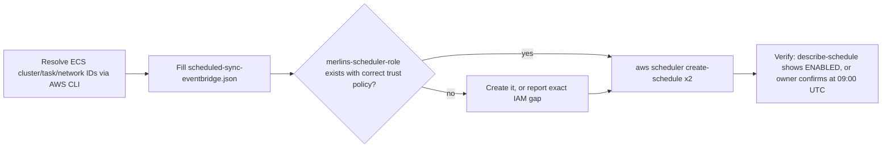

# RFC 0013: Price-Sync Deploy, Consignor Visibility, Show-Analytics Auto-Generation, Universal Sortable Columns

Status: Draft
Author: Claude (session with owner, 2026-08-14)
Date: 2026-08-14

## Summary

Four independent admin-panel gaps, diagnosed via parallel root-cause investigation on 2026-08-14, fixed in one project because they share a verification pass:

1. Deploy the already-built EventBridge Scheduler cron so price history actually accumulates.
2. Make the consignor filter reachable and add a Consignor column, both off by default, wired through the existing column-visibility system rather than the separate "Show all filters" toggle.
3. Auto-generate a `ShowAnalyticsSnapshot` when a show is archived, plus a one-time backfill for shows archived before this ships.
4. Extend column-header sorting to every remaining admin table — including redesigning four bespoke (non-`DataTable`) layouts into sortable ones.

A fifth reported symptom (Trade page Catalog/Inventory and Raw/Graded toggle buttons rendering unstyled) was investigated and found **not reproducible** in current source — both toggles already carry `accent-mint`/`text-pine-200` vault styling. It is out of scope here; if still visibly wrong after a hard refresh, it is a new bug report.

## Motivation

Owner-reported, 2026-08-14: no card shows price history despite being in the system a while; no consignor filter/column on Inventory; every show's analytics read zero even though the Daily tab works; column sorting is inconsistent across admin tables. Each was root-caused (see `claude-progress.txt` FEATURE GOAL section for the full diagnosis) to a real, distinct gap rather than one shared bug.

## Detailed Design

### 1. Price-sync cron deploy

No code change — `services/catalog_sync.py`'s `refresh_held_prices`/`refresh_catalog_prices`, `append_price_points`, and `get_price_history` are already correct and tested (79+ tests). `deploy/scheduled-sync-eventbridge.json` and `docs/aws-setup.md` Phase 8 already define the two schedules (`merlins-price-sync` daily, `merlins-catalog-sync` monthly). The work is purely: resolve the four placeholders (`<CLUSTER_ARN>`, `<ACCOUNT_ID>`, `<TASK_DEF_ARN>`, `<SUBNET_IDS>`, `<SECURITY_GROUP_ID>`) against the real ECS resources (account `560151615792`, per `backend/taskdef.json`) and run `aws scheduler create-schedule` for both.

Flow:


If any `create-schedule`/`iam` call 403s, stop and report the exact action/policy needed (per owner instruction) rather than substituting a manual runbook silently.

### 2. Consignor filter + column

Reference: `frontend/lib/admin-inventory-columns.tsx`. Today the consignor filter (line 685) has `columnKey: null`, so `isFilterVisible()` (line 694-701) can only ever show it via the `showAllFilters` toggle — never via the per-column visibility set. This is the exact mechanism the owner wants used instead.

**Change 1 — new column**, in `INVENTORY_COLUMNS` (pattern matched to the existing `Ownership` column at line ~278-286):
```ts
{
  key: 'consignor_name',
  label: 'Consignor',
  defaultVisible: false,
  sortable: false, // no backend sort key yet — item stores consignor_id, not a name; see RFC item 4 note below
  render: (item, ctx) => ctx.consignorName(item.consignment?.consignor_id) ?? '—',
},
```
`ctx` (the render context threaded through `buildColumns`) gains a `consignorName(id: string | undefined) => string | undefined` lookup built from `useCosigners()`'s `options` (`value`→`label` map), fetched once at the page level exactly like the filter already does.

**Change 2 — filter's `columnKey` now points at the new column** instead of `null`:
```ts
{
  id: 'consignor', label: 'Consignor', columnKey: 'consignor_name', kind: 'select',
  legacyParam: 'consignor_id', optionSource: 'cosigners',
},
```
No change to `isFilterVisible`'s logic — it already does the right thing once `columnKey` is non-null: the filter is invisible until the admin turns on the Consignor column via the existing column-visibility picker (`frontend/app/(admin)/admin/inventory/page.tsx:~355-391`), at which point it appears automatically. `showAllFilters` no longer needs to include it (Set/Card#/Artist keep the old behavior — untouched).

**Sortability note**: a true backend sort by consignor name would require joining `InventoryItem.consignment.consignor_id` against the `Consignor` entity server-side — there is no such join in `inventory_sort.py` today, and adding one is a small but real addition. Deferred into item 4's backend-sort-registry work rather than done twice; the column ships `sortable: false` in this pass.

### 3. Show Analytics auto-generate on archive

Reference: `backend/src/merlins_collection/routers/admin/analytics.py`. `archive_show` (line 247-254) currently only flips `archived: True` via `_save_show`. `generate_show_analytics` (line 271-313) is the existing, fully-tested snapshot computation — this task calls it from one new place, not rewrite it.

```python
@router.post("/shows/{show_id}/archive")
def archive_show(
    show_id: str,
    repo: InventoryRepository = Depends(get_repo),
) -> dict[str, Any]:
    result = _save_show(repo, _require_show(repo, show_id), {"archived": True})
    generate_show_analytics(show_id, repo=repo)  # best-effort: see below
    return result
```

Open implementation question resolved here, not deferred: **a snapshot-generation failure must never block the archive itself** — archiving is the durable, important state change; the snapshot is a cache. Wrap the call, log on failure, and let `archive_show` still return 200. This mirrors `_mark_snapshots_stale`'s existing "best-effort by nature... deliberately AFTER" framing for post-write bookkeeping in the same file (`_apply_reversal`, line 587-593).

The **manual "Generate" button stays** — re-generating after the fact (e.g. a show re-opened via `unarchive` then re-archived, or a late-arriving voided-transaction correction) still needs it, and this change doesn't touch `unarchive_show` at all.

**Backfill for already-archived shows**: a one-time script, `backend/scripts/backfill_show_analytics.py`, dry-run by default like `scripts/backfill_catalog_sets.py` — walks `repo.list_shows(include_archived=True)`, calls `generate_show_analytics` for every archived show with no existing snapshot (`repo.get_show_analytics(show_id) is None`), `--execute` to actually write. This is the one-time action that makes existing shows stop reading zero; going forward the archive hook keeps new ones covered.

### 4. Universal sortable columns — full scope

**Backend**: generalize `inventory_sort.py`'s registry pattern (extractor functions + `parse_sort`/`sort_items`, the "missing sorts last," "unknown field is a 422" invariants) rather than one bespoke module per table. New file `backend/src/merlins_collection/services/table_sort.py` exposes a `build_sort_registry(fields: dict[str, Callable]) -> SortRegistry` factory carrying `parse_sort`/`sort_items`/`resolve_sort_field` as bound methods, so each table gets its own registry instance without re-deriving the partition-based "missing last" logic or the `rsplit("_", 1)` parsing convention five times. `inventory_sort.py` is refactored to use the factory too (behavior-identical; its own tests are the regression guard).

Five new registries, one per table, each with its own `SORT_FIELDS`-equivalent dict and totality test (mirrors `test_inventory_sort.py`'s pattern of asserting every `Column.key` has a registry entry):

| Table | Registry fields (initial set — extend as columns are added) | Router |
|---|---|---|
| Shows | `date`, `name`, `location`, `archived` | `routers/admin/analytics.py` (`list_shows`) |
| Transactions (History) | `date`, `type`, `amount`, `payment_method` | `routers/admin/analytics.py` (`list_transactions_archive`) |
| Consignors | `name`, `created_at`, `archived` | `routers/admin/cosigners.py` |
| Locations | `label`, `item_count` | `routers/admin/locations.py` |
| Slabs | `cert_number`, `company`, `grade`, `buy_price`, `priced` | `routers/admin/slabs.py` (the list endpoint, not intake) |

Each router accepts an optional `sort: str | None = Query(None)` the same way inventory does, 422s on `parse_sort` returning `None` for a non-empty value, and applies `sort_items` before pagination/limits.

**Frontend, `DataTable`-based pages already unwired** (Triage, Unmatched, Shows, Locations, Cosigners): add local `sortKey`/`sortDir` state + a `handleSort` per page (the existing per-page pattern, not a new abstraction — `DataTable`'s contract is already generic; see `frontend/components/admin/shared/DataTable.tsx:14-27`), mark the relevant `Column`s `sortable: true`, pass `sort=${key}_${dir}` to the list fetch.

**Vault and Show Prep**: converted from client-side-only sort (`frontend/lib/vault-sort.ts`; inline compares in Show Prep's `page.tsx:217-236`) to server-side, for parity with Inventory/Prep Queue — both already proxy through `/inventory/search`, so they inherit `inventory_sort.py`'s registry directly once the page passes `sort` through instead of sorting the response client-side.

**Bespoke layouts redesigned into `DataTable`** (full scope, per owner decision):
- **Market**: `CardPickerRow`-based search results and the watchlist list become `DataTable` rows. Search results are ephemeral (no natural sort key beyond relevance) — sorting applies to the **watchlist** list, not the live search-as-you-type results.
- **Slabs**: `StagingTable` (the pre-commit batch — stays as-is, it's a small in-memory list being built, not a browsed table) is unchanged; `SlabList` (the committed/priced slab list, `?priced=false` worklist included) converts to `DataTable` with the new Slabs registry above.
- **Show Analytics**: the Shows-tab archive listing converts to `DataTable` using the new Shows registry. The Daily tab has no table to sort (single-day dashboard tiles).
- **History**: `TransactionGroups` (grouped, lineage-aware rendering) is **not** replaced — grouping and profit-lineage display are load-bearing per CLAUDE.md's `batch_id` grouping rules and must not become a flat sortable table (a five-card sale reading as one line would break). Sorting applies to **group order** (by group date/total) via a lightweight header control outside `DataTable`, not by flattening to per-transaction rows. This is a narrower interpretation of "sortable" for this one table, called out explicitly rather than silently under-delivered.

### API Contracts

New/changed query params, all following `inventory_sort.py`'s existing `sort=<field>_<asc|desc>` convention:

- `GET /admin/shows?sort=<field>_<asc|desc>` (new param; existing `include_archived` unchanged)
- `GET /admin/transactions?sort=<field>_<asc|desc>` (new param; existing `start`/`end`/`type` unchanged)
- `GET /admin/cosigners?sort=<field>_<asc|desc>` (new)
- `GET /admin/locations?sort=<field>_<asc|desc>` (new)
- `GET /admin/slabs?sort=<field>_<asc|desc>` (new; existing `priced` unchanged)
- `POST /admin/shows/{show_id}/archive` — behavior change only, same request/response shape, now also writes a `ShowAnalyticsSnapshot` as a side effect (best-effort, non-blocking).
- No inventory endpoint contract changes — the consignor column/filter reuses `consignor_id` (already an accepted param) and `INVENTORY_FILTERS`/`INVENTORY_COLUMNS` are frontend-only registries.

## Alternatives Considered

- **Show analytics**: lazy-generate-on-read and nightly-backfill-job were both raised and rejected by the owner in favor of generate-on-archive — it ties the snapshot to the exact moment the show's numbers stop changing, with no added cron dependency and no slow first-read.
- **Consignor visibility**: flipping the global `showAllFilters` default was rejected — it would have surfaced Set/Card#/Artist too, which the owner didn't ask for.
- **Sort backend**: one shared generic registry keyed by table name (a single dict-of-dicts) was considered over five separate modules; rejected because `inventory_sort.py`'s docstring-level "load-bearing, individually tested" properties (missing-last, condition-rank, 422-on-unknown) read better as one file per table's own vocabulary than as branches inside a mega-registry — matches the existing one-file-per-concern layout of `services/`.
- **History sort**: flattening `TransactionGroups` into a plain sortable table was rejected — it's the exact case CLAUDE.md's `batch_id` grouping section warns against ("a five-card sale must void as one action... reads as one line").

## Risks & Mitigations

- **Archive-triggered generation failing silently**: mitigated by explicit logging on the wrapped call; the manual "Generate" button remains as a recovery path, and `stale` (existing field) already covers the void-invalidation case.
- **Backfill script hitting the live table**: dry-run by default, `--execute` required, matches every other one-time script in this repo (`seed_catalog.py`, `backfill_catalog_sets.py`) — same safety convention, no new pattern to learn.
- **EventBridge deploy touching real production infra**: owner explicitly authorized direct execution; any missing IAM permission halts and is reported rather than worked around (owner instruction, 2026-08-14).
- **Sort registry sprawl**: the `table_sort.py` factory keeps the five new registries from re-deriving the same three invariants five times; each still gets its own totality test so a missed column fails loudly (422) rather than silently sorting wrong.
- **Slabs `StagingTable` mistaken for in-scope**: called out explicitly in Detailed Design as unchanged — it's a batch-being-built, not a browsed list, so "sortable" doesn't apply to it.

## Open Questions

None — the four mechanism/scope decisions (analytics trigger, sort scope, consignor visibility mechanism, cron deploy ownership) were collected from the owner via `AskUserQuestion` on 2026-08-14 before this RFC was drafted, per this project's own `design-doc` skill rule that scope selection and mechanism approval are separate asks.
