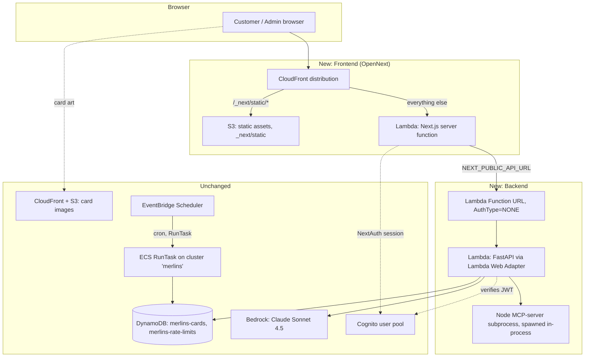

# RFC 0014: ECS to Serverless Migration

Status: Draft
Author: Claude (session with @EthanHarter934)
Date: 2026-08-16

## Summary

Move both standing ECS Express Mode services — `merlins-frontend` and
`merlins-backend` — off Fargate and onto pay-per-request compute: the backend
(FastAPI + the Node MCP-server subprocess it spawns) onto **AWS Lambda via
the Lambda Web Adapter (LWA)**, fronted by a **Lambda Function URL**; the
frontend (Next.js 14, NextAuth) onto **Lambda via OpenNext**, fronted by
**CloudFront**. DynamoDB, Bedrock, Cognito, S3+CloudFront (card images), and
the EventBridge Scheduler → ECS RunTask sync jobs are **unchanged** — none of
them are cost drivers and none of them benefit from this migration. Both new
services deploy **in parallel** with the existing ECS services (no in-place
cutover); DNS moves only after the new path has survived a real card-show
traffic day, and the ECS services + their Application Load Balancer are
decommissioned only after a two-week overlap window.

## Motivation

Live Cost Explorer data pulled 2026-08-16 (account 560151615792, us-east-1)
shows the account on a **~$87/month projected run rate**, of which **99% is
standing infrastructure billed by the hour, not usage**:

| Driver | Projected monthly cost |
|---|---|
| ECS Fargate compute (2 always-on tasks, 1.5 vCPU / 3 GB combined) | ~$54 |
| Public IPv4 address rental (task + ALB ENIs) | ~$29 |
| Application Load Balancer (flat base fee) | ~$3.74 |
| Bedrock + DynamoDB + S3 + ECR combined | <$1 |

`merlins-frontend` and `merlins-backend` both run `desiredCount: 1` with no
autoscaling — not a traffic-driven number, the structural floor Fargate
requires for an always-listening service. This app's own documented traffic
shape (`docs/aws-setup.md`'s Bedrock budget-guardrail section) is the
opposite of steady: bursty at evening card shows, quiet the rest of the time.
An hourly-billed floor is the wrong instrument for that shape; Lambda's
pay-per-invocation model has no floor.

This RFC was preceded by a cost-grounded tutorial (produced and approved by
the owner in the same work session, not checked into the repo) that surveyed
the live AWS account and proposed this same component mapping. This RFC
turns that plan into a concrete, buildable design.

## Detailed Design



### 1. Backend: Lambda + Lambda Web Adapter

The backend keeps its existing container-image build — `backend/Dockerfile`'s
`runtime` stage already bundles Python, the compiled MCP server, and the Node
runtime it needs (installed for exactly this reason: "The backend spawns the
MCP server as `node dist/index.js` — it needs a Node runtime"). Lambda accepts
container images up to 10 GB as the deployment artifact directly, so this
image becomes the Lambda's own image with one addition.

**New Dockerfile stage** (`lambda`, built from the existing `base` stage,
sibling to `runtime`, not a replacement for it — `runtime` keeps serving ECS
until decommission):

```dockerfile
FROM base AS lambda
# Lambda container images don't support attached layers (only zip-packaged
# functions do) — the adapter binary must be COPIED into the image directly.
COPY --from=public.ecr.aws/awsguru/aws-lambda-adapter:0.9.1 /lambda-adapter /opt/extensions/lambda-adapter
WORKDIR /app/backend
RUN useradd --create-home appuser
USER appuser
ENV AWS_LWA_PORT=8000
# BUFFERED for launch — /chat returns a single ChatResponse today, not a
# stream. RESPONSE_STREAM is available later without an app rewrite if
# streaming chat replies becomes a real feature (Function URL is why this
# option exists at all; HTTP API cannot do this).
ENV AWS_LWA_INVOKE_MODE=BUFFERED
CMD ["uvicorn", "merlins_collection.main:app", "--host", "0.0.0.0", "--port", "8000"]
```

**Trust-boundary change — read before reusing the ECS env verbatim.** The
`runtime` stage's `FORWARDED_ALLOW_IPS=10.0.0.0/8,172.16.0.0/12,192.168.0.0/16`
exists because the ALB is a real network hop inside the VPC's private range.
Under LWA, the adapter proxies from **inside the same execution
environment** — the app's actual peer is the adapter on `127.0.0.1`, not a
VPC-scoped load balancer. The Lambda stage must set
**`FORWARDED_ALLOW_IPS=127.0.0.1/32`**, not the ECS ranges; copying the ECS
value would trust nothing (breaking `rate_limit.py`'s per-IP keying back to
the R14 fail-open trap the comment in `Dockerfile` already documents) or,
worse if ever widened, trust the wrong hops. LWA does inject the real client
IP as `X-Forwarded-For` on the request it forwards, so uvicorn's
`ProxyHeadersMiddleware` still does the right thing once the trusted-hop
range is corrected.

**CORS stays exactly as-is, in exactly one place.** `main.py`'s
`CORSMiddleware` already produces the response headers the browser needs.
LWA is not an event-transforming proxy integration (that caveat in AWS's own
API Gateway docs is about Lambda *proxy integration*, where the Lambda must
manually shape a `{statusCode, headers, body}` JSON response) — it runs a
real HTTP server and forwards real HTTP responses through, so FastAPI's
existing CORS headers pass through unchanged. **Do not also configure a
`Cors` block on the Function URL itself** — that would be a second CORS
implementation liable to disagree with the first (e.g. duplicate
`Access-Control-Allow-Origin` headers, which browsers reject).

**Environment variables** — same set `deploy/backend-container.json` already
defines for ECS (`AWS_REGION`, `DYNAMODB_TABLE_NAME`, `RATE_LIMIT_TABLE_NAME`,
`COGNITO_USER_POOL_ID`, `COGNITO_CLIENT_ID`, `CORS_ORIGINS`,
`POKEMONPRICETRACKER_API_KEY`, `ADMIN_API_KEY` per `docs/aws-setup.md`), plus
`AWS_LWA_PORT`/`AWS_LWA_INVOKE_MODE` above. `CORS_ORIGINS` gains the new
CloudFront domain once the frontend has one (sequencing note in §5) but keeps
the existing ECS origin and `localhost:3000` until cutover.

**IAM execution role** — carry `deploy/backend-task-role-permissions.json`'s
three statements (`BusinessTable`, `RateLimitCounters`, `BedrockInvoke`)
verbatim onto the new Lambda execution role, **plus** the actions ECS's
`awslogs` log driver handled differently: `logs:CreateLogGroup`,
`logs:CreateLogStream`, `logs:PutLogEvents` scoped to the function's own log
group (the AWS-managed `AWSLambdaBasicExecutionRole` policy is the standard
way to grant exactly this and nothing more).

**No VPC attachment.** Confirmed live this session: the account has zero NAT
Gateways and zero VPC endpoints today — the ECS tasks already reach
DynamoDB/Bedrock/Cognito over their public AWS endpoints via a public IP, not
a private link. A Lambda with no VPC config reaches the same public endpoints
identically, with none of Lambda's VPC-attachment costs (ENI cold-start
latency, Hyperplane ENI ramp-up) ever entering the picture.

### 2. MCP tool server — no code change, deployment note only

`services/mcp_client.py` and `dependencies.py`'s `@lru_cache` singleton are
unchanged. The Lambda image bundles the same compiled `mcp-server/dist` and
Node runtime the ECS image already bundles (same `base` Dockerfile stage,
per §1). Lambda's execution-environment reuse plays the same role the
always-on ECS process plays today: the cached `McpToolExecutor` and its
subprocess persist across warm invocations of the same environment. The only
behavioral difference is cost-shaped, not correctness-shaped — a **new**
execution environment (first request after idle, or an additional concurrent
one) pays the Node spawn cost once; a warm one does not. No mitigation is
built into this RFC for that latency (see Risks) — it is accepted as the
tradeoff this migration is making on purpose.

### 3. Scheduled sync jobs — unchanged, stated explicitly so it isn't "fixed" later

`EventBridge Scheduler → ECS RunTask` (`docs/aws-setup.md` Phase 8) is not
touched by this RFC. The **cluster** `merlins` and its RunTask capability
must survive this migration even after `merlins-frontend`/`merlins-backend`
are decommissioned in §5 — only the two standing **services** and the ALB go
away, never the cluster itself. `merlins-price-sync` and
`merlins-catalog-sync` keep targeting the same task definition family
(`merlins-merlins-backend`) they always have; nothing here changes that task
definition's image build, only the new `lambda` Dockerfile stage is added
alongside it.

### 4. Frontend: OpenNext on Lambda + CloudFront

OpenNext (`@opennextjs/aws`) consumes the existing `output: 'standalone'`
Next.js build (already configured in `next.config.ts` — built for the
current Docker deployment, and OpenNext's expected input) and produces: a
server Lambda handling SSR and API routes (including NextAuth's
`/api/auth/*` routes, unmodified), a set of static assets deployed to S3, and
a CloudFront distribution that routes `/_next/static/*` and other static
paths to S3 (long cache) and everything else to the server Lambda.

- **Auth is unchanged.** The Cognito app client stays "Traditional web
  application" with a client secret (`AWS_COGNITO_CLIENT_SECRET` is read
  server-side by `auth.config.ts`'s `refreshAccessToken`, which requires a
  server process — exactly what the OpenNext server Lambda still is). A new
  callback URL for the CloudFront domain must be added to the Cognito app
  client before cutover.
- **Build-time env** (`NEXT_PUBLIC_*`, inlined at build per `frontend/Dockerfile`'s
  existing `ARG`/`ENV` pattern): `NEXT_PUBLIC_API_URL` becomes the backend's
  Function URL; `NEXT_PUBLIC_CLOUDFRONT_URL` (card images) and
  `NEXT_PUBLIC_SANITY_*` are unchanged.
- **Runtime server env** on the OpenNext server Lambda: `AUTH_SECRET`,
  `AWS_COGNITO_CLIENT_ID`, `AWS_COGNITO_CLIENT_SECRET`, `AWS_COGNITO_ISSUER`,
  `AWS_COGNITO_DOMAIN` — same values NextAuth already reads today, just
  supplied as Lambda environment variables instead of ECS task environment.
- **`next.config.ts`'s `images.remotePatterns` needs no change** — card art
  is already served from TCGdex/CloudFront/Sanity origins directly, never
  proxied through the app server.

### 5. Parallel deploy, cutover, decommission

1. Both new services get their **own** endpoint first — the Function URL's
   default `*.lambda-url.us-east-1.on.aws` domain for the backend, the
   CloudFront distribution's default `*.cloudfront.net` domain for the
   frontend. Neither carries production DNS yet; ECS keeps serving all real
   traffic through this whole phase.
2. Add the new CloudFront domain to `CORS_ORIGINS` on the backend **before**
   pointing the new frontend at it — otherwise every request from the new
   frontend to the new backend fails CORS from the first smoke test.
3. Add the new CloudFront domain as a Cognito app-client callback URL.
4. Verify end-to-end on the new path: filter search, chat mode (confirms the
   MCP subprocess spawns correctly under Lambda), auth sign-in/refresh, and
   the full admin panel.
5. **Gate real cutover on a real card-show day**, not a quiet smoke test —
   that's the traffic shape this migration is built for, so it's the one
   case that has to be proven before DNS moves.
6. Move DNS to the new endpoints.
7. Keep `merlins-frontend`, `merlins-backend`, and
   `ecs-express-gateway-alb-8badc531` running at their current size (not
   scaled to zero — a rollback needs them warm) for a **two-week overlap
   window**.
8. Decommission: delete the two ECS **services** and the ALB. Leave the
   `merlins` **cluster** itself intact (§3) — it keeps serving
   `RunTask` invocations for the two scheduled sync jobs indefinitely.

## Data Schemas

No schema changes. `merlins-cards` and `merlins-rate-limits` (both
`PAY_PER_REQUEST`, confirmed live) keep their existing key structure and
access patterns — only the compute identity calling them changes, from an
ECS task role to a Lambda execution role with the same permission statements.

## API Contracts

No route or contract changes. Every existing FastAPI route (`/auth`,
`/inventory`, `/chat`, `/health`, `/public/*`, `/admin/*`) is unchanged in
method, path, request/response shape, and status-code mapping — only the
transport in front of them changes:

```
Before:  GET https://<alb-dns-or-domain>/health          → 200 {"status": "ok"}
After:   GET https://<function-url-id>.lambda-url.us-east-1.on.aws/health
                                                            → 200 {"status": "ok"}
```

`/health` itself needs no change — it already does no I/O (deliberately, per
its own docstring), which is exactly what a Lambda cold-start-sensitive
health check wants.

## Alternatives Considered

- **Mangum instead of the Lambda Web Adapter.** Mangum re-implements
  ASGI-event translation in Python rather than running a real HTTP server
  process. Rejected: LWA runs the actual `uvicorn` process as a sidecar,
  which is the closer match to "don't rewrite the app" and has no history of
  friction with a spawned-subprocess pattern like the MCP server; Mangum's
  event-translation model is a second thing to verify against this app's
  specific subprocess/threading design.
- **API Gateway HTTP API instead of a Function URL.** Considered directly
  (see `claude-progress.txt`'s OWNER DECISIONS) and rejected: no response
  streaming (forecloses ever streaming `/chat`), a hard 30-second integration
  timeout HTTP API cannot raise (Function URLs are bound only by the
  function's own configurable timeout, up to 15 minutes), and none of HTTP
  API's exclusive features (native JWT authorizer, usage plans, built-in
  throttling) add anything this app doesn't already do itself (Cognito
  verification lives in FastAPI; rate limiting is DynamoDB-backed and
  app-level).
- **Dropping the MCP protocol/subprocess and calling tool functions
  in-process.** A real simplification, and explicitly out of scope here — it
  is a refactor of `services/mcp_client.py`/`bedrock.py` orthogonal to the
  hosting migration. The current subprocess model maps acceptably onto
  Lambda's warm-execution-environment reuse (§2); revisit separately only if
  cold-start latency on `/chat` proves to be a real problem in practice.
- **Frontend Path B — static export + client-side SPA + Cognito Hosted UI
  PKCE.** Bigger rewrite (drops NextAuth's server-side session model,
  requires a secret-less "Public client" Cognito app client, re-plumbs every
  page that currently trusts a server session), bigger savings. Deferred by
  owner decision — see `claude-progress.txt` — revisit only if request
  volume grows enough to justify it.
- **Amplify Hosting for the frontend.** Already rejected once
  (`docs/aws-setup.md`, Phase 6) for being a git-based remote build service
  rather than deploying this repo's own tested build output. OpenNext
  doesn't have that specific problem — it builds from the repo's own `next
  build`/`output: 'standalone'` artifact, not a black-box remote build — but
  it is still new deploy tooling with its own upgrade surface, an accepted
  tradeoff already surfaced to the owner.

## Risks & Mitigations

| Risk | Mitigation |
|---|---|
| Cold start on `/chat` (Node MCP subprocess spawn + Bedrock roundtrip) in a new execution environment | Accepted at current traffic volume. Provisioned Concurrency would eliminate it but bills while idle, undermining the migration's entire purpose — do not add it preemptively; revisit only against a real, reported latency complaint. |
| `FORWARDED_ALLOW_IPS` copied verbatim from the ECS value | Explicitly corrected in §1 to `127.0.0.1/32` — flagged here again because it is exactly the kind of line a fast copy-paste from `deploy/backend-container.json` would get wrong, and getting it wrong either breaks per-IP rate limiting (R14 fail-open pattern) or, if widened carelessly, creates a spoofable trust boundary. |
| Function URL `AuthType=NONE` has no WAF or edge rate limiting | Not a regression — the ALB has none either today (`docs/aws-setup.md` defers WAF as a fast-follow, never built). The same DynamoDB-backed app-level rate limiter that protects the app today protects it identically after this migration. |
| Double CORS headers if a Function URL `Cors` block is also configured | Explicit design decision in §1: leave the Function URL's own CORS config unset; `CORSMiddleware` in `main.py` is the single source of truth. |
| Lambda's on-demand init timeout is 10 seconds; LWA + uvicorn + FastAPI startup must fit inside it on a cold start | `main.py`'s import-time work is already light (settings validation, router registration, no network calls) — expected to be well inside budget, but this should be measured against a real deployed function, not assumed. |
| A future session "helpfully" migrates the scheduled sync jobs onto Lambda too | §3 states explicitly why they're pinned to Fargate (the monthly catalog sync's documented history of brushing the 15-minute ceiling) — restated here as a risk because it's the single most likely well-intentioned mistake on this project. |
| Container image size | Backend image already bundles Python + Node + `node_modules`; expected to stay far under Lambda's 10 GB container-image limit, but verify the built image size as a smoke check before first deploy. |
| OpenNext is new tooling, a separate upgrade/maintenance surface from Next.js's own release cycle | Accepted tradeoff, already surfaced to the owner in the pre-RFC tutorial's honest cons section. |
| **CONFIRMED, real, 2026-08-17**: `@opennextjs/aws`'s image-optimization function bundling fails its dependency install on Windows — `ENOENT: no such file or directory, mkdtemp '...open-next-install-C:\Users\...\image-optimization-functionXXXXXX'`. Not a path-length issue (well under Windows' 260-char limit); looks like a genuine cross-platform bug in how the bundler constructs an `fs.mkdtemp` template string, embedding a full Windows absolute path (with its own colon and backslashes) where only a short name-safe prefix belongs. The build still exits 0 — silent unless the log is actually read. | The server function (everything Task 6's actual spike question — NextAuth — routes through) built correctly with a real `node_modules`; only the image-optimization function's install failed, confirmed by inspecting `.open-next/image-optimization-function/` directly (no `node_modules` at all, vs. `server-functions/default/`'s complete one). Does not block validating NextAuth. Does block image optimization actually working in any deploy built from a Windows machine — `<Image>` requests would 500 until either (a) the build runs from Linux/Mac/CI instead, (b) a newer `@opennextjs/aws` version is confirmed to fix it, or (c) `images: { unoptimized: true }` trades the feature away as a workaround. Not yet resolved; needs a decision before Task 6 could ever ship for real, not before this spike can answer its NextAuth question. |

## Open Questions

- **RESOLVED 2026-08-17 — OpenNext deployment mechanism: `cdk-nextjs-standalone`**
  (`jetbridge/cdk-nextjs` on npm, v4.3.3). Researched live before deciding,
  not assumed:
  - OpenNext itself ships no first-party CDK construct and is explicit that
    its own CDK reference implementation is community-maintained, "not meant
    to be used in production as is" — only SST gets first-party maintenance.
  - `cdk-nextjs-standalone` is the actively maintained community option that
    genuinely consumes real `@opennextjs/aws` build output (v4.3.3, last
    pushed 2026-07-08, not archived) and builds the topology OpenNext's own
    docs say is "the deployer's responsibility" — CloudFront behaviors, OAC,
    the separate image-optimization Lambda, the SQS FIFO revalidation queue
    for ISR. Runs the server function on Node (not Edge-only), which matters
    since NextAuth v5's server-side session/refresh-token logic needs real
    Node APIs.
  - A near-miss ruled out along the way: `cdklabs/cdk-nextjs` (npm package
    `cdk-nextjs`, no `-standalone`) is a *different*, similarly-named AWS
    CDK Labs project that explicitly does NOT use OpenNext — it reimplements
    independently to avoid OpenNext's Next.js internals. Easy to grab by
    mistake; not usable with this migration's `@opennextjs/aws` build.
  - SST ruled out: v4 (current, 2026-07-12) runs on Pulumi with no CDK
    dependency at all and no native cross-stack interop with this repo's
    existing hand-written CDK backend stack was found — would fragment the
    IaC story the backend Lambda work already committed to, for no
    compensating benefit.
  - **Real, unresolved gap, not papered over**: `cdk-nextjs-standalone`'s
    README claims general "next-auth" compatibility, but a direct search of
    its GitHub issue tracker (open and closed) found zero references to
    NextAuth v5 specifically — every relevant hit (#135, PR #33) is
    NextAuth-v4-era and predates the project's own 2023-04 OpenNext rewrite
    (PR #95). Absence of complaints on an active tracker is weak positive
    signal, not confirmation. **Task 6's spike must independently validate
    NextAuth v5's JWT refresh callback works through this construct's real
    CloudFront + Lambda topology via an actual deploy** — the same
    "measure against a real deployed function, not assumed" discipline
    Task 4 already used for the backend Lambda's cold-start risk — before
    building out the rest of the frontend migration on top of it.
- **CloudFront + Origin Access Control in front of the backend Function
  URL** — not part of this RFC (mirrors the deferred-WAF precedent, keeping
  parity with the ALB's current no-edge-protection posture). Flag for owner
  confirmation if it comes up before Task 7 (cutover), not decided here.
- **Provisioned Concurrency for the backend Lambda during known card-show
  hours** — not needed at launch. Revisit only against a real post-cutover
  latency complaint, per the Risks table above.
