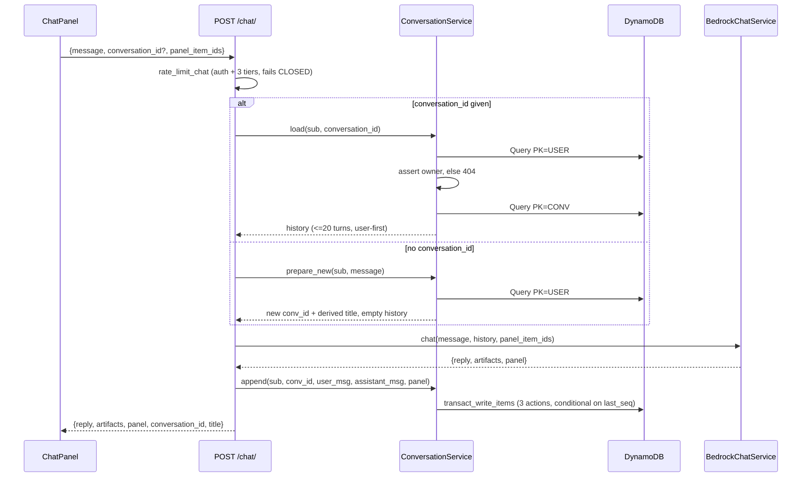

# RFC 0017: Conversation History for the Inventory Chat

- **Status:** Draft
- **Author:** Claude (with the repo owner)
- **Date:** 2026-08-26
- **Phase:** 2 of 3 in the chat plan — Phase 1 is
  [RFC 0016](0016-chat-display-artifacts.md) (display artifacts, shipped),
  Phase 3 is RFC 0018 (admin analyst, not started).
- **Plan of record:** [`docs/plans/rfc-0016/progress.md`](../plans/rfc-0016/progress.md)

## Summary

Move ownership of the `/inventory` chat conversation from the browser to the
server. Conversations become durable DynamoDB rows keyed on the caller's
Cognito `sub`, `POST /chat/` takes a `conversation_id` instead of a
client-assembled `history` array, and five new routes let a customer list,
open, rename, delete and clear their own threads. RFC 0016's display panel
state persists alongside the thread, so resuming a conversation restores the
panel it was last showing — which closes the loop on RFC 0016 decision 2, the
one part of Phase 1 that was designed but could not be finished without
Phase 2's storage.

No new AWS resource, no new dependency, and no schema migration: the
`merlins-cards` table already has TTL enabled on the `ttl` attribute, and
`AuthenticatedUser.sub` already carries the Cognito subject. Nothing existing
is backfilled, because nothing exists to backfill.

## Motivation

A chat today lives entirely in React state. Reloading `/inventory` loses it.
There is no way to return to a question asked yesterday, and no way to hand a
half-finished search back to yourself on a different device.

Worse, the current design makes the **client** the authority on what the model
remembers. `ChatPanel.buildHistory()` (`frontend/components/inventory/
ChatPanel.tsx`) walks its own React state, reassembles completed user/assistant
pairs, truncates each to 4,000 characters, slices to the last 20, and ships the
whole array on every request. `ChatRequest` then re-validates strict
user/assistant alternation on arrival, because it has no other way to know the
array is well-formed. That is a lot of machinery guarding a channel that only
exists because there is nowhere else to keep the transcript — and it means a
client could replay an edited history and put words in the assistant's mouth.

There is also a concrete, already-built integration point waiting on this.
RFC 0019 shipped `HistoryMenu.tsx` with a permanent
`"No past conversations yet"` empty state, specifically so this phase could
start listing real threads without reworking the chat pane's header. That empty
state is the only thing in the split workspace that is currently a promise
rather than a feature.

## Decisions taken as input

These were agreed with the owner and are **not** re-litigated here. Recorded in
[`docs/plans/rfc-0016/progress.md`](../plans/rfc-0016/progress.md) under
"History (RFC-0017)".

| # | Decision |
|---|---|
| 2 | Panel state **persists per conversation**; resuming restores its panel. |
| 4 | Panel entries **re-hydrate live** — prices and availability are current, never snapshots. |
| 7 | **6-month TTL** on conversations. |
| 8 | **Cap 50** conversations per user, oldest auto-pruned. |
| 9 | Titles are **free** — first ~50 chars of the opening message. No extra Bedrock call. User can rename. |
| 10 | **Hard delete**, not soft. |
| 11 | **Admins cannot read other users' conversations.** No route exposes them. |
| 12 | Chat requires login. History keys on the Cognito `sub`. |
| — | Schema sketch: `PK=USER#<sub>` / `SK=CONV#<created_at>#<conv_id>` for the index; `PK=CONV#<conv_id>` / `SK=MSG#<seq>`, one item per message. Every read and write asserts the owning `sub` equals the caller. |

### Four ambiguities in those decisions, resolved with the owner on 2026-08-26

Decisions 7 and 8 each read two ways once messages became separate rows, and
both readings delete different user data. Rather than pick silently:

1. **TTL anchor — "6 months from last use."** A conversation stays alive as
   long as it is used; the thread row's expiry is pushed forward on every
   write. Messages carry their own 6-month expiry from their own timestamp, so
   a thread running longer than six months loses its earliest messages while
   surviving as a thread. Rejected: expiring a whole thread six months after
   its first message, which would delete a conversation someone uses weekly.
2. **Prune criterion — least recently used**, not oldest-by-creation. A thread
   started in January and still used today outranks one started yesterday and
   abandoned. This also makes pruning legible: the thread that gets dropped is
   always the one at the bottom of the history list, because the list is sorted
   by the same field.
3. **Conversation creation is implicit.** `POST /chat/` with no
   `conversation_id` creates one and returns its id. "New chat" stays a
   zero-latency client-side reset, and a thread that is opened but never used
   never exists — so it cannot occupy one of the 50 slots or clutter the list.
4. **Bedrock replay stays capped at 20 turns**, matching today's client-side
   cap. The full thread is stored and readable; only what the model is *shown*
   is bounded. Every replayed turn is re-billed as input tokens on every
   subsequent message, so an uncapped window makes a long thread quadratically
   expensive.

## Detailed Design

### Where each piece lives

| Concern | File | New? |
|---|---|---|
| Pydantic models | `backend/src/merlins_collection/models/chat.py` | extended |
| Persistence | `backend/src/merlins_collection/services/dynamodb.py` | extended |
| Conversation service (title, prune, replay assembly) | `backend/src/merlins_collection/services/conversations.py` | **new** |
| Chat endpoint | `backend/src/merlins_collection/routers/chat.py` | extended |
| Conversation routes | `backend/src/merlins_collection/routers/chat.py` | extended |
| Retention setting | `backend/src/merlins_collection/config.py` | extended |
| Typed client | `frontend/lib/conversations.ts` | **new** |
| Chat transport | `frontend/lib/inventory.ts` (`sendChat`) | extended |
| Chat pane | `frontend/components/inventory/ChatPanel.tsx` | extended |
| History flyout | `frontend/components/inventory/HistoryMenu.tsx` | extended |
| Wiring | `frontend/components/inventory/SplitWorkspace.tsx` | extended |

**No `mcp-server/` change.** The MCP server exposes inventory query tools; it
has never known about conversations and must not start. **No `infra/` change**
— see "No new infrastructure" below.

`services/conversations.py` exists as its own module rather than as more
methods on `BedrockChatService` because title derivation, pruning and replay
assembly are pure logic over stored rows with no Bedrock involvement, and they
need to be unit-testable without a model client. This mirrors how
`services/ledger.py` sits beside the routers that use it.

### Request flow



**Bedrock is called before anything is written.** A model failure therefore
leaves no trace — no thread containing a question with no answer, and no
conversation created for a request that never produced one. The inverse
ordering was rejected in "Alternatives Considered".

### Ownership and isolation

Message rows are keyed `PK=CONV#<conv_id>`, which carries no `sub`. Proving
ownership therefore always goes through the index row first:

> **Every route that touches a conversation resolves it by Querying
> `PK=USER#<sub>` and finding the matching `conv_id` in the result.** There is
> no code path that reads `CONV#<conv_id>` without having done that first.

That Query is bounded at 50 items by decision 8 — it is a single cheap Query,
not a Scan, and it doubles as the backing read for the list route.

Each message row also stores `sub`, and **the fetch path asserts it rather than
merely carrying it**. A field stored "for defense in depth" that nothing ever
reads is decoration; this one is a real second gate — a message row whose `sub`
disagrees with the caller is dropped and logged, which would catch a key-prefix
bug that let two threads collide long before it could serve one customer's
transcript to another.

**A useful consequence of the TTL scheme: the index row always outlives its own
messages, so ownership can never be orphaned by expiry.** The conversation row
expires at `updated_at + 183d` and every message expires at its own
`created_at + 183d`; since `updated_at` is by definition at least as late as the
newest message's `created_at`, no message row can outlive the row that proves
who owns it. Any orphaned message row in the table therefore came from an
interrupted delete (see the delete routes), never from expiry.

**A conversation belonging to another user returns 404, never 403.** A 403
confirms the id exists, which turns the endpoint into an existence oracle for
guessed ULIDs. This matches decision 11: there is no route, admin or otherwise,
that reads a conversation the caller does not own.

### TTL

`settings.conversation_retention_days = 183` (six months), alongside the
existing `price_history_retention_days`. Both row types set the `ttl`
attribute the table already has enabled:

- **Conversation row:** `ttl = updated_at + 183 days`, rewritten on every
  append. This is what "expires six months after last use" means mechanically.
- **Message row:** `ttl = created_at + 183 days`, written once and never
  touched again.

The helper mirrors `services/dynamodb.py`'s existing `_price_history_ttl()`:
epoch seconds derived from the row's own logical timestamp, not from write
time, so a late or backfilled write expires on the same schedule as a punctual
one.

**Two honest consequences, both accepted:**

1. A thread used continuously for more than six months keeps its recent
   messages and loses its earliest ones. The thread survives; its opening
   turns do not. This is the owner's chosen reading and it is what most chat
   products do.
2. **DynamoDB TTL deletion is best-effort, typically within 48 hours of
   expiry, and is not a guarantee.** So `message_count` on the index row can
   read higher than the number of message rows that still exist. It is
   therefore **advisory only** — the fetch route returns whatever rows are
   actually there and never asserts the two agree. Nothing computes anything
   important from `message_count`.

### The 50-conversation cap

Enforced at creation, never in a background job. Before a new conversation's
first write:

1. Query `PK=USER#<sub>` — at most 50 rows, already needed for the list.
2. If the count is at the cap, select the row with the **smallest
   `updated_at`** and hard-delete it (index row plus every message row under
   `PK=CONV#<that id>`).
3. Write the new conversation.

Pruning by `updated_at` rather than by the `created_at` embedded in the sort
key is deliberate and is the whole point of resolution 2 above.

### Sequence numbers and concurrency

Message sort keys are `MSG#<seq>` with `seq` zero-padded to six digits
(`MSG#000001`), so lexicographic sort equals numeric sort and a Query returns
messages in order without post-processing. Six digits is a ceiling of 999,999
messages in one thread, which the 4,000-character message bound and the
six-month TTL together make unreachable.

`last_seq` lives on the conversation row, and **the guard is a different
expression on create than on append** — a distinction worth spelling out,
because using the append guard for both is the obvious mistake and it fails
100% of the time on a brand-new thread:

| Case | Action on the conversation row | `ConditionExpression` |
|---|---|---|
| First message (implicit create) | `Put` | `attribute_not_exists(PK)` |
| Every later message | `Update` | `last_seq = :expected` |

On create the row does not exist yet, so there is no `last_seq` to compare
against. `attribute_not_exists(PK)` here buys **idempotency, not collision
resolution** — it stops a retried request from writing its conversation twice.
Two genuinely independent first messages (two browser tabs) generate two
different `conv_id`s and therefore two different sort keys, so they do not
contend at all, and they *should* become two conversations. On append, the expected value is the
`last_seq` read during load — and the gap between that read and the write spans
the entire Bedrock call, several seconds, which is precisely why the guard
earns its place rather than being theoretical.

Either way the loser's write is rejected and nothing partial lands.

> **AMENDED DURING IMPLEMENTATION (2026-08-26): the loser RETRIES ONCE; it does
> not return 409.** This RFC originally specified a 409 telling the client to
> try again, and that was wrong for where the write actually sits. The append
> happens *after* Bedrock has answered and been billed, so a 409 throws away a
> paid-for reply **and** charges a second call to regenerate it. Re-reading
> `last_seq` and appending behind the winner costs nothing, preserves both
> exchanges, and neither user notices. Only a second consecutive collision —
> sustained contention, not a two-tab race — falls through, and the router then
> serves the reply while logging that it was not persisted.

Implementation note: this is a **conditional `put_item`**, not a
`transact_write_items` spanning the row and both message rows. Mutual exclusion
is the property that matters and the condition provides it; the residual
failure mode (row updated, a message write then fails) leaves a *gap* in `seq`
numbers, which is harmless — ordering is preserved and `message_count` is
already advisory — rather than the lost message an unguarded write would cause.

### Replay assembly

`GET` the last **40** message rows (`ScanIndexForward=False, Limit=40`),
reverse them, then hand `BedrockChatService.chat()` the same
`Sequence[ChatTurn]` it takes today. Two guards, both of which the old
client-side `ChatRequest` validator used to enforce and which the server now
satisfies by construction instead:

- If the trimmed window begins with an **assistant** turn, drop it. Bedrock
  requires the first turn to be `user`.
- If it ends with a **user** turn, drop it — history is completed exchanges
  only.

> **Neither guard is dead code, and the reason is TTL, not partial writes.**
> Messages are always written in user/assistant pairs inside one transaction,
> so alternation holds at write time and it is tempting to conclude the guards
> can never fire. They can: message rows expire **individually**, on their own
> six-month clocks, so a thread older than the retention window loses its
> earliest rows one at a time. The moment a `user` row is reaped a beat before
> its `assistant` partner, the window genuinely begins with an assistant turn
> and Bedrock rejects the whole request. Do not remove these as unreachable.

The 4,000-character per-turn truncation moves server-side unchanged.

### Panel state persistence

RFC 0016 §12 sketched `panel_state` as a per-**message** field carrying
`{"open": bool | None, "item_ids": [...]}`. Two corrections:

1. **There is no `open` field.** RFC 0016 decision 23 collapsed the panel tools
   into one `set_display(item_ids)` and deleted `DisplayPanel.open` entirely —
   an empty list *is* closed. §12's sketch predates that collapse and is stale;
   this RFC supersedes it.
2. **`panel_item_ids` lives on the conversation row, not on each message.**
   Decision 2 says panel state persists *per conversation*, and that is all any
   surface needs — restoring the panel on resume reads one row instead of
   hunting backwards through messages for the last assistant turn. Per-message
   panel history would let the UI show the panel as it stood at each turn;
   nobody asked for that, and it is recoverable later from the artifacts
   already stored per message if anyone ever does.

**Only IDs are stored — never card records.** On resume, `GET /chat/
conversations/{id}` re-hydrates them through the same
`_hydrate_item` path `POST /chat/` uses, so decision 4 holds: prices and
availability are current. An item that has since sold, or otherwise stopped
being customer-visible, hydrates to `None` and simply drops out of the restored
panel — which is correct, not a bug. 50 ULIDs is ~1.3 KB against ~50-100 KB for
50 full `DisplayedCard` records, so this also keeps the row far away from
DynamoDB's 400 KB item limit.

### Titles

Derived server-side on creation, per decision 9 — **no second Bedrock call**:
collapse whitespace in the opening message, take the first 50 characters, and
append `…` if anything was cut. A message that is entirely whitespace cannot
occur (`message` is `min_length=1` and the client trims), but the derivation
falls back to `"New conversation"` if it ever yields an empty string.

A title is set **once** and never regenerated from later messages — a thread
that has been renamed must not have the rename silently undone by the next
message. Renames are bounded at 200 characters, matching
`display_name_override`'s precedent for an admin-typed string.

### Frontend

`ChatPanel` gains one piece of state, `conversationId: string | null`, and one
method on its existing imperative handle:

```ts
export interface ChatPanelHandle {
  reset: () => void                              // existing — now also clears conversationId
  clearDisplay: () => void                       // existing
  loadConversation: (id: string) => Promise<void> // new
}
```

`loadConversation` is guarded by the same monotonic `requestId` ref that
RFC 0019 added to `reset()`, for the identical reason: a reply that resolves
after the user has switched threads must not write into the thread they
switched to.

`HistoryMenu` grows from an empty state into a real list — each row opens that
thread, with rename and delete revealed on hover **and on keyboard focus**, and
a "Clear all" at the foot behind a confirm. The flyout widens from `w-64` to
`w-80` to fit a title plus two actions without truncating to uselessness.
Icons come from `lucide-react`, never emoji, per the standing instruction that
RFC 0019 records.

**The list is ordered by `updated_at` descending, sorted server-side after the
Query.** The sort key embeds `created_at` and cannot express recency, but the
result set is bounded at 50 rows, so sorting the full already-fetched response
is identical in correctness to sorting it in the key — the failure mode
server-side sort exists to prevent is a `limit` truncating before the sort runs,
and there is no `limit` here. This is the same reasoning CLAUDE.md already
records for Vault and Show Prep.

### No new infrastructure

| Needed | Already present |
|---|---|
| TTL on `merlins-cards` | **Enabled**, attribute `ttl` — verified live 2026-08-26 |
| DynamoDB read/write from the backend | Backend Lambda's execution role holds full table access |
| Cognito subject on the request | `AuthenticatedUser.sub`, `models/auth.py` |
| Auth on the new routes | The existing bearer-token dependency |

No CDK change, no table change, no new dependency in either
`package.json` or the backend environment.

## Data Schemas

### Conversation index row

```python
{
  "PK": "USER#<cognito_sub>",
  "SK": "CONV#<created_at ISO8601>#<conv_id ULID>",
  "entity": "conversation",
  "conv_id": str,               # ULID, via models.inventory.new_ulid()
  "sub": str,                   # owner; equals the PK's suffix, stored for readability
  "title": str,                 # 1..200 chars
  "created_at": str,            # ISO8601 UTC; also embedded in the SK
  "updated_at": str,            # ISO8601 UTC; drives list order, prune, and ttl
  "message_count": int,         # ADVISORY — see TTL note
  "last_seq": int,              # highest message seq written; optimistic-concurrency guard
  "panel_item_ids": list[str],  # <=50 ULIDs, never card records
  "ttl": int,                   # epoch seconds = updated_at + conversation_retention_days
}
```

### Conversation message row

```python
{
  "PK": "CONV#<conv_id>",
  "SK": "MSG#<seq:06d>",
  "entity": "conversation_message",
  "conv_id": str,
  "sub": str,                   # defense in depth; ownership is proven via the index row
  "seq": int,
  "role": "user" | "assistant",
  "content": str,               # <=4000 chars, same bound as ChatTurn today
  "artifact_item_ids": list[str],  # <=50 ULIDs; assistant rows only, [] otherwise
  "created_at": str,            # ISO8601 UTC
  "ttl": int,                   # epoch seconds = created_at + conversation_retention_days
}
```

> **`artifact_item_ids` stores IDs, never card records — and this is the same
> rule as the panel, for the same reason.** An earlier draft of this RFC stored
> the full serialized `DisplayedCard[]` per turn so a resumed transcript would
> "render as it originally did". That is a **price snapshot**, and it would have
> re-served a three-month-old price in a card tile that looks identical to a
> live one. It contradicts decision 4, it contradicts RFC 0016's founding rule
> that the model passes IDs and the backend hydrates (the mechanism that exists
> to stop wrong prices reaching a customer), and it contradicts CLAUDE.md's
> standing requirement that a stale figure must not look like a current one.
> Inline cards re-hydrate on fetch exactly as panel cards do.

**Re-hydrating a whole transcript needs a bound, and this is where it goes.**
A 200-message transcript whose assistant turns each displayed five cards is
1,000 hydrations — 2,000 serial reads — for one click on a history row. That
would be strictly worse than the snapshot it replaces. So `GET /chat/
conversations/{id}` performs **one deduplicated hydration pass for the entire
response**, transcript and panel together:

1. Collect every `item_id` referenced by any returned message plus the
   conversation's `panel_item_ids`.
2. Deduplicate. A card shown in four turns is one hydration, and repetition is
   the normal case in a chat that keeps refining one search.
3. Cap at **100 unique items**, keeping the panel's IDs and then the newest
   turns' first — the oldest turns lose their card strips before anything the
   user is looking at does.
4. Hydrate once, then map results back onto each message by ID.

That makes the worst case 100 hydrations regardless of thread length, against
50 for a full panel restore today — the same order of magnitude as the existing
per-message cost, not a new one.

Storing IDs also keeps message rows small, which matters for the response-size
bound below. **`panel` is deliberately not stored per message** — see "Panel
state persistence".

An item that has since sold drops out of the transcript's card strip, while the
assistant's reply text still mentions it. That asymmetry is correct: the text
is a record of what was said, the card is a claim about what is currently
available and at what price.

### Pydantic models (`models/chat.py`)

```python
class ChatRequest(BaseModel):
    message: str = Field(min_length=1, max_length=4000)
    conversation_id: str | None = Field(default=None, max_length=64)
    panel_item_ids: list[str] = Field(default_factory=list, max_length=50)
    # DEPRECATED, ignored, removed one release after the frontend ships.
    # Kept only so a CloudFront-cached old client bundle does not 422 —
    # see "Risks".
    history: list[ChatTurn] = Field(default_factory=list, max_length=20)


class ChatResponse(BaseModel):
    reply: str
    artifacts: list[DisplayedCard] = Field(default_factory=list)
    panel: DisplayPanel = Field(default_factory=DisplayPanel)
    conversation_id: str            # NEW — always present, even for a new thread
    title: str                      # NEW


class ConversationSummary(BaseModel):
    """One row of the history list. No message content."""
    conversation_id: str
    title: str
    created_at: datetime
    updated_at: datetime
    message_count: int


class ConversationMessage(BaseModel):
    seq: int
    role: Literal["user", "assistant"]
    content: str
    # Hydrated live at fetch time from the stored artifact_item_ids — never
    # deserialized from storage. See the schema note above.
    artifacts: list[DisplayedCard] = Field(default_factory=list)
    created_at: datetime


class ConversationDetail(BaseModel):
    """A resumed thread: transcript plus its live-hydrated panel."""
    conversation_id: str
    title: str
    created_at: datetime
    updated_at: datetime
    messages: list[ConversationMessage]   # most recent 200, oldest-first
    truncated: bool = False               # older turns exist but were not returned
    panel: DisplayPanel


class ConversationRenameRequest(BaseModel):
    title: str = Field(min_length=1, max_length=200)
```

`ChatRequest`'s existing `_validate_request_context` loses its
alternation/parity checks along with `history` — the server now guarantees
well-formed history by construction. The `panel_item_ids` length guard stays.

## API Contracts

All routes are under the existing `router = APIRouter(prefix="/chat")` in
`routers/chat.py` and require a valid Cognito bearer token.

> **Only `POST /chat/` carries `rate_limit_chat`. The five conversation routes
> carry `rate_limit_search`.** The distinction is not cosmetic: `rate_limit_chat`
> **fails closed** (503) because Bedrock costs money per call, while
> `rate_limit_search` **fails open** (`_apply(..., fail_closed=False)` in
> `rate_limit.py:378`). Putting history behind the chat limiter would let
> *listing* conversations consume the daily budget for *asking questions*, and
> would lock a customer out of reading their own transcripts during a DynamoDB
> blip — a read that costs nothing failing because a write that costs money
> could not be metered. `rate_limit_search` is the tier every other
> authenticated customer read already uses (`routers/inventory.py:222`), and
> the delete routes take it too: they are cheap, bounded, and self-limiting.

An explicit consequence worth stating, because it inverts the usual instinct:
**a conversation route must never be made to fail closed.** Losing access to
your own history is a strictly worse outcome than serving it un-metered, and
there is no per-call cost on the other side to protect.

### `POST /chat/` — send a message (**modified**)

```jsonc
// Request — new thread
{ "message": "What Charizards do you have under $300?", "panel_item_ids": [] }

// Request — existing thread
{ "message": "Only the holos", "conversation_id": "01JD...", "panel_item_ids": ["01JC..."] }
```

```jsonc
// 200
{
  "reply": "Here are the holo Charizards under $300…",
  "artifacts": [ /* DisplayedCard[] */ ],
  "panel": { "cards": [ /* … */ ], "truncated": false },
  "conversation_id": "01JD...",
  "title": "What Charizards do you have under $300?"
}
```

| Status | When |
|---|---|
| 401 | No/invalid token |
| 404 | `conversation_id` given but not owned by the caller (never 403) |
| 422 | Content filtered by Bedrock (unchanged) |
| 429 | Rate limited (unchanged) |
| 502 / 503 | Upstream Bedrock error / tool-loop limit or limiter fail-closed (unchanged) |

### `GET /chat/conversations` — list

```jsonc
// 200 — at most 50, ordered by updated_at descending
{ "conversations": [
  { "conversation_id": "01JD...", "title": "What Charizards…",
    "created_at": "2026-08-26T18:04:11Z", "updated_at": "2026-08-26T18:22:40Z",
    "message_count": 6 }
] }
```

### `GET /chat/conversations/{conversation_id}` — open

Returns the transcript plus the **live-re-hydrated** panel (decision 4).
`404` if not owned.

> **The transcript is capped at the most recent 200 messages**, returned
> oldest-first, with `truncated: true` when older turns exist. It is not
> unbounded, and it is not paginated. The backend runs behind a Lambda Function
> URL in `BUFFERED` invoke mode (`AWS_LWA_INVOKE_MODE`, confirmed on the live
> function), which caps a response at **6 MB** — and a six-month thread of
> 4,000-character messages can pass that, at which point the route stops
> failing gracefully and starts failing as a truncated body or a 502. 200
> messages of 4,000 characters is ~800 KB before hydration, comfortably inside
> the cap with room for the artifacts. Pagination was rejected as unneeded
> ceremony: nobody scrolls back through a hundred turns of a card-search chat,
> and the cap can become a cursor later without changing the response shape.

```jsonc
{
  "conversation_id": "01JD...",
  "title": "What Charizards…",
  "created_at": "2026-08-26T18:04:11Z",
  "updated_at": "2026-08-26T18:22:40Z",
  "truncated": false,
  "messages": [
    { "seq": 1, "role": "user", "content": "What Charizards…",
      "artifacts": [], "created_at": "2026-08-26T18:04:11Z" },
    { "seq": 2, "role": "assistant", "content": "Here are…",
      "artifacts": [ /* DisplayedCard[] */ ], "created_at": "2026-08-26T18:04:19Z" }
  ],
  "panel": { "cards": [ /* re-hydrated now, not snapshotted */ ], "truncated": false }
}
```

### `PATCH /chat/conversations/{conversation_id}` — rename

Request `{ "title": "Charizard hunt" }` → `200` with the updated
`ConversationSummary`. `404` if not owned. `422` if the title is empty or over
200 characters. **Does not** touch `updated_at`, so renaming a thread does not
reorder the list or reprieve it from pruning — a rename is not use.

### `DELETE /chat/conversations/{conversation_id}` — delete one

`204`. Hard delete (decision 10): the index row and every message row under
`PK=CONV#<id>`. `404` if not owned. Idempotent thereafter.

> **The index row is deleted FIRST, before any message row.** This is the
> inverse of the intuitive order and it is what makes a partial delete safe. A
> long thread can hold hundreds of message rows; `BatchWriteItem` caps at 25
> per call, and the backend Lambda's timeout is **30 seconds**. If the sweep is
> cut off half-way, deleting the index row first means the thread is already
> gone from every route — ownership is resolved through `PK=USER#<sub>`, so
> orphaned message rows are unreachable by construction — and they then reap
> themselves on their own TTL. Delete the messages first and a timeout leaves a
> live, listable thread with a hole punched in its transcript.

### `DELETE /chat/conversations` — clear all

`204`. Deletes every conversation owned by the caller.

**The count of threads is bounded at 50 by decision 8; the count of *rows* is
not** — 50 threads of several hundred messages each is tens of thousands of
rows, far more than a 30-second Lambda can `BatchWriteItem` through. So this
route deletes **all 50 index rows first**, in one bounded pass, then sweeps
message rows for as long as it has budget. The customer's history list is
empty the moment the first pass completes, which is the whole observable
contract; whatever message rows remain are unreachable and expire on their own
TTL. The route returns `204` on completing the index pass, not on completing
the sweep — it never reports success it has not achieved for the thing the
caller can actually observe.

**Requires an explicit confirm in the UI** — it is the only irreversible bulk
action a customer can take.

### No admin route

Decision 11, stated as a property of the design rather than an omission:
**no route in `routers/admin/` reads a conversation, and none may be added.**
A conversation is customer-private. This RFC's test plan includes a permanent
tripwire asserting no admin router exposes one, on the same precedent as
`test_config.py::test_there_is_still_no_psa_setting_to_configure`.

## Alternatives Considered

**Write the user's message before calling Bedrock.** Would preserve the
question if the model failed. Rejected: it creates threads that contain a
question and no answer, which then appear in the history list as broken
entries, occupy one of the 50 slots, and — for a first message — create a whole
conversation for a request that produced nothing. Writing both turns after a
successful call keeps every stored thread coherent. The residual risk (Bedrock
succeeds, the write fails) is handled by returning the reply anyway and logging
loudly; the customer sees their answer and only loses the persistence of it.

**Store `panel_state` per message, as RFC 0016 §12 sketched.** Rejected for
now: decision 2 scopes persistence to the conversation, restoring from one row
beats walking messages backwards for the last assistant turn, and per-message
artifacts are already stored, so per-turn panel history stays recoverable if
anyone ever asks for it.

**Derive `panel_item_ids` server-side and drop it from `ChatRequest`.**
Tempting — it would make the panel fully server-owned. Rejected because
`ChatPanelHandle.clearDisplay()` (RFC 0019) clears the panel with no network
call at all; making the panel server-authoritative would either break that or
require a new endpoint to persist a purely local UI action. The client stays
authoritative for the *current* panel; the server stores it for *resume*.

**A GSI keyed on `updated_at` for list ordering.** Rejected: the result set is
capped at 50 rows by decision 8, so one bounded Query plus an in-memory sort is
both correct and cheaper than an index that would have to be maintained on
every message.

**Rolling every message row's TTL forward on each write**, so an active thread
never loses its oldest turns. Rejected on cost: it is O(messages) extra writes
per message sent, which is worst exactly where it matters — the long threads it
is meant to protect. The owner chose the message-level 6-month window instead.

**A separate `merlins-conversations` table.** Rejected: the single-table design
is this project's established pattern, TTL is already enabled on
`merlins-cards`, and a second table would need its own IAM grant, its own CDK
resource, and its own backup posture for no isolation the `PK` prefix does not
already give.

**Titling with a Bedrock summarization call.** Explicitly rejected by decision
9 — it doubles the model calls on the first message of every thread for a
cosmetic gain, on a route that already fails closed on cost.

## Risks & Mitigations

| Risk | Mitigation |
|---|---|
| **A CloudFront-cached old client bundle keeps sending `history` and no `conversation_id`.** Every message would start a fresh thread and churn through the 50-cap. | `history` stays on `ChatRequest` as an accepted-and-ignored field for one release, so an old bundle gets a working (if historyless) chat rather than a 422. Deploy **backend first**, then frontend. Remove the field one release later. |
| **Cross-user read.** The worst outcome in this RFC — a customer reading another's conversation. | Every route resolves through `PK=USER#<sub>` before touching `CONV#<id>`; foreign ids 404 rather than 403; `sub` is taken from the verified token and is never client-supplied; message rows carry `sub` for defense in depth; a permanent test asserts no admin route exposes a conversation. |
| **Concurrent sends in two tabs** collide on `seq`. | Conditional `put_item` on `last_seq`; the loser re-reads and retries once, so both exchanges survive and no Bedrock call is wasted. See the amendment under "Sequence numbers and concurrency". |
| **Persisting the exchange fails** after Bedrock has already been billed. | The router catches it, logs, and still returns the reply — the thread just does not gain the exchange. Turning a DynamoDB blip into a 500 would charge the owner for an answer the customer never sees. |
| **TTL drift** makes `message_count` disagree with stored rows. | Documented as advisory; nothing computes from it; the fetch route returns what actually exists. |
| **A resumed panel silently shrinks** because items sold. | This is decision 4 working as intended — live hydration, never snapshots. The UI already renders a smaller panel without comment; the count in the header reflects what was actually hydrated. |
| **Prompt injection via stored history.** Replayed turns re-enter the model's context on every message. | Unchanged in kind from today (the client already replays history), and reduced in degree: the transcript is now server-owned, so a client can no longer forge assistant turns. Stored `content` is bounded at 4,000 chars and is never executed. |
| **Restoring a full panel costs ~50 sequential reads.** `_hydrate_item` issues `get_inventory_item` + `get_catalog_card` per item in a serial loop (`services/bedrock.py`), so a 50-card panel is up to 100 reads. | **Not new** — the same cost is already paid on every `/chat` message that round-trips `panel_item_ids`, and the catalog half is served by the existing in-process cache. What *is* new is that it now also sits on a click-driven read path (opening a thread). Accepted for this RFC and left as a measured follow-up rather than pre-optimized; if it bites, the fix is a batched `BatchGetItem` hydration path shared with `/chat`, which benefits both. |
| **A thread growing past six months loses its opening turns.** | Owner's explicit choice; documented here and surfaced in the UI as the transcript simply starting later, not as an error. |
| **`DELETE /chat/conversations` is irreversible** and one click from the flyout. | Confirm dialog, wording modelled on the archive dialogs at `frontend/app/(admin)/admin/shows/page.tsx:264-274` — except this one must say *deleted permanently*, because unlike a show archive, it is. |

## Test Plan

Outside-in, RED before GREEN, per CLAUDE.md.

**Backend**
- Ownership isolation: user B cannot list, fetch, rename or delete user A's
  conversation; each returns 404, not 403.
- Implicit creation: `POST /chat/` with no `conversation_id` returns a new id
  and a title derived from the message; a second call with that id appends.
- 50-cap: the 51st conversation prunes the **least recently used**, not the
  oldest-created — a test that fails under the naive reading.
- Hard delete removes the index row **and** every message row.
- TTL: conversation row's `ttl` moves forward on append; a message row's does
  not; both derive from their own timestamp, not write time.
- Replay: exactly 20 turns maximum, user-first, assistant-last.
- Concurrency: a stale `last_seq` is rejected, and the losing writer retries
  once so BOTH exchanges end up in the transcript.
- A storage failure still returns the Bedrock reply (200), never a 500.
- Panel: stored as IDs only; re-hydrated live on fetch; a sold item drops out.
- Rate limiting: `POST /chat/` uses `rate_limit_chat` (fails closed); the five
  conversation routes use `rate_limit_search` (fails open) — a test asserts a
  conversation route still serves when the limiter's table is unreachable.
- Creation guard: a **retried** first message (same generated `conv_id`) writes
  once, not twice. Two *independent* first messages from two tabs correctly
  produce **two** conversations — they carry different `conv_id`s and different
  sort keys, so they do not collide and must not be made to.
- Hydration fan-out: a 200-message transcript referencing 400 distinct cards
  issues at most 100 hydrations, and a card repeated across ten turns is
  hydrated once.
- Replay survives a **half-expired pair**: a window whose oldest row is an
  assistant turn is corrected, not passed to Bedrock as-is.
- Transcript artifacts are **re-hydrated, never deserialized** — a stored
  `artifact_item_ids` whose item has since re-priced returns the NEW price, and
  one whose item has sold returns no card at all.
- Delete ordering: with the message sweep forced to fail, the thread is still
  gone from `GET /chat/conversations` — i.e. the index row went first.
- Fetch cap: a thread of 250 messages returns 200 with `truncated: true`.
- Permanent tripwire: no admin router exposes a conversation.

**Frontend**
- `HistoryMenu` lists, opens, renames, deletes, and clears with confirm;
  actions reachable by keyboard, not hover alone.
- `ChatPanel.loadConversation` replaces the transcript and panel, and a reply
  in flight from the previous thread cannot land in the new one.
- `reset()` clears `conversationId`, so the next send starts a new thread.
- `sendChat` sends `conversation_id` and no `history`.

## Open Questions

1. **Should a resumed thread scroll to the bottom or to where it left off?**
   Bottom is the assumed default and is what this RFC implements; a saved
   scroll position needs a place to live and nobody has asked for one.
2. **Should the history list show a relative timestamp ("2h ago") per row?**
   The data is there. Left out of this RFC to keep the flyout narrow; trivial
   to add if the list feels undifferentiated in use.
3. **Does `history`'s deprecation window need to be longer than one release?**
   Depends on CloudFront's cache behaviour for the client bundle, which should
   be checked against the real distribution before the field is removed rather
   than assumed.
