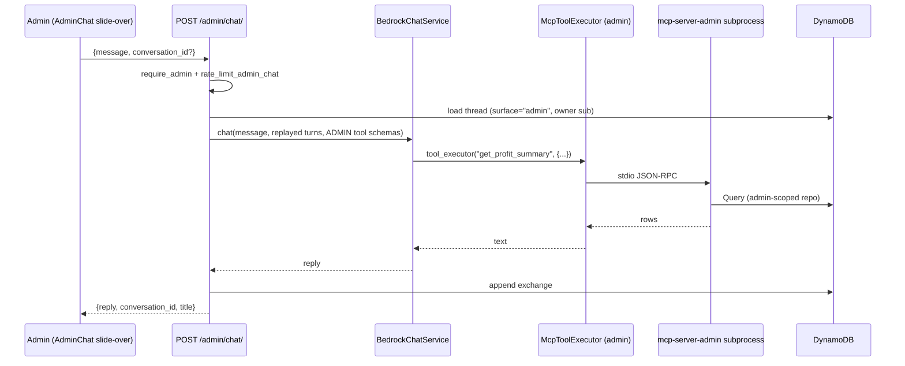

# RFC 0018: Admin Analyst Chat

- **Status:** Draft
- **Author:** Claude (with owner decisions taken 2026-08-27)
- **Date:** 2026-08-27
- **Phase:** 3 of 3 in the chat plan (Phase 1 = RFC-0016 display artifacts, shipped; Phase 2 = RFC-0017 conversation history, shipped)

## Summary

Gives the admin panel a **read-only analyst chat**: a slide-over available on
every `/admin` page that answers questions over the business's own numbers —
profit and margin, aging stock, consignor position, and pricing outliers. It
reuses RFC-0017's conversation store, the existing Bedrock loop, and the
existing `McpToolExecutor` transport unchanged.

The one genuinely new piece of infrastructure is a **second MCP server
process**, `mcp-server-admin/`, holding the four new admin tool families. The
customer chat is never handed its address, so a customer conversation cannot
name an admin tool — the isolation is structural rather than a runtime
`isAdmin` branch that a later refactor could quietly invert.

## Motivation

Every question this chat answers is already answerable today, by opening three
or four admin tabs and doing arithmetic in your head. "What did I actually
make at Portland?" means Show Analytics for the gross, History for the cost
basis of each item sold, and Cosigners for whose split comes out of it. The
data is all there and correctly modelled; what is missing is a way to ask
across it.

That is a narrow, honest problem, and it is why this RFC is **read-only**
(owner decision 1). The admin panel already has well-tested write paths behind
deliberate confirmations — a void that must be a void and never a delete, a
commit that runs the ordinary buy session, an archive that is never a
destroy. Routing writes through a language model would put a probabilistic
layer in front of the most carefully-built guarantees in the repo, to save
clicks nobody has complained about.

**Why now:** RFC-0017 just made conversations persistent, which is what makes
an analyst chat worth having. A question like "and how does that compare to
last month?" is only useful if the thread it belongs to is still there
tomorrow.

## Detailed Design

### Owner decisions taken as input

| # | Decision | Consequence in this design |
|---|---|---|
| 1 | **Read-only.** No writes, not even staged ones | No tool mutates; no confirm-and-apply UI; the admin tool server has no write path to mis-fire |
| 2 | **Global slide-over**, not a new route | Lives in `AdminShell`; no sidebar entry, no `/admin/chat`, works over whatever tab you are on |
| 3 | **Shares RFC-0017's conversation store**, admin-scoped | Reuses the table rows, TTL, 50-cap, pruning and all five routes; a `surface` tag separates the two lists |
| 4 | **Same limiter, higher admin ceiling** | No new limiter mechanism; one admin cannot drain the day's Bedrock spend in a tool loop |
| 5 | **Four tool families**: profit & margin, aging & dead stock, consignor position, pricing outliers | Four new MCP tools, below |
| 6 | **Separate MCP server process** | `mcp-server-admin/`; isolation is which binary is spawned, not a boolean |
| 7 | **No redaction** — admins see everything the admin panel already shows | Tools return cost, margin, splits and payouts without filtering |

### Where each piece lives

| Layer | Path | New? |
|---|---|---|
| Admin MCP server | `mcp-server-admin/` | **NEW** — own `package.json`, own workspace entry |
| Admin tool contract | ~~`shared/admin-tool-contract.json`~~ → **`backend/src/merlins_collection/admin-tool-contract.json`** | **NEW** — mirrors `shared/tool-contract.json`'s role. *Amended during implementation:* `shared/` is for values crossing the Python/TypeScript boundary, and the decision to write the admin MCP server in Python (not TypeScript, as this RFC assumed) left this file with no non-Python reader. Resolving it from the repo root also does not survive the container image, which copies `backend/src` but never `shared/` — see `backend/tests/test_admin_contract_ships.py`. |
| Admin tool executor | `backend/.../dependencies.py::get_admin_mcp_executor` | **NEW** — second `McpToolExecutor`, different command |
| Admin chat route | `backend/.../routers/admin/chat.py` | **NEW** |
| Conversation `surface` tag | `backend/.../services/conversations.py` | Extended |
| Slide-over UI | `frontend/components/admin/AdminChat.tsx` | **NEW** |
| Shell mount | `frontend/components/admin/AdminShell.tsx` | Extended |
| Chat transport, Bedrock loop, MCP client | `services/bedrock.py`, `services/mcp_client.py` | **Unchanged** |

### Request flow



**The customer flow is byte-for-byte unchanged.** `POST /chat/` still resolves
`get_mcp_executor()`, still spawns `mcp-server/`, and is never given the admin
schemas. Two executors, two subprocesses, one shared transport class.

### Why a second process is cheap here

`McpToolExecutor.__init__` already takes `command: list[str]` and an `env`
dict, and `get_mcp_executor()` is a cached singleton that builds one. The
admin executor is the same class with a different path:

```python
@lru_cache(maxsize=1)
def get_admin_mcp_executor() -> McpToolExecutor:
    """Second, admin-only MCP subprocess. Deliberately NOT the same server as
    get_mcp_executor(): the customer chat must not be able to name an admin
    tool, and the cheapest way to guarantee that is for the process serving
    customers to have never loaded one."""
    path = Path(settings.admin_mcp_server_path)
    ...
    return McpToolExecutor(["node", str(path)], env={...})
```

`shutdown_mcp_executor()` gains a sibling, called from the same app-shutdown
hook. No new transport code, no new failure mode: a crashed admin subprocess
respawns exactly as the customer one does.

### Tool schema separation

`BedrockChatService` is handed the tool schemas to advertise. Today those are
pinned to `shared/tool-contract.json`. The admin route passes the admin
contract instead. **A tool the model was never told about cannot be called**,
and behind that, the admin executor is the only one wired to a server that
implements them — so a hallucinated customer-side call to
`get_profit_summary` fails at schema validation, and would fail again at the
executor even if it did not.

### Frontend surface

`AdminChat` is a slide-over panel, not a page:

- One control in `AdminShell`'s header (`MessageSquare`, lucide — never an
  emoji) toggles it.
- The panel overlays the right side; **the tab underneath stays mounted and
  visible**, which is the entire point of decision 2 — you ask about the rows
  you are looking at.
- It reuses `MarkdownMessage` for replies and `CardPresentation` for card
  results, so an answer that names cards shows **image, name and price**, per
  CLAUDE.md's absolute rule. An analyst answer listing twelve cards is exactly
  the "list of things the operator cannot tell apart" that rule exists for.
- Thread history reuses `HistoryMenu`'s shape against the admin surface.
- Width is user-resizable and persisted in `localStorage`, matching
  `SplitWorkspace`'s existing drag behaviour rather than inventing a second
  one.

## Data Schemas

### Conversation rows — extended, not replaced

RFC-0017's rows gain **one optional field**:

```python
class Conversation(BaseModel):
    conv_id: str
    owner_sub: str          # unchanged — the Cognito subject
    title: str
    created_at: datetime
    updated_at: datetime
    ttl: int
    surface: Literal["customer", "admin"] = "customer"   # NEW
```

**`surface` defaults to `"customer"`, and nothing is backfilled.** Every row
written before this RFC is a customer thread, so the default is not a guess —
it is the fact. This follows the `Transaction.batch_id` precedent already
recorded in CLAUDE.md: optional, defaulted, no migration, one code path.

`GET /chat/conversations` filters `surface == "customer"`; the admin list
filters `surface == "admin"`. An admin using both surfaces has two separate
thread lists under one `sub`, which is the intent — "what did I net at
Portland" does not belong in the same list as a customer-facing card question.

**No new table, no new index, no GSI change.** The existing partition already
keys on the owner's `sub`.

### No new persisted analytics

Every figure the tools return is **computed on read** from rows that already
exist (`inventory_item`, `transaction`, `consignor`, `ShowAnalyticsSnapshot`).
Nothing is denormalised for the chat, because a second stored copy of a money
figure is how two sets of books start disagreeing — the concern CLAUDE.md
already records for `services/ledger.is_countable`.

## API Contracts

### `POST /admin/chat/` — send a message

Auth: bearer + **admin Cognito group** (the existing admin dependency).
Limiter: `rate_limit_admin_chat`.

```jsonc
// Request
{ "message": "What was my margin at Portland last month?", "conversation_id": "01JD..." }

// 200
{ "reply": "Portland (2026-07-19): gross $4,210, cost basis $2,880, net $1,330 (31.6%)…",
  "artifacts": [ /* DisplayedCard[] — admin-scoped */ ],
  "conversation_id": "01JD...", "title": "Portland margin" }
```

| Status | When |
|---|---|
| 401 | No/invalid token |
| 403 | Authenticated but not in the admin group |
| 404 | `conversation_id` not owned by the caller |
| 422 | Content filtered by Bedrock |
| 429 | Admin ceiling exhausted |
| 502 / 503 | Bedrock error / tool-loop limit |

**403 here, not 404** — deliberately unlike RFC-0017's thread lookup. A 404 on
a *thread id* hides whether that id exists; a 403 on the *route* hides
nothing, because the route's existence is not a secret and an admin who has
lost their group membership needs to be told that, not shown an empty room.

### Conversation management

Reuses RFC-0017's five routes with a `surface=admin` filter, under
`/admin/chat/conversations`. Same ownership rule, same 404-never-403 on a
thread id, same 204s on delete.

### New MCP tools (`mcp-server-admin/`)

| Tool | Answers | Key inputs |
|---|---|---|
| `get_profit_summary` | Margin by period / show / item; step profit across trade lineage | `start`, `end`, `show_id?`, `group_by` |
| `find_aging_stock` | What is sitting unsold longest | `min_days`, `location?`, `min_value?` |
| `get_consignor_position` | Value held per consignor, splits owed | `consignor_id?` (all when omitted) |
| `find_pricing_outliers` | Off-market, unpriced, or stale-priced items | `direction`, `threshold_pct`, `max_age_days` |

Each returns rows carrying `item_id` so the panel can render real cards.

**Every tool is `readOnlyHint: true`**, and the server registers no tool that
writes. `get_profit_summary` reads cost basis, which is precisely the field
`_CUSTOMER_ITEM_FIELDS` exists to keep off the customer wire — the reason this
lives in a different process.

## Alternatives Considered

- **One MCP server with an `isAdmin` gate** (owner rejected, decision 6). Less
  code and one deploy. Rejected because isolation becomes a runtime boolean:
  one wrong branch in a future refactor puts cost basis on the customer wire,
  and nothing about that failure is loud. A process that never loaded the tool
  cannot leak it.
- **Staged writes with a confirm step.** Genuinely useful for bulk repricing,
  and the reason it lost is timing rather than merit: the read-only version
  has to exist first, and shipping the write path in the same RFC means
  designing a confirmation UI for tools nobody has used yet.
- **A `/admin/chat` route** (decision 2). Simpler to build. Rejected because
  the questions worth asking are about the tab you are on, and a route makes
  you leave it.
- **Its own conversation store** (decision 3). Cleaner separation on paper;
  duplicates ~8 repo methods, 5 routes, and the ownership/TTL/pruning story
  RFC-0017 just got right, to distinguish two things one `surface` string
  already distinguishes.
- **Pre-computed nightly analytics rows.** Faster queries; a second stored
  copy of every money figure, and a staleness window during which the chat
  disagrees with the Analytics tab.

## Risks & Mitigations

| Risk | Mitigation |
|---|---|
| **Prompt injection reaching admin tools.** Card names, notes and consignor names are attacker-influenceable text that lands in the model's context | Tools are read-only, so the worst case is disclosure to an already-authorised admin, not mutation. Decision 7 means there is nothing to disclose they cannot already see |
| **A wrong number stated confidently.** The failure mode that actually matters — an analyst chat is only useful if trusted, and only safe if right | Tools return computed figures with the row ids behind them; the panel renders the source rows. Every money figure routes through the same helpers the admin pages use (`services/ledger.is_countable`, `condition_pricing`) rather than re-implementing arithmetic — CLAUDE.md's single-authority rule |
| **Bedrock spend from a tool loop** | Existing bounded tool-use loop (`BedrockLoopError` → 503) plus decision 4's admin ceiling |
| **Two subprocesses per backend instance** | Both lazy — spawned on first tool call, not at boot. An admin-less deployment never starts the second one |
| **`surface` filter forgotten in one reader** | Same class as the triage-scope bug CLAUDE.md records (list and badge scoped separately, so the badge lied). Mitigation is identical: **one** scoping helper both list and count call, with a test asserting they agree |

## Open Questions

**All four resolved with the owner, 2026-08-27.** Kept here as the record of
what was asked and why the answer went the way it did.

1. **Card results render INLINE in the slide-over**, as a compact grid inside
   the chat panel — not pushed into the tab underneath. The answer and its
   evidence stay together, and no admin tab needs to learn how to accept a
   pushed row set. Rejected: filtering the table beneath (more useful, but
   couples every tab to the chat), and the both-with-a-button variant (the
   push half still needs every tab to accept a row set).

2. **Threads stay private per admin**, on exactly RFC-0017's ownership check.
   No second, weaker access rule to drift against the first. If staff are added
   and shared analysis is wanted, that becomes a deliberate decision then,
   rather than a default nobody chose.

3. **Admin threads are retained for TWO YEARS, not six months.** This is the
   one place this RFC diverges from RFC-0017's mechanics, and it is a
   deliberate owner call: a quarter's margin analysis is worth comparing
   against next year's, which a six-month clock destroys.

   Consequences, because this is not free:
   - a second constant beside RFC-0017's, e.g.
     `ADMIN_CONVERSATION_RETENTION_DAYS = 730`, alongside the existing
     `conversation_retention_days`;
   - the TTL a row is stamped with **branches on `surface`** at write time.
     `services/dynamodb.py`'s `_price_history_ttl()` (RFC-0015) is the shape to
     copy: epoch seconds derived from the row's own logical date, never from
     write time;
   - **the branch lives in ONE function.** Two writers computing a TTL
     independently is how half a thread expires early — the same
     single-authority rule CLAUDE.md records for countability and for
     condition pricing;
   - a test asserting an admin row and a customer row written in the same
     second get *different* `ttl` values, so the branch cannot silently
     collapse to one clock.

4. **Both pricing tools survive.** `flag_underpriced_cards` stays on the
   customer server reading customer-visible fields; `find_pricing_outliers`
   lives on the admin server and additionally reads cost basis, margin and
   price age. They answer a similar question over genuinely different data —
   and merging them would require the customer tool to reach admin data, which
   is precisely the leak the separate process exists to prevent. The overlap is
   the point, not an accident to clean up.
