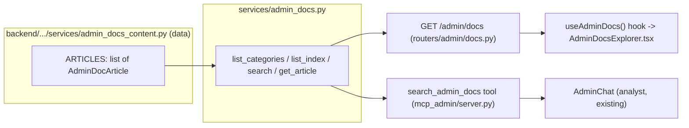

# RFC 0026: Admin Docs Tab + Analyst-Chat Knowledge Access

**Status:** Draft
**Author:** Claude (this session), owner-directed
**Date:** 2026-09-05

## Summary

Add a searchable, categorized documentation surface for the admin panel —
covering what every tab/button does, what it costs or how often it should be
run, and how the figures it displays are calculated — plus a new read-only
MCP tool (`search_admin_docs`) that gives the existing admin analyst chat
(RFC 0018/0020) access to the same content, so an admin can ask it directly
instead of hunting through a page. Content is authored once, as data inside
the backend package, and served to both the frontend Docs tab and the chat
tool over the same service function — no cross-language file sharing, no
duplicate copies to keep in sync.

## Motivation

The owner is the only person who currently knows things like: PokemonPriceTracker's
daily quota means Sync Prices can realistically run ~50 graded lookups a day;
"check for new sets" walks the full catalog and is a monthly-cadence action,
not a daily one; the trade page's displayed percentage is `market value at
purchase / amount paid`, undefined (shown as an em dash) when the cost basis
is zero; "Delete" on Shows/Cosigners is actually an archive, never a real
delete. This knowledge lives in engineering artifacts (CLAUDE.md, RFCs, code
comments) that other, non-technical admins using `/admin` have no reason to
ever open, and it disappears once the owner stops being the one running
Claude Code sessions against this repo.

The owner's ask, directly: a Docs tab in the admin panel — sectioned, not one
long page, with in-page search — covering the entire admin panel in real
depth ("the worst thing to do is not go deep enough... and leave out
important details"), **and**, more importantly, feed the same material to
the analyst chat so an admin can just ask it. The owner also raised, then
self-questioned, giving the chat direct repository access.

**Decided up front, not left to this RFC:** the chat does **not** get repo
access. RFC 0018's entire design is that the admin analyst is isolated by
process/tool-contract/system-prompt from anything with broader reach than
curated read-only business-data tools (see CLAUDE.md, "THE ADMIN ANALYST
CHAT IS A SECOND SURFACE, ISOLATED BY PROCESS"). Source access — code,
`.env`, comments, everything — is a different security posture, not a wider
version of the current one, and the owner's own "maybe that is going too
far" is the right instinct. The fix that actually serves the underlying
need (the chat should be able to answer these questions) is a curated,
read-only **content** tool, the same "librarian" shape RFC 0020 already used
for business data. This RFC builds that instead.

## Detailed Design

### Where content lives, and why

Investigated before drafting this RFC (see `claude-progress.md`'s baseline):
neither this repo's customer MCP server nor the admin one reads a `shared/`
file at **runtime** in production. `mcp-server/src/server.ts`'s tool schemas
are hand-written; `shared/tool-contract.json` is read only by a test, as a
parity pin. The admin tool contract itself was deliberately moved **inside**
the backend package after a production `FileNotFoundError` from a repo-root-
relative runtime read that doesn't survive the Docker image
(CLAUDE.md, "A RUNTIME FILE READ RESOLVED FROM THE REPO ROOT IS UNTESTED BY
CONSTRUCTION"). There is no precedent here for sharing a data file across the
Python/TypeScript boundary at runtime, and inventing one for this feature
would be exactly the shape that bug class warns against.

So: admin docs content is **backend-owned**, written as an importable Python
module (not a JSON file read off disk — no file I/O at all, so there is
nothing to mis-resolve at packaging time), and served to both consumers over
mechanisms each already uses for everything else:

- **Frontend** fetches it over the existing authenticated admin REST API,
  the same way `useLocations`/`useCosigners` fetch anything else admin-side.
- **Chat** reads it via a new MCP tool that calls the same service function
  the REST endpoint calls — one source, two thin callers, matching every
  other admin-analytics tool in this repo (`list_shows` and
  `GET /admin/analytics/by-date` already share `shows_with_analytics` this
  way).



### Content schema

New module `backend/src/merlins_collection/services/admin_docs_content.py`,
mirroring how `LANGUAGE_LABELS`/`FINISH_ATTRIBUTE_SUGGESTIONS` already exist
as literal structured data in this codebase (TS side) rather than JSON on
disk:

```python
class AdminDocArticle(BaseModel):
    id: str            # kebab-case slug, unique — e.g. "sync-prices-cost"
    category: str       # one of ADMIN_DOC_CATEGORIES's ids
    title: str
    summary: str         # one sentence, shown in the browse index and search results
    keywords: list[str] = []   # extra search terms not already in title/body
    body: str            # Markdown; rendered with the frontend's existing
                          # react-markdown + remark-gfm (already a dependency,
                          # used for articles)
    related_routes: list[str] = []  # e.g. ["/admin/market"] -- optional
                                     # "go to this page" links the UI can render

ADMIN_DOC_CATEGORIES: list[tuple[str, str]] = [
    ("overview", "Overview"),
    ("at-the-show", "At the Show"),      # mirrors AdminShell's own sidebar
    ("back-office", "Back Office"),      # grouping labels, so the mental
    ("data", "Data & Reporting"),        # model an admin already has of the
                                          # sidebar carries straight over
    ("money", "Money & Calculations"),   # cross-cutting: the owner's explicit
                                          # "how is this number computed" ask
    ("costs", "Costs, Quotas & Schedules"),  # third-party API budgets, the
                                              # scheduled sync, which buttons
                                              # duplicate it and at what cost
    ("chat", "Asking the Analyst Chat"),
    ("glossary", "Glossary"),
]

ARTICLES: list[AdminDocArticle] = [ ... ]  # authored in the implementation
                                            # phase (roadmap item 5), against
                                            # the table of contents below
```

**Scoping principle for what an article covers** (stated explicitly so
"how deep" has a testable boundary rather than being open-ended): an article
answers *what an admin does, why, and what it costs* — never backend
implementation internals (DynamoDB keys, generation-sweep mechanics, Lambda
packaging) that no admin action depends on knowing. CLAUDE.md stays the
engineering reference; this is the operational one, translated from it.

### Initial table of contents (roadmap item 5 authors these; enumerated here
so "don't leave anything out" has a checklist, not a vibe)

- **Overview** — the three sidebar groups and what "when you use it" means;
  the Dashboard; where Docs itself and the analyst chat fit.
- **At the Show** — Inventory (search/filter/sort, inline click-to-edit,
  ownership column); Buy/Sell/Trade (mode switch, manual-entry escape hatch,
  card-picker image+price rule, Customer View); Slabs (cert field doubles as
  scanner input, Manual Entry disclosure, pricing runs *after* commit).
- **Back Office** — Prep Queue (repurposed from a shipment tracker — the URL
  didn't change but the job did); Show Prep; Shows (archive not delete);
  Triage (the four reasons, bulk-clear's `blank_condition` carve-out); 
  Unmatched (admin-supervision-only, never auto-migrated); Market (Sync
  Prices / "check for new sets" — cost and cadence, see Costs below); Vault.
- **Data & Reporting** — Show Analytics (Daily vs Shows tabs); History (void
  vs. edit — SALES ONLY can be voided, a mistaken purchase or trade has no
  correction path); Cosigners (split-percent direction, archiving); Locations
  (hard-delete + 409-in-use, the one entity NOT on the archive pattern).
- **Money & Calculations** — the acquisition ratio (market-at-purchase ÷ paid,
  em dash when undefined); the trade balance (nets cash against card totals,
  does not add them); how a trade's incoming cost basis is computed
  automatically; sticker price vs. market price (the sticker IS what's
  charged, RFC 0025); consignor split conventions (OUR cut vs. THEIR share —
  the inverse-direction landmine, named explicitly since it has bitten twice).
- **Costs, Quotas & Schedules** — PokemonPriceTracker's 100 credits/day (2
  per graded lookup, ~50 lookups/day in practice); PSA cert lookup: withdrawn,
  do not attempt; what the nightly/monthly scheduled sync already does on its
  own (`MerlinsSyncStack`) so a manual button press is understood as a
  top-up, not the only path; catalog seeding is a rare, deliberate,
  per-language action — never "seed everything."
- **Asking the Analyst Chat** — what it can see (read-only business data +
  this documentation), what it can't (it cannot click buttons or change
  anything), and example questions to ask it.
- **Glossary** — condition tiers (NM/LP+/LP/LP-/MP/HP/DMG) and why the
  storage is two fields; finish vs. finish attributes; the archiving pattern
  in one paragraph.

Full article bodies are written during implementation (roadmap item 5), not
in this RFC — an RFC is the shape of the thing, not the prose.

### Frontend placement

`AdminShell.tsx` gains a **top-level** entry (next to `Dashboard` in
`topLevel`, not inside one of the three time-based groups) — Docs isn't
scoped to "when you use it" the way At the Show/Back Office/Data are; it's
reference material relevant at any point, same as the dashboard itself.
Route: `/admin/docs`. Not added to `mobileItems` — CLAUDE.md's rule that the
mobile bar is an explicit list, never a slice, already covers why: the four
phone slots are the highest-frequency at-a-show actions, and Docs is reached
through the full drawer on mobile like every other non-mobile-bar tab.

`AdminDocsExplorer.tsx` (`components/admin/docs/`) extends the Dictionary's
proven shape (`DictionaryExplorer.tsx`: `useMemo`-filtered plain substring
match, no fuzzy-search dependency) rather than reinventing search:

- A category rail (the 8 categories above) — clicking one shows only its
  articles, satisfying "not one continuous page."
  - a search box that, once non-empty, **overrides** the category filter and
  searches across every category (title + summary + keywords + body,
  case-insensitive substring), showing each hit's category as a badge —
  matching how a person actually looks something up ("what does Sync Prices
  cost" beats browsing to find which category it lives in first).
- Clicking an article expands its body, rendered via the existing
  `react-markdown` + `remark-gfm` (already a dependency; used by
  `ArticleBody.tsx` for the public article hub, so this is precedent, not a
  new capability).

New hook `frontend/lib/use-admin-docs.ts`, mirroring `use-locations.ts`
exactly: gated on `api.isAuthenticated`, re-running on that dependency
(CLAUDE.md's "A FETCH-ONCE ADMIN DROPDOWN HOOK CAN LOSE THE SESSION RACE"
lesson applies here as much as to any other admin hook).

### Chat integration

New 9th tool in `mcp_admin/server.py` / `admin-tool-contract.json`:

```python
@server.tool(
    name="search_admin_docs",
    description=(
        "Search the admin operations knowledge base -- how admin-panel "
        "pages and buttons work, what they cost or how often to run them, "
        "and how displayed figures (e.g. the trade page's acquisition-ratio "
        "percent) are calculated. This is DOCUMENTATION, not live business "
        "data -- for actual numbers use the other tools. Pass `query` to "
        "search titles/keywords/body and get full article text back "
        "(capped at `limit`). Omit `query` to get a lightweight browse index "
        "(id, category, title, summary -- no body) of every article; narrow "
        "with `category` or call again with a `query` once you know what "
        "you're looking for."
    ),
    annotations=READ_ONLY,
)
def search_admin_docs(
    query: str | None = None, category: str | None = None, limit: int = 5
) -> str:
    return _json(admin_docs.search(query=query, category=category, limit=limit))
```

`services/admin_docs.py` (new) holds `search()`, `list_categories()`, plain
functions over `admin_docs_content.ARTICLES` — no repo/DynamoDB dependency at
all, so this module (like `admin_analytics.py`'s lazy-import discipline) is
trivially importable from the standalone MCP subprocess.

`_ADMIN_SYSTEM_PROMPT` (`services/bedrock.py`) gains one more sentence in its
existing tool-selection-preference paragraph (RFC 0020 item 7's pattern):
reach for `search_admin_docs` when the question is about *how the admin
panel works* rather than about the business's own numbers.

## Data Schemas

`AdminDocArticle` (pydantic model, `services/admin_docs_content.py`):

| Field | Type | Notes |
|---|---|---|
| `id` | `str` | kebab-case slug, unique — enforced by a totality test, same style as `SORT_FIELDS` totality tests elsewhere |
| `category` | `str` | must be a key of `ADMIN_DOC_CATEGORIES` |
| `title` | `str` | |
| `summary` | `str` | one sentence |
| `keywords` | `list[str]` | default `[]` |
| `body` | `str` | Markdown |
| `related_routes` | `list[str]` | default `[]` |

No DynamoDB table involved — this is static, code-shipped content, not
per-tenant data. No migration concerns.

## API Contracts

### `GET /admin/docs`

Auth: existing `require_admin` dependency on `admin_router` (no new gating).

Response `200`:
```json
{
  "categories": [{"id": "overview", "label": "Overview"}, ...],
  "articles": [
    {
      "id": "sync-prices-cost",
      "category": "costs",
      "title": "Sync Prices — what it costs and how often to run it",
      "summary": "PokemonPriceTracker gives ~50 graded lookups a day; the nightly job already runs this automatically.",
      "keywords": ["market", "pricing", "quota", "sync"],
      "body": "## Short answer\n...",
      "related_routes": ["/admin/market"]
    }
  ]
}
```

Full article set returned in one call (dataset measured in the tens of KB,
same "small enough to fetch whole" reasoning as `/admin/locations` and
`/admin/cosigners`) — no pagination, no `/admin/docs/{id}`.

### MCP tool `search_admin_docs`

See Detailed Design above for the full signature/description. Response is a
JSON string (matching every other admin tool's `_json()` convention):
browse-index mode returns `[{id, category, title, summary}, ...]`;
query mode returns full `AdminDocArticle` objects, `limit`-capped (default 5).

## Alternatives Considered

- **Sanity-CMS-backed content**, so non-technical admins could edit copy
  themselves. Rejected: the ask is for other admins to *read*, not maintain,
  this content — authorship stays with whoever maintains the codebase (today,
  the owner) — so Sanity's real advantage (non-developer editing) doesn't
  apply, and it would add a live external dependency plus network latency to
  a read-only chat tool for no corresponding benefit.
- **A `shared/` JSON file read by both frontend and backend at runtime.**
  Rejected per the Detailed Design section above — no precedent for this
  shape in the repo, and CLAUDE.md's packaging lesson warns against exactly
  this kind of repo-relative runtime read.
- **Baking full doc content into the admin system prompt** instead of a tool
  call. Rejected: it would inflate the token cost/latency of every single
  chat request, even ones about profit or consignors, and contradicts the
  on-demand "librarian" philosophy RFC 0020 already established.
- **A fuzzy-search library (Fuse.js) for the frontend.** Rejected for v1: the
  Dictionary page's plain substring filter already proves adequate for a
  knowledge base of a few dozen short articles; revisit only if real usage
  shows recall problems.
- **Giving the analyst chat direct repository access.** Rejected — see
  Motivation; this is the security-boundary call the owner explicitly named
  and RFC 0018's isolation design already answers.

## Risks & Mitigations

- **Content drift**: an article states a number (a quota, a cadence) that
  later changes in code. Mitigated by process, not automation — this is the
  same maintenance cost CLAUDE.md itself carries, and the `sync-docs` skill
  already exists for exactly this kind of catch-up. Not worth an automated
  cross-check for prose content; a numeric drift here is a wrong sentence,
  not a wrong charge to a customer.
- **Chat token cost creeping up** if the knowledge base grows large and the
  browse-index mode still returns everything. Mitigated by the index mode
  never including `body` and by `limit` capping query-mode results,
  consistent with how `list_inventory`/`list_transactions` already cap rows.
- **The tool answering from its own training knowledge instead of the
  returned content.** Same generic risk every tool call carries; the tool
  description is explicit that this is documentation to read, not business
  data to compute from — no different in kind from the existing math-trust-
  boundary instruction already in `_ADMIN_SYSTEM_PROMPT`.
- **Security**: no new write path (every new piece here is read-only); no new
  auth surface (reuses `require_admin`); no repo/secret access granted to the
  chat, addressed directly above.

## Open Questions

None blocking implementation. The one open-ended part of this feature —
exactly how deep each article goes — is intentionally not a design question;
it's tracked as `claude-progress.md` roadmap item 5 (content authoring) and
bounded by the scoping principle stated in Detailed Design (what an admin
does/why/cost, never backend internals).
